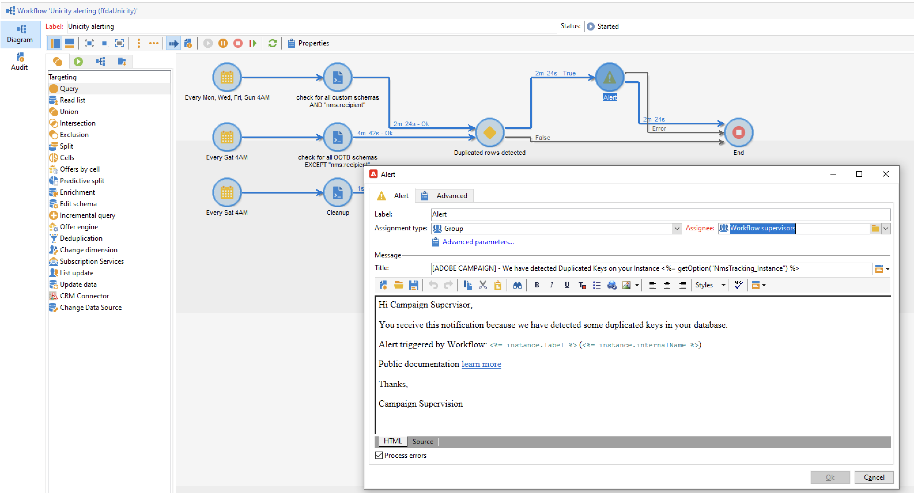

# 密钥管理和唯一性 {#key-management}

在 [企业(FFDA)部署](enterprise-deployment.md)，则主键是通用唯一IDentifier(UUID)，它是字符串。 要创建此UUID，架构的主要元素必须包含 **autouuid** 和 **奥托普** 属性设置为 **true**.

Adobe Campaign v8使用 [!DNL Snowflake] 作为核心数据库。 的分布式架构 [!DNL Snowflake] 数据库不提供机制来确保表中密钥的唯一性：最终用户负责Adobe Campaign数据库内的密钥一致性。

要保持关系数据库的一致性，必须避免对键值（特别是对主键值）重复。 主键上的重复项会导致数据管理工作流活动出现问题，例如 **查询**, **协调**, **更新数据**，等等。 这对于在更新时定义正确的协调标准至关重要 [!DNL Snowflake] 表格。

>[!CAUTION]
>
>重复的键不限于UUID。 在中，可能会发生这种情况，包括在自定义表中创建的自定义键。

## Unicity Service{#unicity-service}

Unicity Service是Cloud Database Manager组件，可帮助用户保留和监视Cloud Database表中唯一键约束的完整性。 这样，您就可以降低插入重复键值的风险。

由于云数据库不强制唯一性约束，因此Unicity服务降低了在使用Adobe Campaign管理数据时插入重复项的风险。

### 独特性工作流{#unicity-wf}

Unicity Service附带一个专用 **[!UICONTROL Unicity alerting]** 内置的工作流，用于监视唯一性约束并在检测到重复项时发出警报。

此技术工作流可从 **[!UICONTROL Administration > Production > Technical workflows > Full FFDA Unicity]** Campaign Explorer节点。 **不得修改**.

此工作流会检查所有自定义架构和内置架构以检测重复行。

如果 **[!UICONTROL Unicity alerting]** (fdaUnicity)工作流会检测到某些重复键，并将它们添加到特定的 **审核的唯一性** 表，包括架构名称、键类型、受影响行数和日期。 您可以从 **[!UICONTROL Administration > Audit > Key Unicity]** 节点。

作为Adobe库管理员，您可以使用SQL活动删除重复项，或联系数据库客户关怀团队以获取更多指导。

### 警报{#unicity-wf-alerting}

将向发送特定通知 **[!UICONTROL Workflow Supervisors]** 运算符组。 可以在 **警报** 活动 **[!UICONTROL Unicity alerting]** 工作流。

## 其他护栏{#duplicates-guardrails}

Campaign提供了一组新护栏，以防止在 [!DNL Snowflake] 数据库。

>[!NOTE]
>
>从Campaign v8.3开始，这些防护可用。要检查您的版本，请参阅 [此部分](../start/compatibility-matrix.md#how-to-check-your-campaign-version-and-buildversion)

### 投放准备{#remove-duplicates-delivery-preparation}

Adobe Campaign会在投放准备期间自动从受众中删除任何重复的UUID。 此机制可防止在准备投放时发生任何错误。 作为最终用户，您可以在投放日志中查看以下信息：由于重复的键值，某些收件人可能会从主目标中排除。 在这种情况下，将显示以下警告： `Exclusion of duplicates (based on the primary key or targeted records)`.

### 更新工作流中的数据{#duplicates-update-data}

在 [企业(FFDA)部署](enterprise-deployment.md)，则无法选择内部键(UUID)作为字段来更新工作流中的数据。

使用显式协调键值时， **更新数据** 活动可通过以下方式自动确保基于此键的目标架构的不可用性：

1. 删除传入数据的重复项（从过渡）
1. 使用目标表删除数据重复项（合并）

>[!CAUTION]
>
>此护栏仅适用于选项 **[!UICONTROL Using reconciliation keys]**.

### 查询具有重复项的架构{#query-with-duplicates}

当工作流开始对架构运行查询时，Adobe Campaign会检查 [“审核唯一性”表](#unicity-wf). 如果存在，工作流会记录一条警告，因为对复制数据的后续操作可能会影响工作流结果。

此检查在以下工作流活动中执行：

* 查询
* 增量查询
* 读取列表