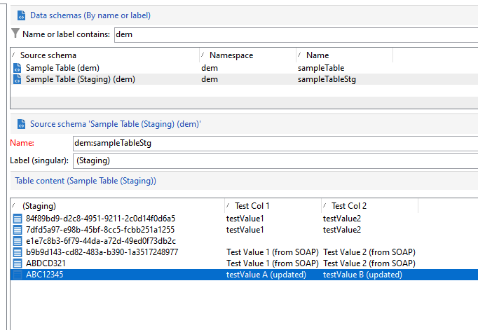

# 特定的FFDA Campaign API{#gs-new-api}

在上下文中 [企业(FFDA)部署](enterprise-deployment.md)， Campaign v8附带了两个特定的API，用于管理Campaign本地数据库和云数据库之间的数据。 使用这些功能的先决条件是在架构上启用暂存机制。 [了解详情](staging.md)

* 摄取API： **xtk.session.ingest**

  此API仅用于数据插入。 [了解详情](#data-insert-api)

* 数据更新/删除API： **xtk.session.ingestExt**

  此API用于更新或删除数据。 [了解详情](#data-update-api)

专用的内置工作流将同步云数据库中的数据。

## 插入数据{#data-insert-api}

此 **xtk.session.ingest** API仅专用于数据插入。 无更新/删除。

### 插入而不进行协调{#insert-no-reconciliation}

**在工作流中**

在中使用以下代码 **Javascript代码** 在不进行协调的情况下在云数据库中插入数据的活动：

```
var xmlStagingSampleTable = <sampleTableStg
                                testcol1="testValue1"
                                testcol2="testValue2"
                                xtkschema="dem:sampleTableStg">
                            </sampleTableStg>;
strUuid = xtk.session.Ingest(xmlStagingSampleTable);
logInfo(strUuid);
```

执行工作流后，会按预期提供暂存表。

**来自SOAP调用**

1. 获取身份验证令牌。
1. 触发API。 有效负载为：

   ```
   <soapenv:Envelope xmlns:soapenv="http://schemas.xmlsoap.org/soap/envelope/" xmlns:urn="urn:xtk:session">
   <soapenv:Header/>
   <soapenv:Body>
       <urn:Ingest>
           <urn:sessiontoken>___xxxxxxx-xxxx-xxx-xxx-xxxxxxxxxxx</urn:sessiontoken>
           <urn:domDoc>
               <sampleTableStg
                   testcol1="Test Value 1 (from SOAP)"
                   testcol2="Test Value 2 (from SOAP)"
                   xtkschema="dem:sampleTableStg">
               </sampleTableStg>
           </urn:domDoc>
       </urn:Ingest>
   </soapenv:Body>
   </soapenv:Envelope>
   ```

1. UUID会发送回SOAP响应：

   ```
   <SOAP-ENV:Envelope xmlns:xsd="http://www.w3.org/2001/XMLSchema" xmlns:xsi="http://www.w3.org/2001/XMLSchema-instance" xmlns:ns="urn:wpp:default" xmlns:SOAP-ENV="http://schemas.xmlsoap.org/soap/envelope/">
   <SOAP-ENV:Body>
       <IngestResponse SOAP-ENV:encodingStyle="http://schemas.xmlsoap.org/soap/encoding/" xmlns="urn:wpp:default">
           <pstrSUuids xsi:type="xsd:string">e1e7c8b3-6f79-44da-a72d-49ed0f73db2c</pstrSUuids>
       </IngestResponse>
   </SOAP-ENV:Body>
   </SOAP-ENV:Envelope>
   ```

因此，会按预期提供暂存表。


### 插入并协调

**在工作流中**

在中使用以下代码 **Javascript代码** 使用协调在云数据库中插入数据的活动：

```
var xmlStagingSampleTable = <sampleTableStg  _key="@id" id="ABC12345"
                              testcol1="testValue1"
                              testcol2="testValue2"
                              xtkschema="dem:sampleTableStg">
                            </sampleTableStg>;         
strUuid = xtk.session.Ingest(xmlStagingSampleTable);
logInfo(strUuid);
```

执行工作流后，会按预期提供暂存表。


**来自SOAP调用**

1. 获取身份验证令牌。
1. 触发API。 有效负载为：

   ```
   <soapenv:Envelope xmlns:soapenv="http://schemas.xmlsoap.org/soap/envelope/" xmlns:urn="urn:xtk:session">
   <soapenv:Header/>
   <soapenv:Body>
     <urn:Ingest>
        <urn:sessiontoken>___5e71f4bf-d38a-4ba8-ac15-35a958f7f138</urn:sessiontoken>
        <urn:domDoc>
           <sampleTableStg  _key="@id" id="ABDCD321"
                testcol1="Test Value 1 (from SOAP)"
                testcol2="Test Value 2 (from SOAP)"
                xtkschema="dem:sampleTableStg">
            </sampleTableStg>
        </urn:domDoc>
     </urn:Ingest>
    </soapenv:Body>
   </soapenv:Envelope>
   ```

1. 在此情况下，不会将UUID提供回响应，因为它已在有效负载中提供。 响应为：

   ```
   <SOAP-ENV:Envelope xmlns:xsd="http://www.w3.org/2001/XMLSchema" xmlns:xsi="http://www.w3.org/2001/XMLSchema-instance" xmlns:ns="urn:wpp:default" xmlns:SOAP-ENV="http://schemas.xmlsoap.org/soap/envelope/">
   <SOAP-ENV:Body>
       <IngestResponse SOAP-ENV:encodingStyle="http://schemas.xmlsoap.org/soap/encoding/" xmlns="urn:wpp:default">
           <pstrSUuids xsi:type="xsd:string"/>
       </IngestResponse>
   </SOAP-ENV:Body>
   </SOAP-ENV:Envelope>
   ```

因此，会按预期提供暂存表。

## 更新或删除数据{#data-update-api}

此 **xtk.session.IngestExt** API已针对数据更新/删除进行了优化。 仅用于插入，首选 **xtk.session.ingest**. 无论记录键是否不在临时表中，插入都起作用。

### 插入/更新

**在工作流中**

在中使用以下代码 **Javascript代码** 更新云数据库中的数据的活动：

```
var xmlStagingRecipient = <sampleTableStg  _key="@id" id="ABC12345"
                              testcol1="testValue A (updated)"
                              testcol2="testValue B (updated)"
                              xtkschema="dem:sampleTableStg">
                            </sampleTableStg>;
xtk.session.IngestExt(xmlStagingRecipient);
```

执行工作流后，会按预期更新暂存表。



**来自SOAP调用**

1. 获取身份验证令牌。
1. 触发API。 有效负载为：

   ```
   <soapenv:Envelope xmlns:soapenv="http://schemas.xmlsoap.org/soap/envelope/" xmlns:urn="urn:xtk:session">
   <soapenv:Header/>
   <soapenv:Body>
       <urn:IngestExt>
           <urn:sessiontoken>___444cd168-a1e2-4fb6-a2a8-73be9f133489</urn:sessiontoken>
           <urn:domDoc>
           <sampleTableStg  _key="@id" id="ABDCD321"
                   testcol1="Test Value E (from SOAP)"
                   testcol2="Test Value F (from SOAP)"
                   xtkschema="dem:sampleTableStg">
               </sampleTableStg>
           </urn:domDoc>
       </urn:IngestExt>
   </soapenv:Body>
   </soapenv:Envelope>
   ```

1. SOAP响应为：

   ```
   <SOAP-ENV:Envelope xmlns:xsd="http://www.w3.org/2001/XMLSchema" xmlns:xsi="http://www.w3.org/2001/XMLSchema-instance" xmlns:ns="urn:wpp:default" xmlns:SOAP-ENV="http://schemas.xmlsoap.org/soap/envelope/">
   <SOAP-ENV:Body>
       <IngestExtResponse SOAP-ENV:encodingStyle="http://schemas.xmlsoap.org/soap/encoding/" xmlns="urn:wpp:default"/>
   </SOAP-ENV:Body>
   </SOAP-ENV:Envelope>
   ```

因此，会按预期更新暂存表。

## 订阅管理 {#sub-apis}

中介绍了Campaign中的订阅管理 [此页面](../start/subscriptions.md).

插入订阅和退订数据依赖于 [暂存机制](staging.md) 在Campaign本地数据库中。 订阅服务器信息临时存储在本地数据库的临时表中，同步工作流将此数据从本地数据库发送到云数据库。 因此，订阅和退订过程将 **异步**. 选择加入和选择退出请求每小时通过特定的技术工作流处理。 [了解详情](replication.md#tech-wf)


**相关主题**

* [Campaign JSAPI](https://experienceleague.adobe.com/developer/campaign-api/api/p-1.html){target="_blank"}
