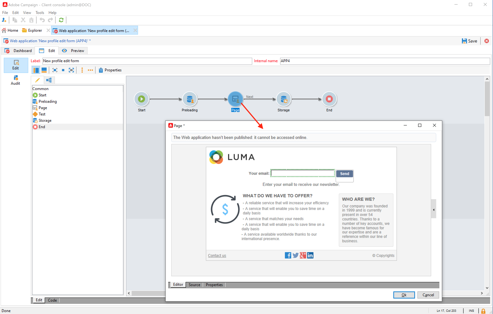

# 使用Web窗体收集和更新用户档案

使用Campaign创建Web窗体，轻松高效地收集和管理用户档案数据。 您可以将这些表单共享到您的网站中，这样您的联系人就可以轻松地提供其信息。数据会发送到Campaign以创建或更新其用户档案。

请参阅[ Campaign Classic v7 文档](https://experienceleague.adobe.com/docs/campaign-classic/using/designing-content/web-forms/about-web-forms.html?lang=zh-Hans){target=&quot;_blank&quot;}了解如何创建 Web 窗体。
