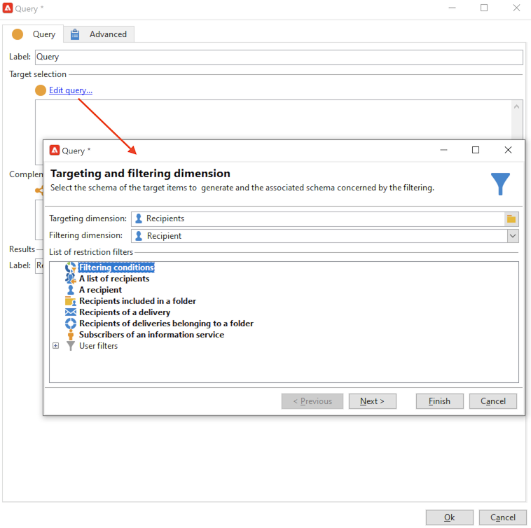

# 在列表中创建受众{#create-segments}

使用Campaign列表创建和组织受众。

列表是一组静态的联系人，在投放操作中可以定位这些联系人，或在导入或其他工作流操作期间对其进行更新。 例如，通过查询从数据库中提取的群体可以存储为列表。

通过&#x200B;**[!UICONTROL Profiles and targets]**&#x200B;选项卡中的&#x200B;**[!UICONTROL Lists]**&#x200B;链接创建和管理列表。 这些列表基于默认的Adobe Campaign配置文件表(nms：recipient)。 [了解详情](../dev/datamodel.md#ootb-profiles.md)

您可以使用工作流中的&#x200B;**更新列表**&#x200B;活动创建列表。 此活动会将生成的群体存储到列表中。 使用它创建新列表或更新现有列表。 要创建包含内置用户档案表以外的其他类型数据的列表，必须运行工作流。 例如，通过在访客表上使用查询，然后更新列表，您可以创建访客列表。 [了解详情](#create-a-list-wf)。

观看本视频，了解有关Adobe Campaign中列表管理的更多信息。

>[!VIDEO](https://video.tv.adobe.com/v/334909?quality=12)

## 创建联系人列表 {#create-a-list-of-contacts}

要创建联系人列表，请执行以下步骤：

1. 单击&#x200B;**[!UICONTROL Create]**&#x200B;按钮并选择&#x200B;**[!UICONTROL New list]**。

   

1. 在列表创建窗口的&#x200B;**[!UICONTROL Edit]**&#x200B;选项卡中输入信息。

   

   * 在&#x200B;**[!UICONTROL Label]**&#x200B;字段中输入列表名称，并根据需要更改内部名称。
   * 添加此列表的描述。
   * 可指定失效日期：达到此日期后，会清空并自动删除此列表。

1. 在&#x200B;**[!UICONTROL Content]**&#x200B;选项卡中，单击&#x200B;**[!UICONTROL Add]**&#x200B;以选择属于该列表的用户档案。

   

   您可以使用&#x200B;**[!UICONTROL Create]**&#x200B;图标创建新配置文件并将其直接从此窗口添加到列表中。 该用户档案也会被添加到数据库中。

1. 单击&#x200B;**[!UICONTROL Save]**&#x200B;保存列表。 然后系统会将其添加到列表概要中。

## 将过滤的联系人转换为列表 {#convert-data-to-a-list}

您可以选择配置文件并将它们添加到列表中。 要执行此操作，请按照以下步骤进行：

1. 在Campaign Explorer中，选择用户档案并右键单击。

   可以筛选这些用户档案以满足特定条件。

1. 选择 **[!UICONTROL Actions > Associate selection with a list...]**。

   

1. 选择现有列表或创建新列表，然后单击&#x200B;**[!UICONTROL Next]**。

   

1. 单击 **[!UICONTROL Start]** 按钮。

   

选择&#x200B;**[!UICONTROL Recreate the list]**&#x200B;选项可从列表中删除现有内容并优化列表的创建（无需查询即可验证用户档案是否已链接到列表）。

如果取消选中&#x200B;**[!UICONTROL No trace of this job is saved in the database]**&#x200B;选项，则可以选择（或创建）执行文件夹，其中将存储链接到此进程的信息。

通过窗口的上半部分，您可以监视执行情况。 使用&#x200B;**[!UICONTROL Stop]**&#x200B;按钮可停止该进程。 已处理的联系人将会链接到列表。

执行完成后，访问&#x200B;**[!UICONTROL Profiles and Targets > Lists]**&#x200B;菜单并选择列表： **[!UICONTROL Content]**&#x200B;选项卡显示链接到此列表的用户档案。

## 使用工作流创建列表  {#create-a-list-wf}

您可以使用&#x200B;**[!UICONTROL List update]**&#x200B;活动创建列表或向收件人列表添加群体。

在以下示例中，您将创建一个25到40之间的所有收件人的列表。

1. 选择&#x200B;**[!UICONTROL Profiles and targets]**&#x200B;和&#x200B;**[!UICONTROL Targeting workflows]**，然后从&#x200B;**[!UICONTROL Create]**&#x200B;按钮创建新工作流。
1. 输入此工作流的标签，例如“25-40位联系人”，添加说明，然后单击&#x200B;**[!UICONTROL Next]**。

   

1. 插入&#x200B;**[!UICONTROL Query]**&#x200B;活动以定义目标群体，并编辑查询。

   

1. 定义筛选条件，如下所示：

   

   在[本节](https://experienceleague.adobe.com/docs/campaign/automation/workflows/wf-activities/targeting-activities/query.html){target="_blank"}中了解如何在工作流中创建查询。

1. 为此查询添加标签并保存更改。
1. 添加&#x200B;**[!UICONTROL List update]**&#x200B;活动并进行编辑。

   

1. 输入活动的标签。
1. 选择&#x200B;**[!UICONTROL Create the list if necessary (Computed name)]**&#x200B;选项可显示将在执行第一个工作流后创建列表，然后使用以下执行进行更新。
1. 选择文件夹并输入列表的标签。
1. 选择&#x200B;**[!UICONTROL Database of the targeting dimension]**&#x200B;以存储表。
1. 保留选中&#x200B;**[!UICONTROL Purge the list if it exists (otherwise add to the list)]**&#x200B;选项可删除不符合定位条件的收件人，并将新收件人插入到列表中。
1. 同时保持选中&#x200B;**[!UICONTROL Create or use a list with its own table]**&#x200B;选项。
1. 保持取消选中&#x200B;**[!UICONTROL Generate an outbound transition]**&#x200B;选项。
1. 单击&#x200B;**[!UICONTROL Ok]**，然后保存工作流。
1. 启动工作流。

   随后将创建匹配的收件人列表。 您可以从主页的&#x200B;**[!UICONTROL Lists]**&#x200B;条目访问此列表。

   

   您可以通过向工作流添加调度程序使此工作流重复出现。 [了解详情](https://experienceleague.adobe.com/docs/campaign/automation/workflows/wf-activities/flow-control-activities/scheduler.html){target="_blank"}。

## 从列表中删除配置文件 {#remove-a-profile-from-a-list}

要从列表中删除配置文件，请编辑该列表，在&#x200B;**[!UICONTROL Content]**&#x200B;选项卡中选择该配置文件，然后单击&#x200B;**[!UICONTROL Delete]**&#x200B;图标。

## 删除配置文件列表 {#delete-a-list-of-profiles}

要删除列表，请从Campaign Explorer中浏览到该列表，选择它并右键单击。 选择&#x200B;**[!UICONTROL Delete]**。 警告消息会要求您确认此删除操作。

>[!NOTE]
>
>删除列表时，该列表上的用户档案不受影响，但会更新其用户档案中的数据。
