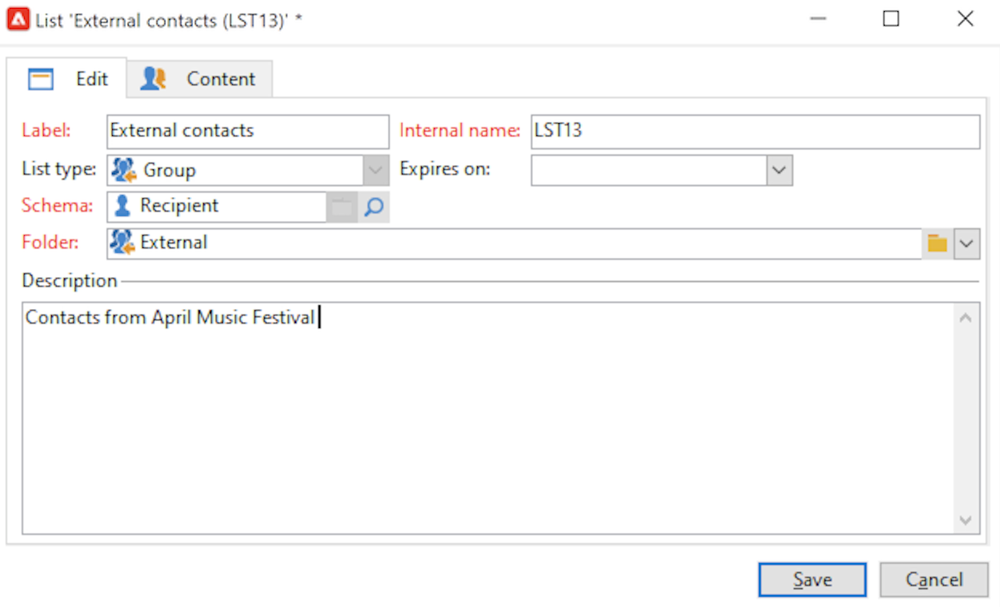

# 在列表中创建受众{#create-segments}

使用Campaign列表创建和组织受众。

列表是一组静态联系人，可在投放操作中定位，或在导入或其他工作流操作期间更新。 例如，通过查询从数据库中提取的群体可以存储为列表。

列表通过 **[!UICONTROL Lists]** 链接 **[!UICONTROL Profiles and targets]** 选项卡。 这些列表基于默认的Adobe Campaign用户档案表(nms:recipient)。 [了解详情](../dev/datamodel.md#ootb-profiles.md)

您可以使用 **更新列表** 活动。 此活动将生成的群体存储到列表中。 使用它可创建新列表或更新现有列表。 要创建包含除内置配置文件表之外其他类型数据的列表，必须运行工作流。 例如，通过在访客表上运行查询并更新列表，您可以创建一个访客列表。[了解详情](#create-a-list-wf)。

请观看此视频，进一步了解Adobe Campaign中的列表管理。

>[!VIDEO](https://video.tv.adobe.com/v/334909?quality=12)

## 创建联系人列表 {#create-a-list-of-contacts}

要创建联系人列表，请执行以下步骤：

1. 单击 **[!UICONTROL Create]** 按钮，选择 **[!UICONTROL New list]**.

   

1. 在列表创建窗口的 **[!UICONTROL Edit]** 选项卡中输入信息。

   

   * 在 **[!UICONTROL Label]** 字段中输入列表名，如有必要，更改內部名称。
   * 添加此列表的描述。
   * 可指定失效日期：达到此日期后，会清空并自动删除此列表。

1. 在 **[!UICONTROL Content]** 选项卡中，单击 **[!UICONTROL Add]** 选择哪些用户档案属于此列表。

   

   您可以创建新配置文件，并使用 **[!UICONTROL Create]** 图标。 该用户档案也会被添加到数据库中。

1. 单击 **[!UICONTROL Save]** 保存列表。然后系统会将其添加到列表概要中。

## 将过滤的联系人转换为列表 {#convert-data-to-a-list}

您可以选择用户档案并将其添加到列表。 要执行此操作，请执行以下步骤：

1. 在Campaign Explorer中，选择用户档案并右键单击。

   可以过滤这些用户档案以满足特定条件。

1. 选择 **[!UICONTROL Actions > Associate selection with a list...]**。

   

1. 选择现有列表或创建新列表，然后单击 **[!UICONTROL Next]**.

   

1. 单击 **[!UICONTROL Start]** 按钮。

   

选择 **[!UICONTROL Recreate the list]** 选项，从列表中删除现有内容并优化列表的创建（无需查询即可验证用户档案是否已链接到列表）。

如果取消选中 **[!UICONTROL No trace of this job is saved in the database]** 选项，您可以选择（或创建）将存储与此进程链接的信息的执行文件夹。

可在窗口的上半部监控该执行过程。可以通过 **[!UICONTROL Stop]** 按钮停止该过程。已处理的联系人将会链接到列表。

执行完成后，访问 **[!UICONTROL Profiles and Targets > Lists]** 菜单，然后选择列表：the **[!UICONTROL Content]** 选项卡会显示链接到此列表的用户档案。

## 使用工作流创建列表  {#create-a-list-wf}

您可以使用 **[!UICONTROL List update]** 活动创建列表或向收件人列表添加群体。

在以下示例中，您会创建一个包含25到40位所有收件人的列表。

1. 选择 **[!UICONTROL Profiles and targets]**&#x200B;和 **[!UICONTROL Targeting workflows]**，然后从创建新工作流 **[!UICONTROL Create]** 按钮。
1. 为此工作流输入标签，例如“25-40联系人”，添加描述，然后单击 **[!UICONTROL Next]**.

   

1. 插入 **[!UICONTROL Query]** 活动，以定义目标群体并编辑查询。

   

1. 定义筛选条件，如下所示：

   

   了解如何在的工作流中创建查询 [Campaign Classicv7文档](https://experienceleague.adobe.com/docs/campaign-classic/using/automating-with-workflows/targeting-activities/query.html#creating-a-query){target=&quot;_blank&quot;}

1. 为此查询添加标签并保存更改。
1. 添加 **[!UICONTROL List update]** ，并对其进行编辑。

   

1. 输入活动的标签。
1. 选择 **[!UICONTROL Create the list if necessary (Computed name)]** 选项，显示执行第一个工作流后将创建列表，然后通过以下执行进行更新。
1. 选择文件夹并输入列表的标签。
1. 选择 **[!UICONTROL Database of the targeting dimension]** 来存储表格。
1. 离开 **[!UICONTROL Purge the list if it exists (otherwise add to the list)]** 选项可删除与定位标准不匹配的收件人，并将新收件人插入到列表中。
1. 另请将 **[!UICONTROL Create or use a list with its own table]** 选项。
1. 离开 **[!UICONTROL Generate an outbound transition]** 选项。
1. 单击 **[!UICONTROL Ok]**，并保存工作流。
1. 启动工作流。

   然后，将创建匹配收件人的列表。 您可以从 **[!UICONTROL Lists]** 主页的条目。

   

   您可以通过向工作流中添加调度程序来定期执行此工作流。 请参阅 [Campaign Classic v7 文档](https://experienceleague.adobe.com/docs/campaign-classic/using/automating-with-workflows/flow-control-activities/scheduler.html){target=&quot;_blank&quot;}以了解详情。

## 从列表中删除用户档案 {#remove-a-profile-from-a-list}

要从列表中删除配置文件，请编辑该列表，在 **[!UICONTROL Content]** ，然后单击 **[!UICONTROL Delete]** 图标。

## 删除用户档案列表 {#delete-a-list-of-profiles}

要删除列表，请从Campaign Explorer浏览到该列表，选择该列表并右键单击。 选择 **[!UICONTROL Delete]**. 警告消息会要求您确认此删除操作。

>[!NOTE]
>
>删除列表时，该列表上的用户档案不受影响，但会更新其用户档案中的数据。
