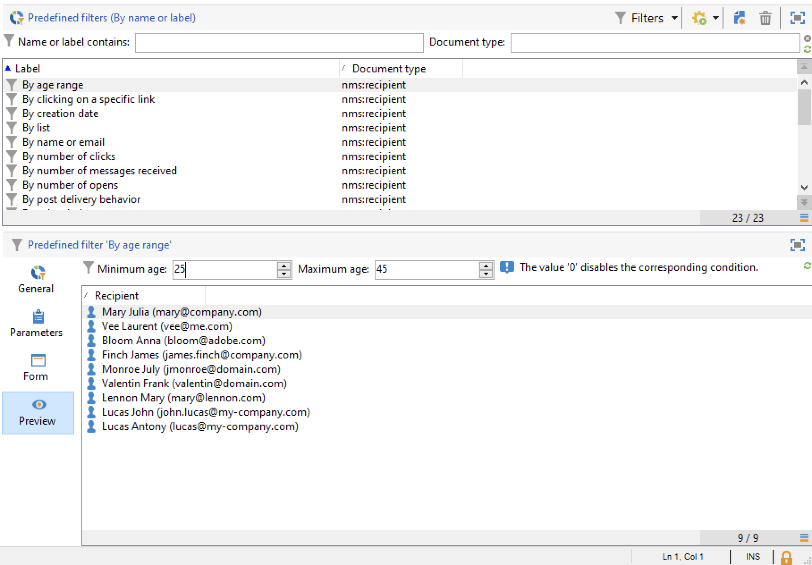
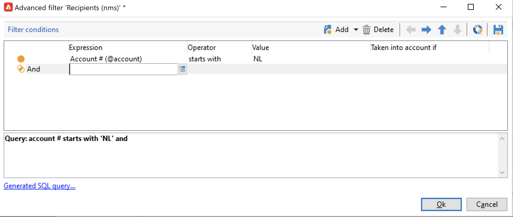

# 创建和管理过滤器{#create-filters}

数据过滤是选择数据集的较小部分（仅限符合特定标准的记录），并将此子集用于特定操作（更新、受众创建）或分析的过程。

从&#x200B;**[!UICONTROL Explorer]**&#x200B;浏览Campaign时，数据会显示在列表中。 您可以使用现有的内置过滤器来访问此数据的特定子集：例如隔离的地址、未定位的收件人、特定年龄范围或创建日期。

您也可以创建自己的过滤器，保存它们以供将来使用或与其他Campaign用户共享。

筛选器配置允许您从列表&#x200B;**[!UICONTROL dynamically]**&#x200B;中选择数据：修改数据时，将更新过滤的数据。

>[!NOTE]
>
>用户界面配置设置在设备级别本地定义。 有时可能有必要清理此数据，尤其是在刷新数据时出现问题的情况下。 为此，请使用&#x200B;**[!UICONTROL File > Clear the local cache]**&#x200B;菜单。

Adobe Campaign中提供了以下类型的过滤器：

## 预定义过滤器{#predefined-filters}

每个列表上方的&#x200B;**筛选器**&#x200B;按钮提供了预定义筛选器。

例如，对于用户档案，以下内置过滤器可用：

您可以在资源管理器的&#x200B;**[!UICONTROL Profiles and Targets > Pre-defined filters]**&#x200B;节点中访问筛选器详细信息。

>[!NOTE]
>
>对于所有其他数据列表，预定义过滤器存储在&#x200B;**[!UICONTROL Administration > Configuration > Predefined filters]**&#x200B;节点中。

选择一个筛选器以显示其定义。

使用最后一个选项卡预览过滤的数据。

内置预定义过滤器包括：

<table> 
 <tbody> 
  <tr> 
   <td> <strong>标签</strong>  </td> 
   <td> <strong>查询</strong>  </td> 
  </tr> 
  <tr> 
   <td> 已打开  </td> 
   <td> 选择已打开投放的收件人。  </td> 
  </tr> 
  <tr> 
   <td> 已打开但未单击  </td> 
   <td> 选择已打开投放但未单击链接的收件人。  </td> 
  </tr> 
  <tr> 
   <td> 不活动的收件人  </td> 
   <td> 选择在X个月内未打开投放的收件人。  </td> 
  </tr> 
  <tr> 
   <td> 按设备类型列出的最后一个活动  </td> 
   <td> 选择在过去Z天内使用设备X单击或打开了投放Y的收件人。  </td> 
  </tr> 
  <tr> 
   <td> 按设备类型（跟踪）列出上次活动  </td> 
   <td> 选择在过去Z天内使用设备X单击或打开了投放Y的收件人。  </td> 
  </tr> 
  <tr> 
   <td> 未定位的收件人  </td> 
   <td> 选择在X个月内从未通过渠道Y进行定位的收件人。  </td> 
  </tr> 
  <tr> 
   <td> 非常活跃的收件人  </td> 
   <td> 选择在过去Y个月内至少点击过投放X次的收件人。  </td> 
  </tr> 
  <tr> 
 <td> 列入阻止列表电子邮件地址  </td> 
    <td> 选择电子邮件地址位于阻止列表上的收件人。  </td>
  </tr> 
  <tr> 
   <td> 隔离的电子邮件地址  </td> 
   <td> 选择其电子邮件地址已被隔离的收件人。  </td> 
  </tr> 
  <tr> 
   <td> 在文件夹 中重复的电子邮件地址 </td> 
   <td> 选择其电子邮件地址在文件夹中重复的收件人。  </td> 
  </tr> 
  <tr> 
   <td> 未打开也未单击  </td> 
   <td> 选择尚未打开投放或单击投放的收件人。  </td> 
  </tr> 
  <tr> 
   <td> 新收件人（天）  </td> 
   <td> 选择最近X天创建的收件人。  </td> 
  </tr> 
  <tr> 
   <td> 新收件人（分钟）  </td> 
   <td> 选择最近X分钟创建的收件人。  </td> 
  </tr> 
  <tr> 
   <td> 新收件人（月）  </td> 
   <td> 选择过去X个月中创建的收件人。  </td> 
  </tr> 
  <tr> 
   <td> 按订阅  </td> 
   <td> 按订阅选择收件人。  </td> 
  </tr> 
  <tr> 
   <td> 通过单击特定链接  </td> 
   <td> 选择点击了投放中特定URL的收件人。  </td> 
  </tr> 
  <tr> 
   <td> 按投递行为  </td> 
   <td> 根据收件人在收到投放后的行为选择收件人。  </td> 
  </tr> 
  <tr> 
   <td> 按创建日期  </td> 
   <td> 按创建日期选择从X个月（当前日期减去n个月）到Y个月（当前日期减去n个月）的期间的收件人。  </td> 
  </tr> 
  <tr> 
   <td> 按列表  </td> 
   <td> 按列表选择收件人。  </td> 
  </tr> 
  <tr> 
   <td> 按点击次数  </td> 
   <td> 选择过去X个月内点击过投放的收件人。  </td> 
  </tr> 
  <tr> 
   <td> 按接收的邮件数  </td> 
   <td> 根据收件人收到的邮件数选择收件人。  </td> 
  </tr> 
  <tr> 
   <td> 按打开次数  </td> 
   <td> 选择在X和Y投放之间打开超过Z时间的收件人。  </td> 
  </tr> 
  <tr> 
   <td> 按名称或电子邮件  </td> 
   <td> 根据收件人的姓名或电子邮件选择收件人。  </td> 
  </tr> 
  <tr> 
   <td> 按年龄范围  </td> 
   <td> 根据收件人的年龄选择收件人。  </td> 
  </tr> 
 </tbody> 
</table>

### 默认筛选器{#default-filters}

每个列表上方的字段允许您对此列表使用&#x200B;**预定义的默认筛选器**。 对于收件人列表，您可以默认根据姓名和电子邮件地址进行筛选。

>[!NOTE]
>
>**%**&#x200B;字符替换任意字符串。 例如，在“电子邮件”字段中输入`%@gmail.com`以显示具有Gmail地址的所有用户档案。 在“姓氏”字段中输入`%@L`以显示其姓氏中带有L的所有用户档案。

要更改收件人列表的默认筛选器，请浏览到&#x200B;**[!UICONTROL Profiles and Targets > Predefined filters]**&#x200B;节点。

对于所有其他类型的数据，通过&#x200B;**[!UICONTROL Administration > Configuration > Predefined filters]**&#x200B;节点配置默认筛选器。

应用以下步骤：

1. 选择您希望默认使用的筛选器。
1. 单击&#x200B;**[!UICONTROL Parameters]**&#x200B;选项卡并选择&#x200B;**[!UICONTROL Default filter for the associated document type]**。

   

1. 为当前默认预定义过滤器取消选中相同选项。
1. 单击&#x200B;**[!UICONTROL Save]**&#x200B;以应用筛选器。
1. 浏览到“收件人”文件夹，然后单击当前筛选器右侧的&#x200B;**[!UICONTROL Remove this filter]**&#x200B;图标：新的默认筛选器可用。
   

## 快速过滤器{#quick-filters}

使用并组合&#x200B;**快速筛选器**&#x200B;以定义特定字段的筛选器。

添加后，快速过滤器字段会逐个显示在数据列表上方。 它们可以相互独立地删除。

快速过滤器特定于每个运算符，每当运算符清除其客户端控制台的缓存时，都会重新初始化快速过滤器。

如果需要重用某个筛选器，请创建一个&#x200B;**高级筛选器**&#x200B;并保存它。 [了解详情](#advanced-filters)。

要创建&#x200B;**快速筛选器**，请执行以下步骤：

1. 右键单击要过滤的字段并选择&#x200B;**[!UICONTROL Filter on this field]**。

   

   默认筛选字段显示在列表上方。

   

1. 选择过滤器选项。
1. 如果需要，请使用过滤器右侧的灰色图标将其删除。
1. 您可以组合过滤器以优化您的过滤器。

   

如果您需要对表单中不可用的字段进行筛选，请在列中筛选，然后对该列进行筛选。 要执行此操作，

1. 单击&#x200B;**[!UICONTROL Configure list]**&#x200B;图标。

   

1. 选择要显示的列，例如收件人的年龄，然后单击&#x200B;**确定**。

   

1. 右键单击收件人列表中的&#x200B;**Age**&#x200B;列，然后选择&#x200B;**[!UICONTROL Filter on this column]**。

   

   然后，您可以选择年龄筛选选项。 在页面中添加其他筛选器以定义范围。

   

## 高级筛选条件{#advanced-filters}

在&#x200B;**高级筛选器**&#x200B;中组合复杂条件。 使用这些筛选器创建复杂查询或数据查询组合。 这些过滤器可以保存并与其他Campaign用户共享。

### 创建高级过滤器{#create-adv-filters}

要创建&#x200B;**高级筛选器**，请单击&#x200B;**[!UICONTROL Filters]**&#x200B;按钮并选择&#x200B;**[!UICONTROL Advanced filter...]**。

您还可以右键单击数据列表并选择&#x200B;**[!UICONTROL Advanced filter...]**。

定义筛选条件。 在下面的示例中，您将筛选其帐号不以NL开头的收件人以及居住在巴黎或洛杉矶的收件人。

1. 单击&#x200B;**[!UICONTROL Expression]**&#x200B;列的&#x200B;**[!UICONTROL Edit expression]**&#x200B;图标。

   

1. 选择要过滤的字段。
1. 从下拉列表中选择要应用的运算符。

   

1. 从&#x200B;**[!UICONTROL Value]**&#x200B;列中选择所需的值。 您可以合并多个筛选器以优化查询。 要添加筛选条件，请单击&#x200B;**[!UICONTROL Add]**。

   

   >[!NOTE]
   >
   >您可以为表达式分配层次结构，也可以使用工具栏箭头更改查询表达式的顺序。

1. 三个运算符可用于组合表达式：**和**、**或**、**Except**。 单击箭头切换到&#x200B;**或**。

   

1. 单击&#x200B;**[!UICONTROL Ok]**&#x200B;以创建筛选器并将其应用于当前列表。

应用的过滤器显示在列表上方。

要编辑或修改此过滤器，请单击列表上蓝色的“描述”链接。

### 保存高级过滤器{#save-adv-filters}

您可以将高级过滤器另存为[预定义过滤器](#predefined-filters)，以便可以重复使用它并与其他Campaign用户共享。

要保存高级过滤器，请执行以下步骤：

1. 单击筛选器的描述可对其进行编辑。
1. 单击窗口右上角的&#x200B;**[!UICONTROL Save as filter]**&#x200B;图标。

   

1. 输入此筛选器的名称并保存。

   

该筛选器已添加到[预定义筛选器](#predefined-filters)。 可以从此节点更新它。

>[!NOTE]
>
>您可以为筛选器添加快捷方式，以从键盘激活它。

此外，收件人列表的预定义过滤器中也提供了此过滤器。

### 使用过滤器定义区段 {#filter-as-segment}

您可以使用和组合过滤器来创建目标群体区段。

保存后，在&#x200B;**[!UICONTROL User filters]**&#x200B;部分中选择消息的目标群体时，可以使用高级过滤器。

>[!NOTE]
>
>使用&#x200B;**[!UICONTROL Exclude recipients from this segment]**&#x200B;仅定向不符合筛选条件的联系人。

### 使用函数构建高级过滤器{#use-functions-adv-filters}

要执行高级筛选功能，请使用函数来定义筛选器的内容。 高级过滤器编辑器可利用Campaign查询编辑器的所有功能。

了解如何在这些端到端示例中构建高级查询：

* 在[此页面](https://experienceleague.adobe.com/docs/campaign/automation/workflows/wf-activities/targeting-activities/query.html?lang=zh-Hans){target="_blank"}中了解如何定位简单的收件人属性。
* 在[此页面](https://experienceleague.adobe.com/docs/campaign/automation/workflows/use-cases/designing-queries/query-many-to-many-relationship.html?lang=zh-Hans){target="_blank"}中了解如何筛选过去7天内未联系的收件人。
* 了解如何在[此页面](https://experienceleague.adobe.com/docs/campaign/automation/workflows/use-cases/designing-queries/create-a-filter.html?lang=zh-Hans){target="_blank"}中按Active帐户筛选操作员列表。
* 在[此页面](https://experienceleague.adobe.com/docs/campaign/automation/workflows/use-cases/deliveries/send-a-birthday-email.html?lang=zh-Hans){target="_blank"}中了解如何构建生日电子邮件受众。

### 预定义过滤器的高级参数 {#param-for-data-filters}

高级参数适用于预定义过滤器。 要访问这些筛选器，请浏览到筛选器的&#x200B;**[!UICONTROL Parameters]**&#x200B;选项卡。

* 要默认显示基于此文档类型的所有列表的筛选器，请选择&#x200B;**[!UICONTROL Default filter for the associated document type]**&#x200B;选项。

  例如，**[!UICONTROL By name or login]**&#x200B;筛选器应用于运算符此选项处于选中状态，因此筛选器始终显示在所有运算符列表中。

* 要使某个过滤器对所有营销活动操作员都可用，请选择&#x200B;**[!UICONTROL Filter shared with other operators]**&#x200B;选项。

* 要定义表单以选择筛选条件，请选择&#x200B;**[!UICONTROL Use parameter entry form]**&#x200B;选项。 必须在&#x200B;**[!UICONTROL Form]**&#x200B;选项卡中以XML格式输入此表单。 例如，收件人列表中提供的内置预定义过滤器&#x200B;**[!UICONTROL Recipients who have opened]**&#x200B;会显示一个过滤器字段，允许您选择将过滤器应用于的投放。

* **[!UICONTROL Advanced parameters]**&#x200B;链接允许您定义其他设置。

   * 您可以将SQL表与过滤器关联，使其对共享该表的所有编辑器通用。
   * 要防止任何用户覆盖该筛选器，请选择&#x200B;**[!UICONTROL Do not restrict the filter]**&#x200B;选项。 例如，此选项对投放向导中可用的“投放的收件人”和“属于文件夹的投放的收件人”过滤器有效。 这些过滤器不能过载。
