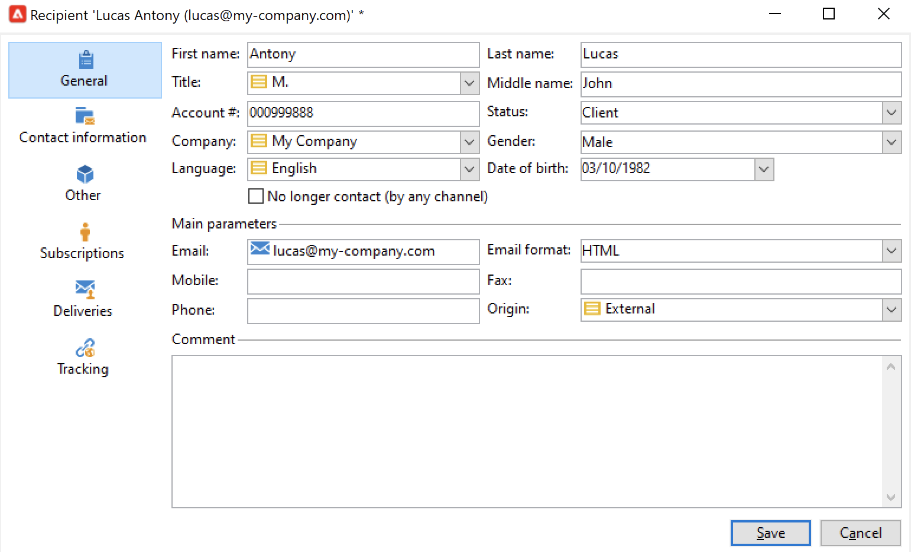

# 手动创建轮廓{#create-profiles-manual}

要填充Campaign数据库，您可以[导入用户档案](import-profiles.md)或手动添加用户档案，如下所述。

要手动创建收件人，请执行以下步骤：

1. 浏览到&#x200B;**[!UICONTROL Profiles and targets]**&#x200B;选项卡并选择&#x200B;**[!UICONTROL Recipients]**&#x200B;类别。

   

   默认情况下，收件人存储在树的&#x200B;**[!UICONTROL Profiles and Targets > Recipients]**&#x200B;节点中。 您还可以从此视图创建收件人。

1. 单击&#x200B;**[!UICONTROL Create button]**。
1. 输入用户档案的数据。

   

   在[此页面](view-profiles.md#edit-a-profiles)中了解有关收件人内置表单的更多信息。

1. 单击&#x200B;**[!UICONTROL Save]**：配置文件已添加到Campaign的默认收件人文件夹中。
