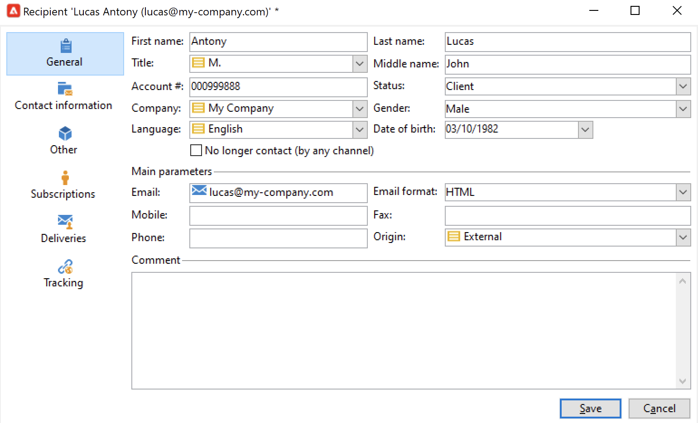

# 手动创建用户档案{#create-profiles-manual}

要填充Campaign数据库，您可以 [导入用户档案](import-profiles.md) 或手动添加它们，如下所述。

要手动创建收件人，请执行以下步骤：

1. 浏览到 **[!UICONTROL Profiles and targets]** 选项卡，然后选择 **[!UICONTROL Recipients]** 类别。

   

   默认情况下，收件人存储在 **[!UICONTROL Profiles and Targets > Recipients]** 树节点。 您还可以从此视图创建收件人。

1. 单击 **[!UICONTROL Create button]**.
1. 输入用户档案的数据。

   

   在中了解有关收件人内置表单的更多信息 [此页面](view-profiles.md#edit-a-profiles).

1. 单击 **[!UICONTROL Save]**：用户档案会添加到Campaign的默认收件人文件夹中。
