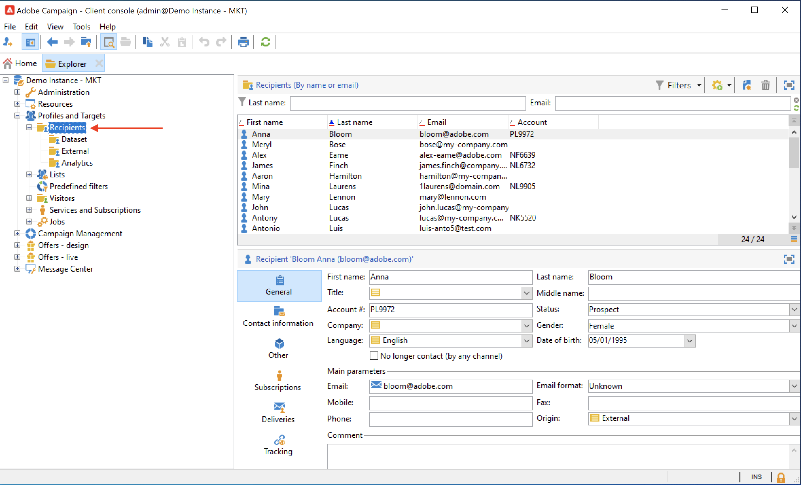

# 轮廓和受众入门{#gs-profiles-and-audiences}

用户档案是存储在Campaign数据库中的联系人，例如客户、服务的订阅者或潜在客户。 有许多可能的机制可获取轮廓并创建此数据库：通过 Web 窗体在线收集、手动或自动导入文本文件、复制公司数据库或其他信息系统的内容。 借助Adobe Campaign，您可以将营销历史、购买信息、偏好、CRM数据和任何相关的PI数据整合到一个整合视图中，以便进行分析并采取行动。 用户档案包含定向、鉴别和跟踪个人所需的所有信息。

配置文件是&#x200B;**nmsRecipient**&#x200B;表或外部表中的记录，用于存储所有配置文件属性，例如名字、姓氏、电子邮件地址、Cookie ID、客户ID、移动标识符或与特定渠道相关的其他信息。 链接到收件人表的其他表包含与用户档案相关的数据，例如投放日志表，其中包含发送给收件人的所有投放的记录。 在[本节](../dev/datamodel.md#ootb-profiles)中了解有关内置用户档案和收件人表的更多信息。

在Adobe Campaign中，**收件人**&#x200B;是发送投放内容（电子邮件、短信等）所定位的默认用户档案。

通过存储在数据库中的收件人数据，您可以筛选将接收任何给定投放的目标，并在投放内容中添加个性化数据。 数据库中还有其他类型的轮廓。 这些用户档案是针对不同用途而设计的。 例如，种子轮廓用于在将投放内容发送给最终目标前测试该投放内容。

要使用配置文件数据填充Adobe Campaign，您可以：

* 从外部数据源（如CRM系统或平面文件）导入[数据文件](../start/import.md)
* [创建Web窗体](../dev/webapps.md)以允许客户输入自己的信息和创建自己的配置文件
* [映射到存储配置文件的外部数据库](../connect/fda.md)
* 在客户端控制台中手动输入配置文件，如下所示：

导入后，您可以创建受众以发送消息。 在本节](create-audiences.md)中了解如何创建受众[。