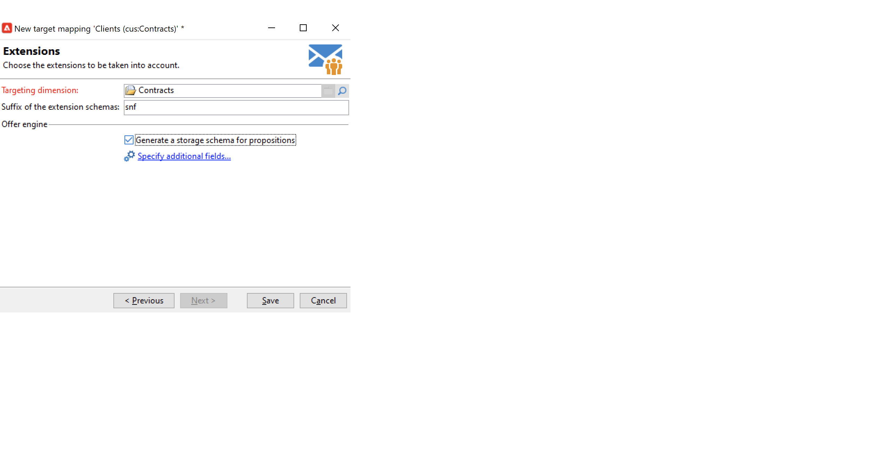

# 使用目标映射{#gs-target-mappings}

默认情况下，投放模板目标 **[!UICONTROL Recipients]**. 因此，其目标映射使用 **nms：recipient** 表格。

您可以为投放使用其他目标映射，也可以创建新的目标映射。

## 内置目标映射 {#ootb-mappings}

Adobe Campaign附带以下内置目标映射：

| 名称 | 使用至 | 架构 |
|---|---|---|
| 收件人 | 发送给收件人（内置收件人表） | nms：recipient |
| 访客 | 向已通过反向链接（病毒式营销）收集用户档案的访客投放，例如。 | mns：visitor |
| 订阅 | 发送给订阅了新闻稿等信息服务的收件人 | nms：subscription |
| 访客订阅 | 向订阅了信息服务的访客投放 | nms：visitorSub |
| 运算符 | 交付到Adobe Campaign操作员 | nms：operator |
| 外部文件 | 通过包含投放所需所有信息的文件投放 | 无链接架构，未输入目标 |

## 创建目标映射 {#new-mapping}

您还可以创建目标映射。 例如，在下列情况下，您可能需要添加自定义目标映射：

* 使用自定义收件人表，
* 可在目标映射屏幕上配置与内置定向维度不同的筛选维度。

在中了解有关自定义收件人表的更多信息 [此页面](../dev/custom-recipient.md).

Adobe Campaign目标映射创建向导可帮助您创建使用自定义目标映射所需的所有架构。

1. 浏览到 **[!UICONTROL Administration]** `>` **[!UICONTROL Campaign Management]** `>` **[!UICONTROL Target mappings]** 来自Adobe Campaign explorer。

1. 创建新的目标映射，并选择自定义架构作为定向维度。

   

1. 指示存储用户档案信息的字段：姓氏、名字、电子邮件、地址等。

   

1. 指定用于信息存储的参数，包括扩展架构的后缀，以便轻松识别它们。

   

   您可以选择是否存储排除项(**excludelog**)，包含消息(**broadlog**)，或者在单独的表中。

   您还可以选择是否管理此投放映射的跟踪(**trackinglog**)。

1. 然后，选择要考虑的扩展。 扩展类型取决于您的Campaign设置和加载项。

   

   单击 **[!UICONTROL Save]** 按钮以启动投放映射创建：根据选定的参数自动创建所有链接表。
