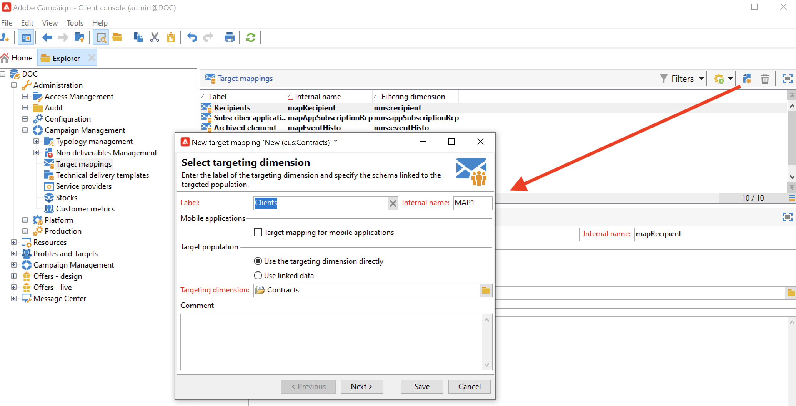

# 使用目标映射{#gs-target-mappings}

默认情况下，投放模板定位 **[!UICONTROL Recipients]**. 因此，其目标映射使用 **nms:recipient** 表。

您可以为投放使用其他目标映射，或创建新的目标映射。

## 内置目标映射 {#ootb-mappings}

Adobe Campaign提供了以下内置目标映射：

| 名称 | 使用 | 架构 |
|---|---|---|
| 收件人 | 发送给收件人（内置收件人表） | nms:recipient |
| 访客 | 将其用户档案通过反向链接（病毒式营销）收集的访客交付给。 | mns:visitor |
| 订阅 | 向订阅新闻稿等信息服务的收件人发送 | nms:subscription |
| 访客订阅 | 向订阅了信息服务的访客提供 | nms:visitorSub |
| 运算符 | 交付给Adobe Campaign运营商 | nms:operator |
| 外部文件 | 通过包含投放所需所有信息的文件进行投放 | 未链接架构，未输入目标 |

## 创建目标映射 {#new-mapping}

您还可以创建目标映射。 例如，在以下情况下，您可能需要添加自定义目标映射：

* 使用自定义收件人表，
* 您可以配置一个与目标映射屏幕上内置定向维度不同的过滤维度。

了解有关 [本页](../dev/custom-recipient.md).

Adobe Campaign target映射创建向导可帮助您创建使用自定义target映射所需的所有架构。

1. 浏览到 **[!UICONTROL Administration]** `>` **[!UICONTROL Campaign Management]** `>` **[!UICONTROL Target mappings]** 从Adobe Campaign资源管理器。

1. 创建新的目标映射，然后选择您的自定义架构作为目标维度。

   

1. 指示存储用户档案信息的字段：姓氏、名字、电子邮件、地址等

   

1. 指定信息存储的参数，包括扩展架构的后缀，以便它们易于识别。

   

   您可以选择是否存储排除项(**排除日志**)，带消息(**broadlog**)或在单独的表中。

   您还可以选择是否管理此投放映射的跟踪(**trackinglog**)。

1. 然后，选择要考虑的扩展。 扩展类型取决于您的Campaign设置和加载项。

   

   单击 **[!UICONTROL Save]** 用于启动投放映射创建的按钮：所有链接的表都会根据所选参数自动创建。
