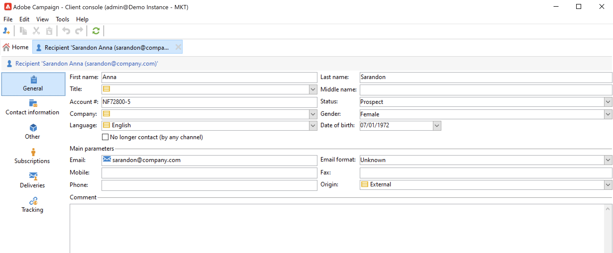

# 查看现有配置文件 {#view-profiles}

浏览到&#x200B;**[!UICONTROL Profiles and targets]**&#x200B;以访问存储在Adobe Campaign数据库中的收件人。

在此页面中，您可以[创建新收件人](create-profiles.md)，编辑现有收件人并访问其个人资料详细信息。

有关更高级的配置文件操作，请从Adobe Campaign主页上的&#x200B;**[!UICONTROL Explorer]**&#x200B;链接访问Campaign树。

>[!CAUTION]
>
>内置的收件人屏幕是通过XML架构及其相关表单定义的。 XML架构存储在Adobe Campaign资源管理器树的&#x200B;**[!UICONTROL Administration > Configuration > Data schemas]**&#x200B;节点中。 只有专家用户才能改变这些模式。
>

## 编辑轮廓 {#edit-a-profiles}

选择配置文件以在新选项卡中显示详细信息。

有关用户档案的数据将分组到选项卡中。 这些选项卡及其内容取决于您的特定设置和已安装的包。

对于典型的内置收件人，您可以访问以下选项卡：

* **[!UICONTROL General]**，适用于所有常规配置文件数据。 特别是，它包含姓氏、名字、电子邮件地址、电子邮件格式等。

  此选项卡还存储配置文件的&#x200B;**选择退出**&#x200B;标记：选择&#x200B;**[!UICONTROL No longer contact (by any channel)]**&#x200B;选项后，配置文件将处于阻止列表。 例如，如果收件人点击了新闻稿中的退订链接，则此信息会添加到联系人数据中。 任何渠道（电子邮件、直邮等）不再定向此类收件人。 有关详细信息，请参见[此页面](../send/quarantines.md)。

* **联系信息**，其中包含所选配置文件的直邮地址。

  您可以在此屏幕中检查地址的质量索引，以及地址包含的错误数。 此信息由直邮提供商根据在之前的投放过程中发现的错误数直接使用，不能手动更改。

* **其他**，用于可以根据您的需求进行个性化填充的特定字段。

  使用&#x200B;**[!UICONTROL Field properties…]**&#x200B;上下文菜单更改字段名称并定义其格式。

  

  输入新设置，如下所示：

  

  在UI中检查更新：

  

  >[!CAUTION]
  >更改适用于所有收件人。
  >

* **订阅**，适用于所有活动的服务订阅。 使用&#x200B;**历史记录**&#x200B;选项卡访问此联系人的订阅和取消订阅的详细信息。

  

  在本节[中了解有关订阅](../start/subscriptions.md)的更多信息。

* 针对所选用户档案的所有投放日志，**投放**。 使用此选项卡可访问联系人的营销历史记录：通过所有渠道针对用户档案的所有投放操作的标签、日期和状态。

* **跟踪**，针对选定配置文件的所有跟踪日志。 此信息用于跟踪投放后的用户档案行为。 此选项卡显示投放中跟踪的所有URL的累积总数。 该列表是可配置的，通常包含：点击的URL、点击的日期和时间，以及包含该URL的文档

  在本节[中了解有关跟踪](../start/tracking.md)的更多信息。
