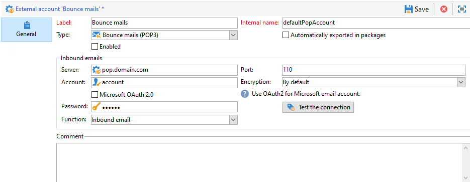

# 配置外部帐户

Adobe Campaign 提供了一组预定义的外部帐户。要设置与外部系统的连接，您可以创建新的外部帐户。

技术工作流或营销策划工作流等技术流程，会使用外部帐户。例如，在工作流中设置文件传输或与任何其他应用程序(Adobe Target、Experience Manager等)进行数据交换时，您需要选择外部帐户。

您可以从Adobe Campaign访问外部帐户 **[!UICONTROL Explorer]**：浏览到 **[!UICONTROL Administration]** `>` **[!UICONTROL Platform]** `>` **[!UICONTROL External accounts]**.

>[!CAUTION]
>
>* 作为托管Cloud Service用户，外部帐户是按Adobe为您的实例配置的，不得修改。
>
>* 在上下文中 [企业(FFDA)部署](../architecture/enterprise-deployment.md)，特定 **[!UICONTROL Full FDA]** (ffda)外部帐户管理Campaign本地数据库与云数据库之间的连接([!DNL Snowflake])。
>

## Campaign特定的外部帐户

Adobe Campaign使用以下技术帐户来启用和执行特定流程。

### 退回邮件 {#bounce-mails-external-account}

>[!NOTE]
>
>从Campaign v8.3开始，提供了适用于POP3功能的Microsoft Exchange Online OAuth 2.0身份验证。要检查您的版本，请参阅 [本节](../start/compatibility-matrix.md#how-to-check-your-campaign-version-and-buildversion).
>

此 **退回邮件** 外部帐户指定要用于连接到电子邮件服务的外部POP3帐户。 所有配置为POP3访问的服务器都可以接收回邮。

在中了解有关入站电子邮件的更多信息 [此页面](https://experienceleague.adobe.com/docs/campaign/automation/workflows/wf-activities/event-activities/inbound-emails.html).

配置 **[!UICONTROL Bounce mails (defaultPopAccount)]** 外部帐户：

* **[!UICONTROL Server]** - POP3服务器的URL。

* **[!UICONTROL Port]** - POP3连接端口号。 默认端口为110。

* **[!UICONTROL Account]**  — 用户的名称。

* **[!UICONTROL Password]**  — 用户帐户密码。

* **[!UICONTROL Encryption]**  — 选择的加密类型，介于 **[!UICONTROL By default]**， **[!UICONTROL POP3 + STARTTLS]**， **[!UICONTROL POP3]** 或 **[!UICONTROL POP3S]**.

  此 **退回邮件** 外部帐户指定要用于连接到电子邮件服务的外部POP3帐户。 所有配置为POP3访问的服务器都可以接收回邮。

* **[!UICONTROL Function]**  — 入站电子邮件或SOAP路由器

>[!CAUTION]
>
>在使用Microsoft OAuth 2.0配置POP3外部帐户之前，您首先需要在Azure门户中注册应用程序。 有关更多信息，请参阅此[页面](https://docs.microsoft.com/en-us/azure/active-directory/develop/quickstart-register-app){target="_blank"}.
>

要使用Microsoft OAuth 2.0配置POP3外部连接，请检查 **[!UICONTROL Microsoft OAuth 2.0]** 并填写以下字段：

* **[!UICONTROL Azure tenant]**  — 可在以下位置找到Azure ID(或目录（租户）ID)： **Essentials** Azure门户中应用程序概述的下拉列表。

* **[!UICONTROL Azure Client ID]**  — 客户端ID(或应用程序（客户端）ID)可以在 **Essentials** Azure门户中应用程序概述的下拉列表。

* **[!UICONTROL Azure Client secret]**  — 客户端密码ID可在 **客户端密钥** 中的列 **证书和密钥** Azure门户中应用程序的菜单。

* **[!UICONTROL Azure Redirect URL]**  — 重定向URL位于 **身份验证** Azure门户中应用程序的菜单。 它应以下列语法结束 `nl/jsp/oauth.jsp`，例如 `https://redirect.adobe.net/nl/jsp/oauth.jsp`.

  输入其他凭据后，您可以单击 **[!UICONTROL Setup the connection]** 以完成外部帐户配置。

### 路由 {#routing}

此 **[!UICONTROL Routing]** 外部帐户允许您根据安装的包配置Adobe Campaign中可用的每个渠道。

### 执行实例 {#execution-instance}

在事务型消息的上下文中，执行实例将链接到控制实例并将它们连接起来。 将事务性消息模板部署到执行实例。 在中了解有关消息中心架构的更多信息 [此页面](../architecture/architecture.md#transac-msg-archi).

## 访问外部系统外部帐户

* **外部数据库（联合数据访问）** - **外部数据库** 类型外部帐户用于通过联合数据访问(FDA)连接到外部数据库。 要了解有关联合数据访问(FDA)选项的更多信息，请参阅 [本节](../connect/fda.md).

  与Adobe Campaign v8兼容的外部数据库列在 [兼容性矩阵](../start/compatibility-matrix.md)

* **twitter** - **twitter** type external account用于将Campaign连接到您的twitter帐户，以代表您发布消息。 在中了解有关Twitter集成的更多信息 [本节](../connect/ac-tw.md).

## Adobe解决方案集成外部帐户

* **Adobe Experience Cloud** - **[!UICONTROL Adobe Experience Cloud]** 外部帐户用于实施AdobeIdentity Management服务(IMS)以连接到Adobe Campaign。 在中了解有关AdobeIdentity Management服务(IMS)的更多信息 [本节](../start/connect.md#logon-to-ac).

* **网站分析** - **[!UICONTROL Web Analytics (Adobe Analytics)]** 外部帐户用于配置从Adobe Analytics到Adobe Campaign的数据传输。 在中详细了解Adobe Campaign - Adobe Analytics集成 [此页面](../connect/ac-aa.md).

* **Adobe Experience Manager** - **[!UICONTROL AEM]** 外部帐户允许您直接在Adobe Experience Manager中管理电子邮件投放和表单的内容。 在中详细了解Adobe Campaign - Adobe Analytics集成 [此页面](../connect/ac-aem.md).

## CRM连接器外部帐户

* **Microsoft Dynamics CRM** - **[!UICONTROL Microsoft Dynamics CRM]** 外部帐户允许您将Microsoft Dynamics数据导入和导出到Adobe Campaign。 在中详细了解Adobe Campaign - Microsoft Dynamics CRM集成 [此页面](../connect/ac-ms-dyn.md).

* **Salesforce.com** - **[!UICONTROL Salesforce CRM]** 外部帐户允许您将Salesforce数据导入和导出到Adobe Campaign中。 详细了解Adobe Campaign - Salesforce.com CRM集成，位于 [此页面](../connect/ac-sfdc.md).

## 传输数据外部帐户

这些外部帐户可用于通过以下方式将数据导入或导出到Adobe Campaign **[!UICONTROL Transfer file]** 工作流活动。 了解有关 **文件传输** 在的工作流中 [此页面](https://experienceleague.adobe.com/docs/campaign/automation/workflows/wf-activities/event-activities/file-transfer.html).

* **FTP和SFTP** - **FTP** 外部帐户允许您配置和测试对Adobe Campaign外部服务器的访问。 要与外部系统（如用于文件传输的SFTP或FTP服务器898）建立连接，您可以创建自己的外部帐户。

  为此，请在此外部帐户中指定用于建立与SFTP或FTP服务器连接的地址和凭据。

  >[!NOTE]
  >
  >从版本8.5开始，您现在可以在配置SFTP外部帐户时使用私钥安全进行身份验证。 [了解有关密钥管理的更多信息](https://experienceleague.adobe.com/docs/control-panel/using/sftp-management/key-management.html)

* **Amazon Simple Storage Service (S3)** - **AWS S3** connector可用于使用以下工具将数据导入或导出Adobe Campaign **[!UICONTROL Transfer file]** 工作流活动。 在设置此新外部帐户时，您需要提供以下详细信息：

   * **[!UICONTROL AWS S3 Account Server]**：服务器的URL，填充如下：   `<S3bucket name>.s3.amazonaws.com/<s3object path>`

   * **[!UICONTROL AWS access key ID]**：了解如何在中查找您的AWS访问密钥ID [Amazon文档](https://docs.aws.amazon.com/general/latest/gr/aws-sec-cred-types.html#access-keys-and-secret-access-keys){target="_blank"}.

   * **[!UICONTROL Secret access key to AWS]**：了解如何在中查找AWS的秘密访问密钥 [Amazon文档](https://aws.amazon.com/fr/blogs/security/wheres-my-secret-access-key/){target="_blank"}.

   * **[!UICONTROL AWS Region]**：在中详细了解AWS地区 [Amazon文档](https://aws.amazon.com/about-aws/global-infrastructure/regions_az/){target="_blank"}.

   * 此 **[!UICONTROL Use server side encryption]** 复选框允许您以S3加密模式存储文件。 了解如何在中查找访问密钥ID和访问密钥 [Amazon文档](https://docs.aws.amazon.com/general/latest/gr/aws-sec-cred-types.html#access-keys-and-secret-access-keys){target="_blank"}.

* **Azure Blob存储** - **Azure** 外部帐户可用于使用以下方式将数据导入或导出到Adobe Campaign **[!UICONTROL Transfer file]** 工作流活动。 配置 **Azure** 要与Adobe Campaign配合使用，您需要提供以下详细信息：

   * **[!UICONTROL Server]**：Azure Blob Storage服务器的URL。

   * **[!UICONTROL Encryption]**：加密类型，介于 **[!UICONTROL None]** 或 **[!UICONTROL SSL]**.

   * **[!UICONTROL Access key]**：了解如何查找您的 **[!UICONTROL Access key]** 在 [Microsoft文档](https://docs.microsoft.com/en-us/azure/storage/common/storage-account-keys-manage?tabs=azure-portal){target="_blank"}.
