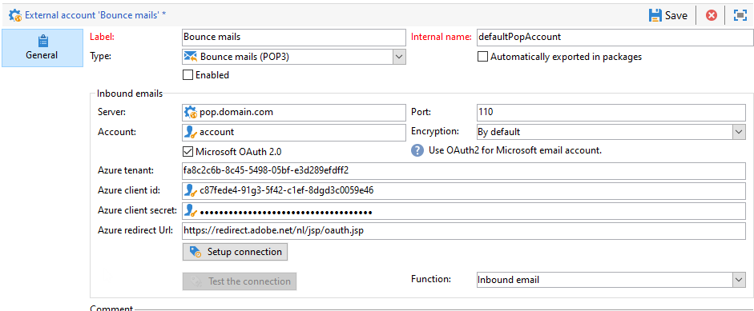

# 配置外部帐户

Adobe Campaign 提供了一组预定义的外部帐户。要设置与外部系统的连接，您可以创建新的外部帐户。

技术工作流或营销策划工作流等技术流程，会使用外部帐户。例如，在工作流中设置文件传输或与任何其他应用程序(Adobe Target、Experience Manager等)进行数据交换时，您需要选择外部帐户。

您可以从Adobe Campaign访问外部帐户 **[!UICONTROL Explorer]**:浏览 **[!UICONTROL Administration]** `>` **[!UICONTROL Platform]** `>` **[!UICONTROL External accounts]**.


>[!CAUTION]
>
>在 [企业(FFDA)部署](../architecture/enterprise-deployment.md)，特定 **[!UICONTROL Full FDA]** (ffda)外部帐户管理Campaign本地数据库与云数据库([!DNL Snowflake])。
>
>作为托管Cloud Services用户，外部帐户是按Adobe为您的实例配置的，不得修改。

## 特定于促销活动的外部帐户

Adobe Campaign使用以下技术帐户来启用和执行特定进程。

  作为托管Cloud Services用户，Adobe会为您配置所有特定于促销活动的外部帐户。

### 退回邮件 {#bounce-mails-external-account}

>[!NOTE]
>
>从Campaign v8.3开始，提供了Microsoft Exchange Online OAuth 2.0的POP3身份验证功能。要检查您的版本，请参阅 [此部分](../start/compatibility-matrix.md#how-to-check-your-campaign-version-and-buildversion)

的 **退回邮件** 外部帐户指定用于连接到电子邮件服务的外部POP3帐户。 为POP3访问配置的所有服务器都可用于接收回信。

详细了解 [本页](https://experienceleague.adobe.com/docs/campaign/automation/workflows/wf-activities/event-activities/inbound-emails.html)


配置 **[!UICONTROL Bounce mails (defaultPopAccount)]** 外部帐户：

* **[!UICONTROL Server]**

   POP3服务器的URL。

* **[!UICONTROL Port]**

   POP3连接端口号。 默认端口为110。

* **[!UICONTROL Account]**

   用户的名称。

* **[!UICONTROL Password]**

   用户帐户密码。

* **[!UICONTROL Encryption]**

   之间选择的加密类型 **[!UICONTROL By default]**, **[!UICONTROL POP3 + STARTTLS]**, **[!UICONTROL POP3]** 或 **[!UICONTROL POP3S]**.
的 **退回邮件** 外部帐户指定用于连接到电子邮件服务的外部POP3帐户。 为POP3访问配置的所有服务器都可用于接收回信。

* **[!UICONTROL Function]**

   入站电子邮件或SOAP路由器



>[!IMPORTANT]
>
>在使用Microsoft OAuth 2.0配置POP3外部帐户之前，您首先需要在Azure门户中注册应用程序。 有关详细信息，请参见此 [ 页面](https://docs.microsoft.com/en-us/azure/active-directory/develop/quickstart-register-app)。

要使用Microsoft OAuth 2.0配置外部POP3，请检查 **[!UICONTROL Microsoft OAuth 2.0]** ，并填写以下字段：

* **[!UICONTROL Azure tenant]**

   可以在 **要点** Azure门户中应用程序概述的下拉列表。

* **[!UICONTROL Azure Client ID]**

   可以在 **要点** Azure门户中应用程序概述的下拉列表。

* **[!UICONTROL Azure Client secret]**:

   可以在 **客户端密钥** 列 **证书和密钥** Azure门户中的应用程序菜单。

* **[!UICONTROL Azure Redirect URL]**:

   可在 **身份验证** Azure门户中的应用程序菜单。 它应该以以下语法结尾 `nl/jsp/oauth.jsp`，例如 `https://redirect.adobe.net/nl/jsp/oauth.jsp`.

输入不同的凭据后，您可以单击 **[!UICONTROL Setup the connection]** 完成外部帐户配置。

### 路由 {#routing}

的 **[!UICONTROL Routing]** 外部帐户允许您根据安装的包配置Adobe Campaign中可用的每个渠道。

>[!CAUTION]
>
>的 **[!UICONTROL Internal email delivery routing]** (defaultEmailBulk)外部帐户 **必须** 在Adobe Campaign v8中启用。

### 执行实例 {#execution-instance}

在事务型消息传递的上下文中，执行实例链接到控制实例并连接它们。 事务型消息模板将部署到执行实例。

 了解有关 [本页](../architecture/architecture.md#transac-msg-archi).

## 访问外部系统外部帐户

* **外部数据库（联合数据访问）**

   的 **外部数据库** 类型外部帐户用于通过联合数据访问(FDA)连接到外部数据库。

   与Adobe Campaign v8兼容的外部数据库列在 [兼容性矩阵](../start/compatibility-matrix.md)

    在 [此部分](../connect/fda.md).

* **Twitter**

   的 **Twitter** 键入外部帐户，将Campaign连接到您的twitter帐户，并代表您发布消息。

    进一步了解Twitter集成 [此部分](../connect/ac-tw.md).

## Adobe解决方案集成外部帐户

* **Adobe Experience Cloud**

   的 **[!UICONTROL Adobe Experience Cloud]** 外部帐户用于实施AdobeIdentity Management服务(IMS)以连接到Adobe Campaign。

    在中了解有关AdobeIdentity Management服务(IMS)的更多信息 [此部分](../start/connect.md#connect-ims).

* **网络分析**

   的 **[!UICONTROL Web Analytics (Adobe Analytics)]** 外部帐户用于配置从Adobe Analytics到Adobe Campaign的数据传输。

    进一步了解Adobe Campaign - Adobe Analytics集成 [本页](../connect/ac-aa.md).

* **Adobe Experience Manager**

   的 **[!UICONTROL AEM]** 外部帐户允许您直接在Adobe Experience Manager中管理电子邮件投放内容和表单。

    进一步了解Adobe Campaign - Adobe Analytics集成 [本页](../connect/ac-aem.md).


## CRM连接器外部帐户

* **Microsoft Dynamics CRM**

   的 **[!UICONTROL Microsoft Dynamics CRM]** 外部帐户允许您将Microsoft Dynamics数据导入和导出到Adobe Campaign。

    进一步了解Adobe Campaign - Microsoft Dynamics CRM集成 [本页](../connect/ac-ms-dyn.md).

* **Salesforce.com**

   的 **[!UICONTROL Salesforce CRM]** 外部帐户允许您将Salesforce数据导入和导出到Adobe Campaign。

    进一步了解Adobe Campaign - Salesforce.com中的CRM集成 [本页](../connect/ac-sfdc.md).

## 传输数据外部帐户

这些外部帐户可用于使用 **[!UICONTROL Transfer file]** 工作流活动。

了解有关 [本页](https://experienceleague.adobe.com/docs/campaign/automation/workflows/wf-activities/event-activities/file-transfer.html)

* **FTP和SFTP**

   的 **FTP** 外部帐户允许您配置和测试对Adobe Campaign以外服务器的访问权限。 要设置与外部系统（如用于文件传输的SFTP或FTP服务器898）的连接，您可以创建自己的外部帐户。
为此，请在此外部帐户中指定用于建立与SFTP或FTP服务器连接的地址和凭据。

* **Amazon Simple Storage Service(S3)**

   的 **AWS S3** 连接器可用于通过 **[!UICONTROL Transfer file]** 工作流活动。 在设置此新外部帐户时，您需要提供以下详细信息：

   * **[!UICONTROL AWS S3 Account Server]**:服务器的URL，填写如下：   ```<S3bucket name>.s3.amazonaws.com/<s3object path>```

   * **[!UICONTROL AWS access key ID]**:了解如何在 [Amazon文档](https://docs.aws.amazon.com/general/latest/gr/aws-sec-cred-types.html#access-keys-and-secret-access-keys){target=&quot;_blank&quot;}。

   * **[!UICONTROL Secret access key to AWS]**:了解如何在 [Amazon文档](https://aws.amazon.com/fr/blogs/security/wheres-my-secret-access-key/){target=&quot;_blank&quot;}。

   * **[!UICONTROL AWS Region]**:详细了解AWS地区 [Amazon文档](https://aws.amazon.com/about-aws/global-infrastructure/regions_az/){target=&quot;_blank&quot;}。

   * 的 **[!UICONTROL Use server side encryption]** 复选框允许您以S3加密模式存储文件。 了解如何在 [Amazon文档](https://docs.aws.amazon.com/general/latest/gr/aws-sec-cred-types.html#access-keys-and-secret-access-keys){target=&quot;_blank&quot;}。

* **Azure Blob Storage**

   的 **Azure** 外部帐户可用于使用 **[!UICONTROL Transfer file]** 工作流活动。 配置 **Azure** 要与Adobe Campaign配合使用的外部帐户，您需要提供以下详细信息：

   * **[!UICONTROL Server]**:您的Azure Blob存储服务器的URL。

   * **[!UICONTROL Encryption]**:之间的加密类型 **[!UICONTROL None]** 或 **[!UICONTROL SSL]**.

   * **[!UICONTROL Access key]**:了解如何查找 **[!UICONTROL Access key]** in [Microsoft文档](https://docs.microsoft.com/en-us/azure/storage/common/storage-account-keys-manage?tabs=azure-portal){target=&quot;_blank&quot;}。
