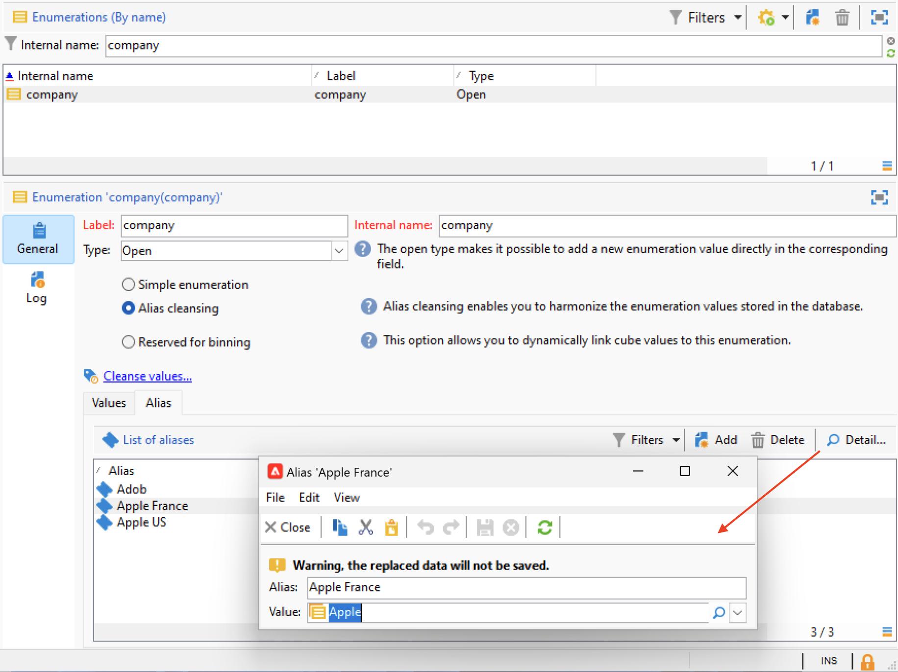

# Campaign用户界面设置 {#ui-settings}

## 明细列表 {#enumerations}

明细列表（也称为“明细列表”）是系统建议用于填充字段的值列表。 使用枚举来标准化这些字段的值，帮助进行数据输入或在查询中使用。

值列表将显示为一个下拉列表，您可以从中选择要在字段中输入的值。 下拉列表还支持预测输入：输入前几个字母，应用程序将填写其余字母。

已定义此类型字段的值，并通过 **[!UICONTROL Administration > Platform > Enumerations]** 树的节点。

### 枚举类型 {#types-of-enum}

枚举存储在 **[!UICONTROL Administration > Platform > Enumerations]** 文件夹。

它们可以是：打开、系统、表情符号或关闭。

* 安 **打开** 枚举允许用户根据此枚举直接在字段中添加新值。
* A **已关闭** 枚举具有一个固定的值列表，这些值只能从 **[!UICONTROL Administration > Platform > Enumerations]** 文件夹。
* 安 **表情符号** 枚举用于更新表情符号列表。 了解详情
* A **系统** 枚举与系统字段关联，并且具有内部名称。

对于 **打开** 和 **已关闭** 枚举、特定选项可用：

* **简单枚举** 是默认的标准类型。
* **别名清理** 枚举用于协调存储在数据库中的枚举值。 [了解详情](#alias-cleansing)
* **保留用于绑定** 是用于将多维数据集值链接到此枚举的选项。 [了解详情](../reporting/gs-cubes.md)

### 别名清理 {#alias-cleansing}

在枚举字段中，您可以选择一个值，或输入一个在下拉列表中不可用的自定义值。 可以将自定义值作为新枚举值添加到现有枚举值中，在本例中， **[!UICONTROL Open]** 选项。 可以使用别名清理功能清理这些自定义值。 例如，如果用户输入 `Adob` 而不是 `Adobe`，别名清理过程可以自动用正确的术语替换它。

>[!CAUTION]
>
>数据清理是影响数据库中数据的关键过程。 Adobe Campaign会进行批量数据更新，这可能会导致某些值被删除。 因此，此操作是专家用户专用的。

启用 **[!UICONTROL Alias cleansing]** 选项来对枚举使用数据清理功能。 选择此选项后， **[!UICONTROL Alias]** 选项卡。

当用户输入的值在别名清理枚举中不存在时，该值会添加到 **值** 列表。 您可以 [从这些值创建别名](#convert-to-alias)或 [从头开始创建新别名](#create-alias).

#### 创建别名{#create-alias}

要创建别名，请执行以下步骤：

1. 单击 **[!UICONTROL Add]** 按钮 **[!UICONTROL Alias]** 选项卡。
1. 输入要转换的别名，然后选择要在下拉列表中应用的值。

   

1. 单击 **[!UICONTROL Ok]** 确认。

1. 保存更改。值的替换由 **别名清理** 工作流，每晚执行。 请参阅 [运行数据清理](#running-data-cleansing).

对于基于此枚举的所有字段，当用户输入值时 **Adobe** 在“公司”字段(在Adobe Campaign控制台中，在Web窗体中)中，该字段将自动替换为值 **Adobe**.

#### 将错误值转换为别名{#convert-to-alias}

您还可以将现有枚举值转换为别名。 要执行此操作，请执行以下操作：

1. 在枚举的值列表中，右键单击并浏览 **[!UICONTROL Actions... > Convert values into aliases...]**.

   

1. 选择要以别名转换的值，然后单击 **[!UICONTROL Next]**.
1. 单击 **[!UICONTROL Start]** 以运行转化。

   执行完成后，别名将添加到 **别名** 选项卡。 您可以关联正确的值以替换错误的条目。 要执行此操作，请执行以下操作：

1. 选择要清理的值。
1. 单击 **细节……** 按钮。
1. 在下拉列表中选择新值。

   

>[!CAUTION]
>
>您可以在 **[!UICONTROL Hits]** 列 **[!UICONTROL Alias]** 子选项卡。 它可显示输入此值的次数。  [了解详情](#calculate-entry-occurrences)。

#### 运行数据清理 {#running-data-cleansing}

数据清理由 **[!UICONTROL Alias cleansing]** 技术工作流。 默认情况下，每天执行一次。

还可以通过 **[!UICONTROL Cleanse values...]** 链接。

的 **[!UICONTROL Advanced parameters...]** 链接允许您设置开始考虑收集值的日期。

单击 **[!UICONTROL Start]** 按钮来运行数据清理。

##### 监控发生次数 {#calculate-entry-occurrences}

的 **[!UICONTROL Alias]** 枚举的子选项卡可显示在输入的所有值中出现别名的次数。 此信息是估计值，将显示在 **[!UICONTROL Hits]** 列。

>[!CAUTION]
>
>计算别名条目发生次数可能需要很长时间。

您可以通过 **[!UICONTROL Cleanse values...]** 链接。 为此，请单击 **[!UICONTROL Advanced parameters...]** 链接并选择选项。

* **[!UICONTROL Update the number of alias hits]**:这允许您根据输入的日期更新已计算的点击量。
* **[!UICONTROL Recalculate the number of alias hits from the start]**:允许您在整个Adobe Campaign平台上运行计算。

您还可以创建专用工作流，以便计算在给定时间段内自动运行，例如每周运行一次。

为此，请创建 **[!UICONTROL Alias cleansing]** 工作流中，更改调度程序，并在 **[!UICONTROL Enumeration value cleansing]** 活动：

* **-updateHits** 要更新别名点击数，
* **-updateHits:full** 重新计算所有别名点击。
