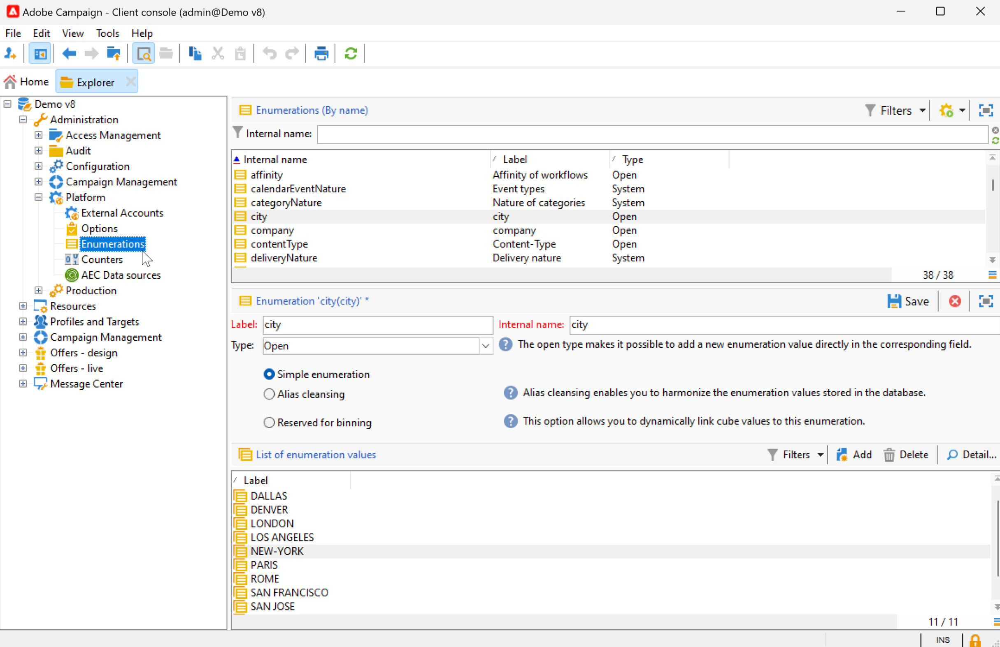

# Campaign使用者介面設定 {#ui-settings}

## 默认单位 {#default-units}

在Adobe Campaign中，對於表示持續時間的欄位（例如資源的有效期、任務的核准截止日期等），值可以表示為以下內容 **件數**：

* **[!UICONTROL s]** 代表秒數
* **[!UICONTROL mn]** 代表分鐘
* **[!UICONTROL h]** 代表小時
* **[!UICONTROL d]** 代表天數

## 自訂Campaign Explorer{#customize-explorer}

您可以將資料夾新增至Campaign Explorer、建立檢視及指派許可權。

瞭解如何在中管理資料夾和檢視 [此頁面](../audiences/folders-and-views.md)

## 管理和自訂清單{#customize-lists}

在Campaign使用者端主控台中，資料會顯示在清單中。 您可以根據自己的需求調整這些清單。 例如，您可以新增欄、篩選資料、計算記錄、儲存和共用您的設定。

此外，您也可以建立和儲存篩選器。  進一步瞭解中的篩選器 [此頁面](../audiences/create-filters.md).

### 記錄數 {#number-of-records}

默认情况下，Adobe Campaign 会加载列表的前 200 条记录。这意味着不一定会显示您所查看的数据库表的所有记录。您可以统计列表中的记录数量并加载更多记录。

在列表屏幕的右下角，**计数器**&#x200B;会显示已加载的记录数，以及数据库中的记录总数（应用任何过滤器之后的记录数）：

如果出現問號而不是右側的數字，例如 `240/?`，按一下計數器以啟動計算。

若要載入及顯示其他記錄，請按一下 **[!UICONTROL Continue loading]**. 預設會載入200筆記錄。 若要變更要載入的預設記錄數，請使用 **[!UICONTROL Configure list]** 圖示填入清單的右下角。 在清單組態視窗中，按一下 **[!UICONTROL Advanced parameters]** （左下方）並變更要擷取的行數。

要加载所有记录，可右键单击列表，然后选择 **[!UICONTROL Load all]**。

>[!CAUTION]
>
>當清單包含大量記錄時，完整載入可能需要一些時間。

### 新增和移除欄 {#add-columns}

對於每個清單，內建欄配置可以調整為顯示更多資訊或隱藏未使用的欄。

當資料顯示在記錄的詳細資訊中時，以滑鼠右鍵按一下欄位並選取 **[!UICONTROL Add in the list]**.

该列会添加到现有列的右侧。

您也可以使用清單設定畫面來新增及移除欄：

1. 從記錄清單中，按一下 **[!UICONTROL Configure list]** 圖示加以檢視。
1. 連按兩下要新增到中的欄位 **[!UICONTROL Available fields]** 清單：新增至 **[!UICONTROL Output columns]** 清單。

   

   >[!NOTE]
   >
   >默认不会显示高级字段。若要顯示，請按一下 **顯示進階欄位** 圖示，位於可用欄位清單的右下角。
   >
   >通过具体图标标识各字段：SQL 字段、链接的表、已计算字段等。针对选中的每个字段，在可用字段的列表下会显示其说明。

1. 使用上/下箭頭來修改 **顯示順序**.

1. 单击 **[!UICONTROL OK]** 确认配置并显示结果。

如果您需要移除欄，請選取該欄並按一下 **垃圾桶** 圖示。

您可以使用 **[!UICONTROL Distribution of values]** 圖示來檢視目前資料夾中所選欄位的值重新分割。

### 新建列 {#create-a-new-column}

您可以创建新的列来显示列表中的其他字段。

若要建立欄，請遵循下列步驟：

1. 從記錄清單中，按一下 **[!UICONTROL Configure list]** 圖示加以檢視。
1. 按一下 **[!UICONTROL Add]** 圖示以在清單中顯示新欄位。
1. 設定欄位以新增到欄中。

### 在子資料夾中顯示資料 {#display-sub-folders-records}

列表可显示：

* 所選資料夾中包含的所有記錄（預設）
* 所選資料夾及其子資料夾中包含的所有記錄

若要從一個顯示模式切換至另一個顯示模式，請按一下 **[!UICONTROL Display sub-levels]** （在「促銷活動」工具列中）。

### 儲存清單設定 {#saving-a-list-configuration}

清單設定是在本機為每個使用者定義的。 清空本地缓存时，本地配置被禁用。

依預設，設定引數會套用至具有對應資料夾型別的所有清單。 當您修改從資料夾顯示收件者清單的方式時，此設定會套用至所有其他收件者資料夾。

您可以儲存多個要套用至相同型別之不同資料夾的設定。 该配置会随包含数据的文件夹的属性一同保存，并可重新应用。

若要儲存清單設定以便重複使用，請遵循下列步驟：

1. 在檔案總管中，以滑鼠右鍵按一下包含所顯示資料的資料夾。
1. 选择 **[!UICONTROL Properties]**。
1. 按一下 **[!UICONTROL Advanced settings]** 然後在中指定名稱 **[!UICONTROL Configuration]** 欄位。
1. 按一下 **[!UICONTROL OK]** 然後按一下 **[!UICONTROL Save]**.

然後，您可以將此設定套用至相同型別的任何其他資料夾。 進一步瞭解中的資料夾 [此頁面](../audiences/folders-and-views.md).

### 匯出清單 {#exporting-a-list}

要从列表中导出数据，必须使用导出向导。要启动此向导，可从列表中选择要导出的元素，右键单击它后选择 **[!UICONTROL Export...]**。

<!--The use of the import and export functions is explained in [Generic imports and exports](../../platform/using/about-generic-imports-exports.md).-->

>[!CAUTION]
>
>不得使用“复制/粘贴”功能从列表中导出元素。

### 排序清單 {#sorting-a-list}

列表中可包含大量的数据。您可以排序这些数据，或者应用简单或高级过滤器。利用排序，您可以按升序或降序顺序显示数据。您可以利用过滤器来定义并组合各种标准，从而仅显示所选的数据。

单击列标题可应用升序或降序排序，或者取消数据排序。正在使用的排序状态和排序顺序会在列标签前方以蓝色箭头表示。列标签前方的红色破折号表示该排序已应用到数据库中已建立索引的数据。此排序方法用于优化排序作业。

此外也可以配置排序或组合排序标准。为此请执行以下操作步骤：

1. **[!UICONTROL Configure list]** 在清單右下方。
1. 在列表配置窗口中，单击 **[!UICONTROL Sorting]** 选项卡。
1. 选择要排序的字段以及排序方向（升序或降序）。
1. 排序优先级通过排序列的顺序来定义。要改变优先级，可使用适当的图标改变各列的顺序。

   排序优先级不会影响列表中各类的显示情况。

1. 单击 **[!UICONTROL Ok]** 确认此配置，并在列表中显示结果。

## 使用分項清單 {#enumerations}

分項清單（也稱為「分項清單」）是系統建議用來填入欄位的值清單。 使用列舉來標準化這些欄位的值，有助於資料輸入或在查詢中使用。

值清單會以下拉式清單的形式顯示，您可以從中選取要在欄位中輸入的值。 下拉式清單也會啟用預測性輸入：輸入第一個字母，應用程式會填入其餘字母。

此類欄位的值已定義，透過 **[!UICONTROL Administration > Platform > Enumerations]** 樹狀結構的節點。

### 分項清單的型別 {#types-of-enum}

分項清單儲存在 **[!UICONTROL Administration > Platform > Enumerations]** 檔案夾。

它們可以是：開放、系統、表情符號或封閉。

* 一個 **開啟** 列舉可讓使用者根據此列舉直接在欄位中新增值。
* A **已關閉** 分項清單有固定的值清單，只能從 **[!UICONTROL Administration > Platform > Enumerations]** 檔案夾。
* 一個 **表情符號** 列舉用於更新表情符號清單。 了解详情
* A **系統** 分項清單與系統欄位相關聯，且帶有內部名稱。

對象 **開啟** 和 **已關閉** 列舉、特定選項可供使用：

* **簡單分項清單** 是預設標準型別。
* **別名清除** 列舉可用來協調資料庫中儲存的列舉值。 [了解详情](#alias-cleansing)
* **保留供量化** 是可將立方體值連結至此分項清單的選項。 [了解详情](../reporting/gs-cubes.md)

### 別名清除 {#alias-cleansing}

在分項清單欄位中，您可以選取值，或輸入下拉式清單中無法使用的自訂值。 自訂值可以新增到現有的列舉值中，作為新的列舉值 — 在此案例中，是 **[!UICONTROL Open]** 必須選取選項。 可使用別名清除功能來清除這些自訂值。 例如，如果使用者輸入 `Adob` 而非 `Adobe`，別名清除程式可自動以正確的字詞取代。

>[!CAUTION]
>
>資料清除是影響資料庫中資料的重要程式。 Adobe Campaign會執行大量資料更新，這可能會導致某些值被刪除。 因此，這項操作是保留給專家使用者使用。

啟用 **[!UICONTROL Alias cleansing]** 選項來使用列舉的資料清除功能。 選取此選項時， **[!UICONTROL Alias]** 標籤會顯示在視窗底部。

當使用者輸入的值不存在別名清除分項清單中時，則會將其新增到 **值** 清單。 您可以 [從這些值建立別名](#convert-to-alias)，或 [從頭開始建立新別名](#create-alias).

#### 建立別名{#create-alias}

若要建立別名，請遵循下列步驟：

1. 按一下 **[!UICONTROL Add]** 的按鈕 **[!UICONTROL Alias]** 標籤。
1. 輸入您要轉換的別名，然後在下拉式清單中選取要套用的值。

   

1. 按一下 **[!UICONTROL Ok]** 並確認。

1. 保存您的更改。值的取代是由 **別名清除** 每晚執行的工作流程。 請參閱 [執行資料清除](#running-data-cleansing).

對於所有根據此分項清單的欄位，當使用者輸入值時 **Adobe** 在「公司」欄位中(在Adobe Campaign主控台的Web表單中)，該值會自動被取代 **Adobe**.

#### 將錯誤值轉換為別名{#convert-to-alias}

您也可以將現有的列舉值轉換為別名。 若要執行此動作：

1. 在分項清單的值清單中，按一下滑鼠右鍵並瀏覽至 **[!UICONTROL Actions... > Convert values into aliases...]**.

   

1. 選取要轉換為別名的值，然後按一下 **[!UICONTROL Next]**.
1. 按一下 **[!UICONTROL Start]** 以執行轉換。

   執行完成後，別名會新增到清單中 **別名** 標籤。 您可以關聯正確的值來取代錯誤的專案。 若要執行此動作：

1. 選取要清除的值。
1. 按一下 **詳細資料……** 按鈕。
1. 在下拉式清單中選取新值。

   

>[!NOTE]
>
>您可以在下列位置追蹤別名的發生次數： **[!UICONTROL Hits]** 中的欄 **[!UICONTROL Alias]** 子標籤。 它可以顯示輸入此值的次數。  [了解详情](#calculate-entry-occurrences)。

#### 執行資料清除 {#running-data-cleansing}

資料清除是由 **[!UICONTROL Alias cleansing]** 技術工作流程。 預設會每天執行。

清除作業也可以透過以下方式觸發： **[!UICONTROL Cleanse values...]** 連結。

此 **[!UICONTROL Advanced parameters...]** 連結可讓您設定開始考慮所收集值的日期。

按一下 **[!UICONTROL Start]** 按鈕以執行資料清除。

##### 監視發生次數 {#calculate-entry-occurrences}

此 **[!UICONTROL Alias]** 分項清單的子索引標籤可顯示輸入的所有值中別名出現的次數。 此資訊為預估值，會顯示在 **[!UICONTROL Hits]** 欄。

>[!CAUTION]
>
>計算別名專案發生次數可能需要很長的時間。

您可以透過以下方式手動執行點選計算 **[!UICONTROL Cleanse values...]** 連結。 若要這麼做，請按一下 **[!UICONTROL Advanced parameters...]** 連結並選取選項。

* **[!UICONTROL Update the number of alias hits]**：這可讓您根據輸入的日期更新已計算的點選。
* **[!UICONTROL Recalculate the number of alias hits from the start]**：可讓您在整個Adobe Campaign平台上執行計算。

您也可以建立專屬的工作流程，讓計算在指定的期間內自動執行，例如每週執行一次。

若要這麼做，請建立 **[!UICONTROL Alias cleansing]** 工作流程，變更排程器，並在 **[!UICONTROL Enumeration value cleansing]** 活動：

* **-updateHits** 若要更新別名點選數，
* **-updateHits：full** 以重新計算所有別名點選。
