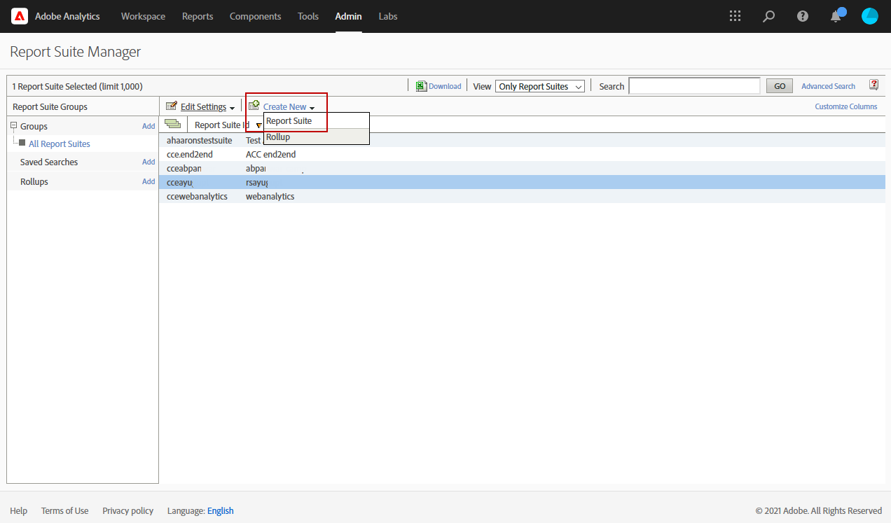
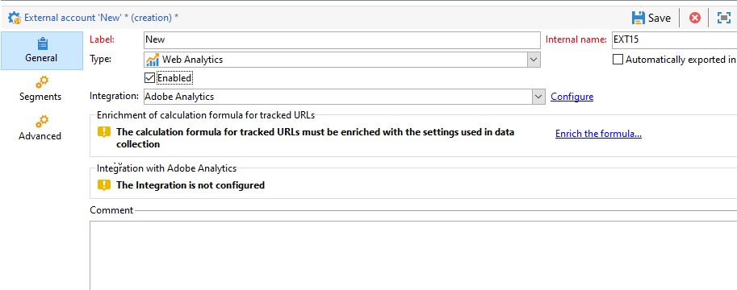
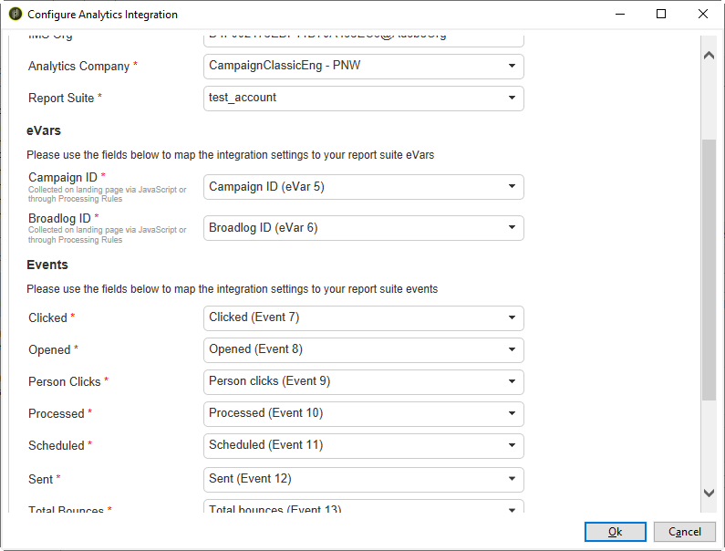

# 使用Campaign和Adobe Analytics {#ac-aa}

您可以配置Adobe Analytics以集成Campaign和Analytics。

此集成允许Adobe Campaign和Adobe Analytics通过&#x200B;**Web Analytics连接器**&#x200B;加载项进行交互。 此集成将Adobe Campaign投放的电子邮件营销活动的指标和属性发送到Adobe Analytics。

>[!NOTE]
>
>作为托管Cloud Service用户，[联系Adobe](../start/campaign-faq.md#support)以将Campaign与Adobe Experience Cloud服务和解决方案连接。 必须通过专用软件包在您的环境中安装Web Analytics连接器加载项。

使用 Adobe Analytics Connector，Adobe Campaign 可以对互联网受众进行评测（网站分析）。利用Web分析工具，Adobe Campaign可将指标和营销活动属性转发到Analytics。

每个工具的操作周边如下所示：

* **Adobe Analytics**&#x200B;标记通过Adobe Campaign启动的电子邮件营销活动

* **Adobe Campaign**&#x200B;将指标和营销活动属性发送到连接器，连接器再将它们转发到网站分析工具

>[!CAUTION]
>
>Adobe Analytics Connector 与事务性消息传递（消息中心）不兼容。

要设置Campaign-Analytics连接，必须执行以下操作：

1. [在 Adobe Analytics 中创建报表包](#report-suite-analytics)
1. [配置转化变量和成功事件](#configure-conversion-success)
1. [在Adobe Campaign中配置外部帐户](#external-account-ac)

## 创建Analytics报表包 {#report-suite-analytics}

要在[!DNL Adobe Analytics]中创建您的&#x200B;**[!UICONTROL Report suite]**，请执行以下步骤：

1. 在 [!DNL Adobe Analytics] 中，选择 **[!UICONTROL Admin tab]**，然后单击 **[!UICONTROL All admin]**。

   

1. 单击 **[!UICONTROL Report suites]**。

   

1. 在 **[!UICONTROL Report suite manager]** 页面中，依次单击 **[!UICONTROL Create new]** 和 **[!UICONTROL Report suite]**。

   有关创建&#x200B;**[!UICONTROL Report suite]**&#x200B;的详细过程，请参阅[Adobe Analytics文档](https://experienceleague.adobe.com/docs/analytics/admin/manage-report-suites/new-report-suite/t-create-a-report-suite.html#prerequisites){target="_blank"}。

   

1. 选择模板。

1. 使用以下信息配置新报表包：

   * **[!UICONTROL Report Suite ID]**
   * **[!UICONTROL Site Title]**
   * **[!UICONTROL Time Zone]**
   * **[!UICONTROL Go Live Date]**
   * **[!UICONTROL Estimated Page Views Per Day]**

   

1. 配置后，单击 **[!UICONTROL Create report suite]**。

## 配置转化变量和成功事件 {#configure-conversion-success}

创建 **[!UICONTROL Report suite]** 后，您需要按如下方式配置 **[!UICONTROL Conversion variables]** 和 **[!UICONTROL Success events]**：

1. 选择您之前配置的 **[!UICONTROL Report suite]**。

1. 在 **[!UICONTROL Edit settings]** 按钮中，选择 **[!UICONTROL Conversion]** > **[!UICONTROL Conversion variables]**。

   

1. 单击 **[!UICONTROL Add new]** 以创建评测电子邮件营销活动影响所需的标识符，即内部营销活动名称 (cid) 和 iNmsBroadlog (bid) 表 ID。

   要了解如何编辑&#x200B;**[!UICONTROL Conversion variables]**，请参阅此[Adobe Analytics文档](https://experienceleague.adobe.com/docs/analytics/admin/admin-tools/conversion-variables/t-conversion-variables-admin.html#admin-tools){target="_blank"}。

   

1. 完成后单击 **[!UICONTROL Save]**。

1. 然后，要创建 **[!UICONTROL Success events]**，请在 **[!UICONTROL Edit settings]** 按钮中选择 **[!UICONTROL Conversion]** > **[!UICONTROL Success events]**。

   

1. 单击 **[!UICONTROL Add new]** 以配置以下 **[!UICONTROL Success events]**：

   * **[!UICONTROL Clicked]**
   * **[!UICONTROL Opened]**
   * **[!UICONTROL Person clicks]**
   * **[!UICONTROL Processed]**
   * **[!UICONTROL Scheduled]**
   * **[!UICONTROL Sent]**
   * **[!UICONTROL Total bounces]**
   * **[!UICONTROL Unique Clicks]**
   * **[!UICONTROL Unique Opens]**
   * **[!UICONTROL Unsubscribed]**

   要了解如何配置&#x200B;**[!UICONTROL Success events]**，请参阅此[Adobe Analytics文档](https://experienceleague.adobe.com/docs/analytics/admin/admin-tools/manage-report-suites/edit-report-suite/conversion-variables/success-event.html)

   

1. 完成后单击 **[!UICONTROL Save]**。

配置报表包后，您需要在Adobe Campaign中配置&#x200B;**[!UICONTROL External accounts]**。

## 配置Campaign外部帐户 {#external-account-ac}

现在，您需要在 Adobe Campaign 中配置 **[!UICONTROL Web Analytics]** 外部帐户，以启用两种解决方案之间的同步。

请注意，如果在配置外部帐户时，您的 **[!UICONTROL Report suite]**、**[!UICONTROL Conversion variables]** 或 **[!UICONTROL Success events]** 不可见，这意味着您在与用户关联的 **[!UICONTROL Product profile]** 中缺少对此新创建组件的权限。

有关此内容的更多信息，请参阅[Adobe Analytics的产品配置文件](https://experienceleague.adobe.com/docs/analytics/admin/admin-console/permissions/product-profile.html#product-profile-admins){target="_blank"}页面。

1. 浏览到Adobe Campaign资源管理器树的&#x200B;**[!UICONTROL Administration]** > **[!UICONTROL Platform]** > **[!UICONTROL External accounts]**&#x200B;文件夹，然后单击&#x200B;**[!UICONTROL New]**。

   

1. 使用下拉列表从 **[!UICONTROL Integration]** 下拉列表中选择 **[!UICONTROL Web Analytics]** 类型和 **[!UICONTROL Adobe Analytics]**。

   

1. 单击 **[!UICONTROL Integration]** 下拉列表旁边的 **[!UICONTROL Configure]**。

1. 从 **[!UICONTROL Configure Analytics integration]** 窗口中，将外部帐户映射到之前创建的报表包，并提供以下信息：

   * **[!UICONTROL E-Mail]**
   * **[!UICONTROL IMS Org]**
   * **[!UICONTROL Analytics Company]**
   * **[!UICONTROL Report Suite]**

1. 在 **[!UICONTROL eVars]** 类别中，映射在 [!DNL Adobe Analytics] 中配置的两个 **[!UICONTROL Conversion variables]**。

   >[!NOTE]
   >
   >Campaign ID和Broadload ID字段是通过JavaScript在登陆页面上或通过处理规则收集的。 [了解有关处理规则的更多信息](https://experienceleague.adobe.com/en/docs/analytics/admin/admin-tools/manage-report-suites/edit-report-suite/report-suite-general/c-processing-rules/processing-rules)

   

1. 在 **[!UICONTROL Events]** 类别中，映射在 [!DNL Adobe Analytics] 中配置的十个 **[!UICONTROL Success events]**。

1. 完成后单击 **[!UICONTROL Submit]**。Adobe Campaign 将在映射的 Analytics **[!UICONTROL Report Suite]** 中创建 **[!UICONTROL Data source]**、**[!UICONTROL Calculated metrics]**、**[!UICONTROL Remarketing segments]** 和 **[!UICONTROL Classifications]**。

   在 [!DNL Adobe Analytics] 和 Adobe Campaign 之间完成同步后，您可以关闭此窗口。

1. 可以从 **[!UICONTROL Configure Analytics integration]** 窗口的 **[!UICONTROL Data Settings]** 选项卡中查看设置。

   使用 **[!UICONTROL Sync]** 按钮，[!DNL Adobe Campaign] 将会同步在 [!DNL Adobe Analytics] 中完成的名称变更。如果组件在 [!DNL Adobe Analytics] 中被删除，则将在 [!DNL Adobe Campaign] 中删除该组件，或显示&#x200B;**未找到**&#x200B;消息。

   

   >[!NOTE]
   >
   > 您无法在此版本的Campaign v8中添加或删除区段。

1. 在 **[!UICONTROL External account]** 中，单击 **[!UICONTROL Enrich the formula...]** 链接以更改 URL 计算公式，以指定网站分析工具集成信息（活动 ID）以及必须跟踪其活动的网站域名。

   

1. 指明网站的域名。

   

1. 单击 **[!UICONTROL Next]** 并确保域名已保存。

   

1. 如有必要，您可以让计算公式过载运行。要实现此目的，请勾选方框并直接在窗口中编辑公式。

   >[!IMPORTANT]
   >
   >此配置模式为专家用户而设：公式中的任何错误都可能导致电子邮件投放停止。

1. **[!UICONTROL Advanced]** 选项卡可让您配置或修改更多技术设置。

   * **[!UICONTROL Lifespan]**：允许您指定延迟（以天为单位），在此之后，技术工作流会在Adobe Campaign中恢复Web事件。 默认值：180 天。
   * **[!UICONTROL Persistence]**：可让您指定将所有网站事件（例如购买）归因到再营销活动的时段，默认值：7 天。

>[!NOTE]
>
>如果您使用多个受众衡量工具，则在创建外部帐户时，可以在 **[!UICONTROL Partners]** 下拉列表中选择 **[!UICONTROL Other]**。您只能在投放属性中引用一个外部帐户：因此，您需要通过添加 Adobe 以及使用的所有其他衡量工具预期的参数来调整跟踪 URL 的公式。

## 网站分析流程的技术工作流 {#technical-workflows-of-web-analytics-processes}

Adobe Campaign和Adobe Analytics之间的数据交换由作为后台任务运行的技术工作流处理。

此工作流可在Campaign Explorer树的&#x200B;**[!UICONTROL Administration]** > **[!UICONTROL Production]** > **[!UICONTROL Technical workflows]** > **[!UICONTROL Web analytics process]**&#x200B;文件夹下使用。

**[!UICONTROL Sending of indicators and campaign attributes]**&#x200B;工作流允许您使用Adobe Analytics Connector通过Adobe Campaign将电子邮件营销活动指标发送到Adobe Experience Cloud。 此工作流在每天凌晨 4 点触发，可能需要 24 小时才能将数据发送到 Analytics。

请注意，切勿重新启动此工作流，否则它将重新发送所有先前数据，可能会影响 Analytics 结果的准确性。

所涉指标包括：

* **[!UICONTROL Messages to deliver]** (@toDeliver)
* **[!UICONTROL Processed]** (@processed)
* **[!UICONTROL Success]** (@success)
* **[!UICONTROL Total count of opens]** (@totalRecipientOpen)
* **[!UICONTROL Recipients who have opened]** (@recipientOpen)
* **[!UICONTROL Total number of recipients who clicked]** (@totalRecipientClick)
* **[!UICONTROL People who clicked]** (@personClick)
* **[!UICONTROL Number of distinct clicks]** (@recipientClick)
* **[!UICONTROL Opt-Out]** (@optOut)
* **[!UICONTROL Errors]** (@error)

>[!NOTE]
>
>发送的数据是基于上次快照的 delta 值，可能会导致量度数据中出现负值。

发送的属性如下所示：

* **[!UICONTROL Internal name]** (@internalName)
* **[!UICONTROL Label]** (@label)
* **[!UICONTROL Label]** (operation/@label)：仅当安装了 **Campaign** 软件包时
* **[!UICONTROL Nature]** (operation/@nature)：仅当安装了 **Campaign** 软件包时
* **[!UICONTROL Tag 1]** (webAnalytics/@tag1)
* **[!UICONTROL Tag 2]** (webAnalytics/@tag2)
* **[!UICONTROL Tag 3]** (webAnalytics/@tag3)
* **[!UICONTROL Contact date]** (scheduling/@contactDate)

## 跟踪投放 {#tracking-deliveries-in-adobe-campaign}

为了让 Adobe Experience Cloud 能够在 Adobe Campaign 发送投放后跟踪网站上的活动，您需要在投放属性中引用匹配的连接器。要执行此操作，请应用以下步骤：

1. 打开要跟踪的营销活动的投放。

   

1. 打开投放属性。
1. 转到 **[!UICONTROL Web Analytics]** 选项卡，然后选择之前创建的外部帐户。请参阅[在Adobe Campaign中配置外部帐户](#external-account-ac)。

   

1. 您现在可以发送投放，并在 Adobe Analytics 中访问其报表。

## 创建再营销活动 {#create-a-re-marketing-campaign}

要准备再营销活动，只需创建用于再营销类型的营销活动的投放模板即可。然后，配置再营销活动并将其链接到区段。每个区段必须具有不同的再营销活动。

在 Adobe Campaign 恢复区段，完成对初始营销活动目标人群的行为分析后，将自动启动再营销活动。对于购物车放弃或查看产品但未购买的情况，会向相关收件人发送投放内容，以便他们的网站浏览完成购买。

Adobe Campaign 提供个性化投放模板，您可以使用这些模板或建立您自己的数据库以准备营销活动。

1. 在 **[!UICONTROL Explorer]** 中，转到 Adobe Campaign 树的 **[!UICONTROL Resources]** > **[!UICONTROL Templates]** > **[!UICONTROL Delivery templates]** 文件夹。
1. 复制 **[!UICONTROL Email delivery (re-marketing)]** 模板或 Adobe Campaign 提供的再营销模板示例。
1. 根据您的需求对模板进行个性化并保存。
1. 创建新营销活动，并从下拉列表中选择 **[!UICONTROL Re-marketing campaign]** 模板。
1. 单击 **[!UICONTROL Configure...]** 链接以指定链接到该营销活动的区段和投放模板。
1. 选择Analytics外部帐户[&#128279;](#external-account-ac)和相关区段。
1. 选择要用于此再营销活动的投放模板，然后单击 **[!UICONTROL Finish]** 以关闭窗口。
1. 单击 **[!UICONTROL OK]** 以关闭营销活动窗口。

可通过全局报告页面访问 **[!UICONTROL Re-marketing efficiency]** 报告。它可以让您查看在 Adobe Campaign 再营销活动后，已转化联系人数（即已购买商品）与购物车放弃数的关系。转化率在每周、每月或自Adobe Campaign与Adobe Analytics之间开始同步后进行计算。

**相关主题**

* [Campaign - Experience Cloud Triggers集成](ac-triggers.md)
