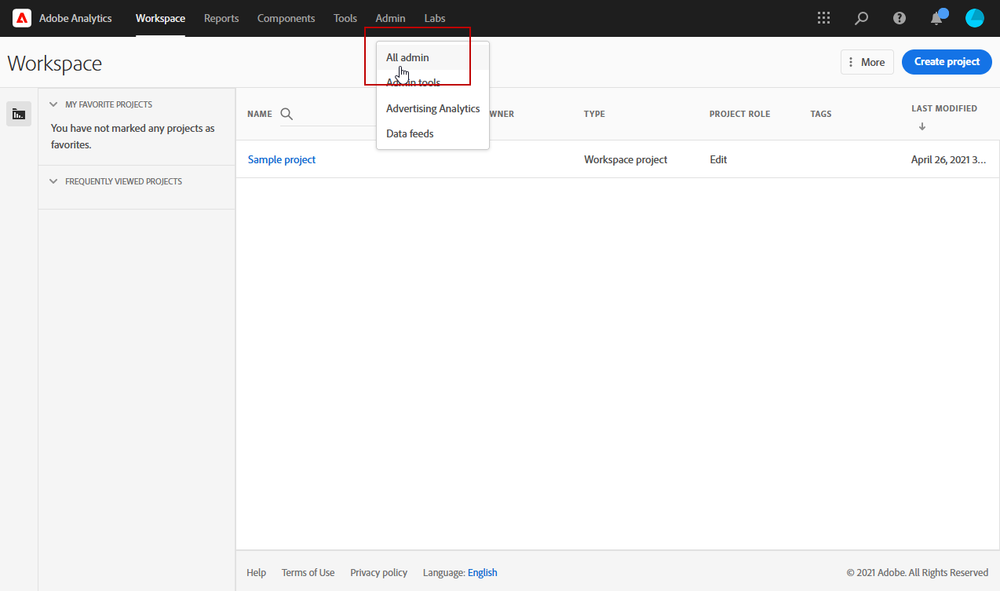

# 使用Campaign和Adobe Analytics

您可以配置Adobe Analytics以集成Campaign和Analytics。

此集成允许Adobe Campaign和Adobe Analytics通过&#x200B;**Web Analytics连接器**&#x200B;附加组件进行交互。 此集成会将Adobe Campaign提供的电子邮件促销活动的指标和属性发送到Adobe Analytics。

使用Adobe Analytics Connector，Adobe Campaign可以测量Internet受众(Web Analytics)。 Web分析工具使Adobe Campaign能够将指标和促销活动属性转发到Analytics。

每个工具的操作周长如下所示：

* **Adobe Analytics**

   * 标记通过Adobe Campaign启动的电子邮件促销活动
   * 以区段形式保存收件人在点击促销活动电子邮件后浏览的网站上的行为。 区段与放弃的产品（已查看但未添加到购物车或已购买）、购买或购物车放弃相关。

* **Adobe Campaign**

   * 将指示器和营销活动属性发送到连接器，连接器又将它们转发到Web分析工具
   * 恢复和分析区段
   * 触发再营销活动

[!DNL :speech_balloon:]  作为受管Cloud Services用户，请 [联系](../start/campaign-faq.md#support) Adobe以将Adobe Analytics Connector与Campaign集成。必须通过专用包在您的环境中安装Web Analytics连接器加载项。

>[!CAUTION]
>
>Adobe Analytics Connector与事务型消息传递（消息中心）不兼容。

要设置Campaign-Analytics连接，您必须执行以下操作：

1. [在Adobe Analytics中创建报表包](#report-suite-analytics)
1. [配置转化变量和成功事件](#configure-conversion-success)
1. [在Adobe Campaign中配置外部帐户](#external-account-ac)

## 在Adobe Analytics中创建报表包{#report-suite-analytics}

要在[!DNL Adobe Analytics]中创建&#x200B;**[!UICONTROL Report suite]**，请执行以下步骤：

1. 从[!DNL Adobe Analytics]中，选择&#x200B;**[!UICONTROL Admin tab]**，然后单击&#x200B;**[!UICONTROL All admin]**。

   

1. 单击 **[!UICONTROL Report suites]**。

   

1. 在&#x200B;**[!UICONTROL Report suite manager]**&#x200B;页面中，依次单击&#x200B;**[!UICONTROL Create new]**&#x200B;和&#x200B;**[!UICONTROL Report suite]**。

   有关创建&#x200B;**[!UICONTROL Report suite]**&#x200B;的详细过程，请参阅此[部分](https://experienceleague.adobe.com/docs/analytics/admin/manage-report-suites/new-report-suite/t-create-a-report-suite.html?lang=en#prerequisites)。

   

1. 选择模板。

1. 使用以下信息配置新报表包：

   * **[!UICONTROL Report Suite ID]**
   * **[!UICONTROL Site Title]**
   * **[!UICONTROL Time Zone]**
   * **[!UICONTROL Go Live Date]**
   * **[!UICONTROL Estimated Page Views Per Day]**

   

1. 配置后，单击&#x200B;**[!UICONTROL Create report suite]**。

## 配置转化变量和成功事件{#configure-conversion-success}

创建&#x200B;**[!UICONTROL Report suite]**&#x200B;后，需要按如下方式配置&#x200B;**[!UICONTROL Conversion variables]**&#x200B;和&#x200B;**[!UICONTROL Success events]**:

1. 选择您之前配置的&#x200B;**[!UICONTROL Report suite]**。

1. 从&#x200B;**[!UICONTROL Edit settings]**&#x200B;按钮中，选择&#x200B;**[!UICONTROL Conversion]** > **[!UICONTROL Conversion variables]**。

   

1. 单击&#x200B;**[!UICONTROL Add new]**&#x200B;以创建测量电子邮件促销活动影响所需的标识符，即内部促销活动名称(cid)和iNmsBroadlog（竞价）表ID。

   要了解如何编辑&#x200B;**[!UICONTROL Conversion variables]**，请参阅此[部分](https://experienceleague.adobe.com/docs/analytics/admin/admin-tools/conversion-variables/t-conversion-variables-admin.html?lang=en#admin-tools)。

   

1. 完成后，单击&#x200B;**[!UICONTROL Save]**。

1. 然后，要创建&#x200B;**[!UICONTROL Success events]**，请从&#x200B;**[!UICONTROL Edit settings]**&#x200B;按钮中选择&#x200B;**[!UICONTROL Conversion]** > **[!UICONTROL Success events]**。

   

1. 单击&#x200B;**[!UICONTROL Add new]**&#x200B;以配置以下&#x200B;**[!UICONTROL Success events]**:

   * **[!UICONTROL Clicked]**
   * **[!UICONTROL Opened]**
   * **[!UICONTROL Person clicks]**
   * **[!UICONTROL Processed]**
   * **[!UICONTROL Scheduled]**
   * **[!UICONTROL Sent]**
   * **[!UICONTROL Total bounces]**
   * **[!UICONTROL Unique Clicks]**
   * **[!UICONTROL Unique Opens]**
   * **[!UICONTROL Unsubscribed]**

   要了解如何配置&#x200B;**[!UICONTROL Success events]**，请参阅此[部分](https://experienceleague.adobe.com/docs/analytics/admin/admin-tools/success-events/t-success-events.html?lang=en#admin-tools)

   

1. 完成后，单击&#x200B;**[!UICONTROL Save]**。

配置报表包后，您需要在Adobe Campaign中配置&#x200B;**[!UICONTROL External accounts]**。

## 在Adobe Campaign中配置外部帐户{#external-account-ac}

现在，您需要在Adobe Campaign中配置&#x200B;**[!UICONTROL Web Analytics]**&#x200B;外部帐户，以启用两个解决方案之间的同步。

请注意，如果在配置外部帐户时，您的&#x200B;**[!UICONTROL Report suite]**、**[!UICONTROL Conversion variables]**&#x200B;或&#x200B;**[!UICONTROL Success events]**&#x200B;中的某个组件不可见，这意味着您在与用户关联的&#x200B;**[!UICONTROL Product profile]**&#x200B;中缺少对此新创建组件的权限。

有关此内容的更多信息，请参阅[Adobe Analytics的产品配置文件](https://experienceleague.adobe.com/docs/analytics/admin/admin-console/permissions/product-profile.html?lang=en#product-profile-admins)页面。

1. 转到Adobe Campaign树的&#x200B;**[!UICONTROL Administration]** > **[!UICONTROL Platform]** > **[!UICONTROL External accounts]**&#x200B;文件夹，然后单击&#x200B;**[!UICONTROL New]**。

   

1. 使用下拉列表从&#x200B;**[!UICONTROL Integration]**&#x200B;下拉列表中选择&#x200B;**[!UICONTROL Web Analytics]**&#x200B;类型和&#x200B;**[!UICONTROL Adobe Analytics]**。

   

1. 单击&#x200B;**[!UICONTROL Integration]**&#x200B;下拉列表旁边的&#x200B;**[!UICONTROL Configure]**。

1. 从&#x200B;**[!UICONTROL Configure Analytics integration]**&#x200B;窗口中，将外部帐户映射到之前创建的报表包，其中提供以下信息：

   * **[!UICONTROL E-Mail]**
   * **[!UICONTROL IMS Org]**
   * **[!UICONTROL Analytics Company]**
   * **[!UICONTROL Report Suite]**

1. 从&#x200B;**[!UICONTROL eVars]**&#x200B;类别中，映射在[!DNL Adobe Analytics]中配置的两个&#x200B;**[!UICONTROL Conversion variables]**。

   

1. 从&#x200B;**[!UICONTROL Events]**&#x200B;类别中，映射在[!DNL Adobe Analytics]中配置的十个&#x200B;**[!UICONTROL Success events]**。

1. 完成后，单击&#x200B;**[!UICONTROL Submit]**。 Adobe Campaign将在映射的Analytics **[!UICONTROL Report Suite]**&#x200B;中创建&#x200B;**[!UICONTROL Data source]**、**[!UICONTROL Calculated metrics]**、**[!UICONTROL Remarketing segments]**&#x200B;和&#x200B;**[!UICONTROL Classifications]**。

   在[!DNL Adobe Analytics]和Adobe Campaign之间完成此同步后，您可以关闭窗口。

1. 可以从&#x200B;**[!UICONTROL Configure Analytics integration]**&#x200B;窗口的&#x200B;**[!UICONTROL Data Settings]**&#x200B;选项卡中查看设置。

   使用&#x200B;**[!UICONTROL Sync]**&#x200B;按钮， [!DNL Adobe Campaign]将同步在[!DNL Adobe Analytics]中完成的名称更改。 如果组件在[!DNL Adobe Analytics]中删除，则组件将在[!DNL Adobe Campaign]中进行删除，或显示&#x200B;**未找到**&#x200B;消息。

   

1. 如果需要，您可以在&#x200B;**[!UICONTROL Update Segments]**&#x200B;选项卡中添加或删除区段。

1. 在&#x200B;**[!UICONTROL External account]**&#x200B;中，单击&#x200B;**[!UICONTROL Enrich the formula...]**&#x200B;链接以更改URL计算公式，以指定Web分析工具集成信息（促销活动ID）以及必须跟踪其活动的网站的域。

   

1. 指定网站的域名。

   

1. 单击&#x200B;**[!UICONTROL Next]**&#x200B;并确保域名已保存。

   

1. 如有必要，您可以使计算公式过载。 要执行此操作，请勾选方框并直接在窗口中编辑公式。

   >[!IMPORTANT]
   >
   >此配置模式为专家用户保留：此公式中的任何错误都可能导致电子邮件投放停止。

1. **[!UICONTROL Advanced]**&#x200B;选项卡允许您配置或修改更多技术设置。

   * **[!UICONTROL Lifespan]**:允许您指定延迟(以days_为单位，技术工作流会在Adobe Campaign中恢复web事件。默认：180天。
   * **[!UICONTROL Persistence]**:允许您将所有Web事件（例如购买）归因到再营销活动的时段，默认：7天。

>[!NOTE]
>
>如果您使用多个受众测量工具，则在创建外部帐户时，可以在&#x200B;**[!UICONTROL Partners]**&#x200B;下拉列表中选择&#x200B;**[!UICONTROL Other]**。 您只能在投放属性中引用一个外部帐户：因此，您需要通过添加Adobe预期的参数以及使用的所有其他测量工具来调整跟踪URL的公式。

## Web分析流程的技术工作流{#technical-workflows-of-web-analytics-processes}

Adobe Campaign和Adobe Analytics之间的数据交换由作为后台任务运行的技术工作流处理。

此工作流可从Campaign Explorer树中的&#x200B;**[!UICONTROL Administration]** > **[!UICONTROL Production]** > **[!UICONTROL Technical workflows]** > **[!UICONTROL Web analytics process]**&#x200B;文件夹下找到。

通过&#x200B;**[!UICONTROL Sending of indicators and campaign attributes]**&#x200B;工作流，您可以使用Adobe Analytics Connector通过Adobe Campaign将电子邮件促销活动指示器发送到Adobe Experience Cloud。 此工作流每天凌晨4点触发，可能需要24小时才能将数据发送到Analytics。

请注意，此工作流不应重新启动，否则将重新发送所有可能会使Analytics结果产生偏差的先前数据。

所涉指标有：

* **[!UICONTROL Messages to deliver]** (@toDeliver)
* **[!UICONTROL Processed]** (@processed)
* **[!UICONTROL Success]** (@success)
* **[!UICONTROL Total count of opens]** (@totalRecipientOpen)
* **[!UICONTROL Recipients who have opened]** (@recipientOpen)
* **[!UICONTROL Total number of recipients who clicked]** (@totalRecipientClick)
* **[!UICONTROL People who clicked]** (@personClick)
* **[!UICONTROL Number of distinct clicks]** (@recipientClick)
* **[!UICONTROL Opt-Out]** (@optOut)
* **[!UICONTROL Errors]** (@error)

>[!NOTE]
>
>发送的数据是基于上次快照的增量，可能会导致量度数据中出现负值。

发送的属性如下所示：

* **[!UICONTROL Internal name]** (@internalName)
* **[!UICONTROL Label]** (@label)
* **[!UICONTROL Label]** (操作/@label):仅当安装了 **** Campaign包时
* **[!UICONTROL Nature]** (操作/@nature):仅当安装了 **** Campaign包时
* **[!UICONTROL Tag 1]** (webAnalytics/@tag1)
* **[!UICONTROL Tag 2]** (webAnalytics/@tag2)
* **[!UICONTROL Tag 3]** (webAnalytics/@tag3)
* **[!UICONTROL Contact date]** (计划/@contactDate)

## 在Adobe Campaign中跟踪投放{#tracking-deliveries-in-adobe-campaign}

为了让Adobe Experience Cloud能够在Adobe Campaign发送投放后跟踪站点上的活动，您需要在投放属性中引用匹配的连接器。 要执行此操作，请应用以下步骤：

1. 打开要跟踪的营销活动的投放。

   

1. 打开投放属性。
1. 转到&#x200B;**[!UICONTROL Web Analytics]**&#x200B;选项卡，然后选择之前创建的外部帐户。 请参阅[在Adobe Campaign中配置外部帐户](#external-account-ac) 。

   

1. 您现在可以发送投放内容，并在Adobe Analytics中访问其报表。

## 创建再营销活动{#creating-a-re-marketing-campaign}

要准备再营销活动，只需创建用于再营销类型营销活动的投放模板即可。 然后，配置再营销活动并将其链接到区段。 每个区段必须具有不同的再营销活动。

在Adobe Campaign完成恢复区段后，将自动启动再营销活动，以分析初始营销活动所定向人员的行为。 如果放弃购买或查看产品而未进行购买，则会向相关收件人发送投放内容，以便其浏览网站以结束购买。

Adobe Campaign提供个性化投放模板，您可以使用这些模板或将您自己的数据库设置在上以准备营销活动。

1. 从&#x200B;**[!UICONTROL Explorer]**&#x200B;中，转到Adobe Campaign树的&#x200B;**[!UICONTROL Resources]** > **[!UICONTROL Templates]** > **[!UICONTROL Delivery templates]**&#x200B;文件夹。

1. 复制&#x200B;**[!UICONTROL Email delivery (re-marketing)]**&#x200B;模板或Adobe Campaign提供的再营销模板示例。

   

1. 根据您的需求对模板进行个性化并进行保存。

1. 创建新营销活动，并从下拉列表中选择&#x200B;**[!UICONTROL Re-marketing campaign]**&#x200B;模板。

   

1. 单击&#x200B;**[!UICONTROL Configure...]**&#x200B;链接以指定链接到该营销活动的客户群和投放模板。

1. 选择之前配置的外部帐户。

   

1. 选择相关区段。

   

1. 选择要用于此再营销活动的投放模板，然后单击&#x200B;**[!UICONTROL Finish]**&#x200B;以关闭窗口。

   

1. 单击&#x200B;**[!UICONTROL OK]**&#x200B;以关闭营销活动窗口。

可通过全局报告页面访问&#x200B;**[!UICONTROL Re-marketing efficiency]**&#x200B;报告。 它允许您查看与Adobe Campaign再营销活动后放弃购物车的次数相关的已转换联系人数（即已购买商品）。 转化率是按周、月或自Adobe Campaign与Web分析工具开始同步后计算的。

**相关主题**

* [Campaign -Experience Cloud触发器集成](ac-triggers.md)
