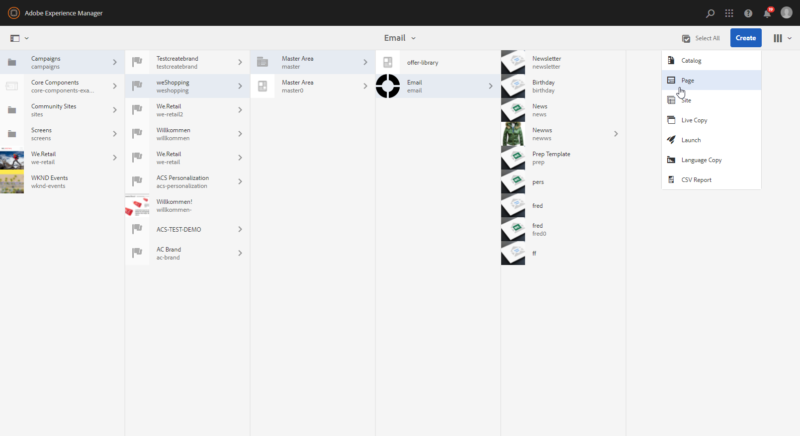

# 使用Campaign和Adobe Experience Manager {#ac-aem}

Adobe Campaign与Adobe Experience Manager之间的集成允许您直接在Adobe Experience Manager中管理电子邮件投放的内容以及表单。 您可以选择将您的&#x200B;**Adobe Experience Manager**&#x200B;内容导入Campaign，或将&#x200B;**Adobe Experience Manager as a Cloud Service**&#x200B;帐户连接，从而允许您直接在Web界面中编辑内容。

[了解如何在Campaign Web界面中编辑您的Adobe Experience Manager作为Cloud Service内容](https://experienceleague.adobe.com/docs/campaign-web/v8/integrations/aem-content.html){target="_blank"}。

[在本文档中了解有关Adobe Experience Manager的更多信息](https://experienceleague.adobe.com/docs/experience-manager-65/administering/integration/campaignonpremise.html#aem-and-adobe-campaign-integration-workflow){target="_blank"}。

>[!NOTE]
>
>作为托管Cloud Service用户，[联系Adobe](../start/campaign-faq.md#support)以将Adobe Experience Manager与Campaign集成。

## 从Adobe Experience Manager导入内容 {#integrating-with-aem}

例如，此集成可用于在Adobe Experience Manager中创建新闻稿，然后在Adobe Campaign中将其用作电子邮件营销活动的一部分。

来自Adobe Experience Manager的&#x200B;**：**

1. 导航到您的[!DNL Adobe Experience Manager]创作实例，然后单击页面左上角的Adobe体验。 从菜单中选择&#x200B;**[!UICONTROL Sites]**。

   

1. 访问&#x200B;**[!UICONTROL Campaigns > Name of your brand (here we.Shopping) > Main Area > Email]**。

1. 单击&#x200B;**[!UICONTROL Create]**&#x200B;并从下拉菜单中选择&#x200B;**[!UICONTROL Page]**。

   

1. 选择&#x200B;**[!UICONTROL Adobe Campaign Email]**&#x200B;模板并命名您的新闻稿。

1. 创建页面后，访问&#x200B;**[!UICONTROL Page information]**&#x200B;菜单并单击&#x200B;**[!UICONTROL Open Properties]**。

   

1. 通过添加组件(例如Adobe Campaign中的个性化字段)自定义电子邮件内容。 请参阅[Adobe Experience Manager文档](https://experienceleague.adobe.com/docs/experience-manager-65/content/sites/authoring/aem-adobe-campaign/campaign.html#editing-email-content){target="_blank"}以了解详情。

1. 电子邮件准备就绪后，导航到&#x200B;**[!UICONTROL Page information]**&#x200B;菜单，然后单击&#x200B;**[!UICONTROL Start workflow]**。

   

1. 从第一个下拉列表中，选择&#x200B;**[!UICONTROL Approve Adobe Campaign]**&#x200B;作为工作流模型，然后单击&#x200B;**[!UICONTROL Start workflow]**。

   

1. 免责声明将显示在页面顶部，声明`This page is subject to the workflow Approve for Adobe Campaign`。 单击免责声明旁边的&#x200B;**[!UICONTROL Complete]**&#x200B;以确认审核，然后单击&#x200B;**[!UICONTROL Ok]**。

1. 再次单击&#x200B;**[!UICONTROL Complete]**&#x200B;并在&#x200B;**[!UICONTROL Next Step]**&#x200B;下拉列表中选择&#x200B;**[!UICONTROL Newsletter approval]**。

   

您的新闻稿现已准备就绪，并已在Adobe Campaign中同步。

来自Adobe Campaign的&#x200B;**：**

1. 在&#x200B;**[!UICONTROL Campaigns]**&#x200B;选项卡中，单击&#x200B;**[!UICONTROL Deliveries]**，然后单击&#x200B;**[!UICONTROL Create]**。

1. 从&#x200B;**[!UICONTROL Delivery template]**&#x200B;下拉菜单中选择&#x200B;**[!UICONTROL Email delivery with AEM content (mailAEMContent)]**&#x200B;模板。

   

1. 向投放添加&#x200B;**[!UICONTROL Label]**&#x200B;并单击&#x200B;**[!UICONTROL Continue]**。

1. 单击&#x200B;**[!UICONTROL Synchronize]**&#x200B;以访问您的AEM投放。

   如果您的界面中看不到该按钮，请导航到&#x200B;**[!UICONTROL Properties]**&#x200B;按钮并访问&#x200B;**[!UICONTROL Advanced]**&#x200B;选项卡。 确保&#x200B;**[!UICONTROL Content editing mode]**&#x200B;字段配置为&#x200B;**[!UICONTROL AEM]**，并在&#x200B;**[!UICONTROL AEM account]**&#x200B;字段中输入您的AEM实例详细信息。

   

1. 选择之前在[!DNL Adobe Experience Manager]中创建的AEM投放，然后单击&#x200B;**[!UICONTROL Ok]**&#x200B;进行确认。

   

1. 请确保在对AEM投放进行修改时单击&#x200B;**[!UICONTROL Refresh content]**&#x200B;按钮。

   

1. 要删除Experience Manager和促销活动之间的关联，请单击&#x200B;**[!UICONTROL Desynchronize]**。

您的电子邮件现已准备就绪，可发送给受众。

## 从Adobe Experience Manager Assets库导入资源 {#assets-library}

在Adobe Campaign中编辑电子邮件或登陆页面时，您也可以直接从[!DNL Adobe Experience Manager Assets Library]插入资源。 [Adobe Experience Manager Assets文档](https://experienceleague.adobe.com/docs/experience-manager-65/content/assets/managing/manage-assets.html){target="_blank"}中详细介绍了此功能。

来自Adobe Experience Manager的&#x200B;**：**

1. 导航到您的[!DNL Adobe Experience Manager]创作实例，然后单击页面左上角的Adobe体验。 从菜单中选择&#x200B;**[!UICONTROL Assets]** `>` **[!UICONTROL Files]**。

   

1. 单击&#x200B;**创建**，然后单击&#x200B;**文件**，将您的资源导入到&#x200B;**Adobe Experience Manager Assets库**。 请参阅[AdobeExperience Manager文档](https://experienceleague.adobe.com/docs/experience-manager-65/content/assets/managing/manage-assets.html#uploading-assets){target="_blank"}以了解详情。

   

1. 根据需要重命名您的资产，然后选择&#x200B;**上传**。

您的资产现已上传到&#x200B;**Adobe Experience Manager Assets库**。

来自Adobe Campaign的&#x200B;**：**

1. 在Adobe Campaign中，通过浏览到&#x200B;**营销活动**&#x200B;选项卡，单击&#x200B;**投放**，然后单击现有投放列表上方的&#x200B;**创建**&#x200B;按钮来创建新投放。

   

1. 选择&#x200B;**投放模板**，然后命名您的投放。

1. 定义消息内容并使其个性化。 [了解详情](../send/email.md)

1. 要使用&#x200B;**Adobe Experience Manager Assets库**，请访问AEM投放的&#x200B;**[!UICONTROL Properties]**，然后选择&#x200B;**[!UICONTROL Advanced]**&#x200B;选项卡。

   选择您的&#x200B;**AEM帐户**&#x200B;并启用&#x200B;**[!UICONTROL Use above AEM instance as shared asset library]**&#x200B;选项。

   

1. 从&#x200B;**图像**&#x200B;图标，访问&#x200B;**[!UICONTROL Select a shared asset]**&#x200B;菜单。

   

1. 从选择窗口中，从&#x200B;**Adobe Experience Manager Assets库**&#x200B;中选择图像，然后&#x200B;**选择**。

   

您的资产现已上传至您的电子邮件投放。 您现在可以指定目标受众，确认投放，然后继续发送。
