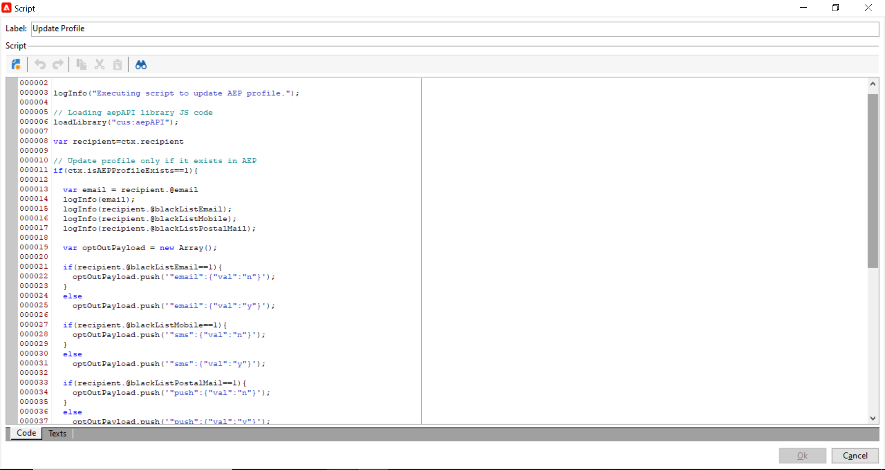

# 从Adobe Campaign登陆页面更新Adobe Experience Platform配置文件 {#ac-aep-lp}

Adobe Campaign与Adobe Experience Platform之间的集成允许您在Adobe Campaign登陆页面与Adobe Experience Platform之间无缝同步配置文件数据。 通过此集成，您可以：

* 检索Adobe Experience Platform配置文件属性，以在Adobe Campaign登陆页面中显示更新的信息。
* 将更新的用户档案属性发送回Adobe Experience Platform，以根据登陆页面中已填写和提交的内容更新相应的属性。

设置此集成的主要步骤如下：

<table>
<tr>
<td><p><a href="#oauth">设置OAuth连接</a></p></td>
<td><p><a href="#source">创建HTTP API源连接</a></p></td>
<td><p><a href="#xtk">在Campaign中添加身份验证选项</a></p></td>
<td><p><a href="#javascript">在Campaign中添加代码JavaScript</a></p></td>
<td><p><a href="#script">配置登陆页面工作流</a></p></td>
</table>

## 设置Oauth连接 {#oauth}

Adobe Cloud Platform API使用OAuth 2.0协议进行身份验证和授权。 要使用API调用将Adobe Experience Platform连接到Adobe Campaign，您需要使用在Adobe Developer控制台中创建的OAuth集成生成访问令牌。

为此，请执行以下步骤：

1. 访问Adobe Developer Console。
1. 使用Adobe Experience Platform API产品创建新的API连接。 有关如何获取OAuth 2.0访问令牌的详细步骤，请参阅 [Adobe Developer控制台文档](https://developer.adobe.com/developer-console/docs/guides/authentication/Tools/OAuthPlayground/).
1. 创建连接后，导航至 **[!UICONTROL OAuth Server-to-Server]** 菜单并复制以下详细信息，这些是Campaign进行身份验证所必需的：

   * `CLIENT ID`
   * `CLIENT SECRET`
   * `ORGANIZATION ID`

   {width="70%"}

现在您的Oauth连接已配置，请创建和配置新的 **[!UICONTROL HTTP API]** 将Adobe Campaign与Adobe Experience Platform关联的源连接。

## 创建HTTP API源连接 {#source}

建立OAuth连接后，下一步是创建 **[!UICONTROL HTTP API]** Adobe Experience Platform中的源连接。 利用此连接，可使用API将数据流式传输到Adobe Experience Platform。 执行以下步骤：

1. 导航到Adobe Experience Platform **[!UICONTROL Sources]**，搜索 **[!UICONTROL HTTP API]** 源，然后单击 **[!UICONTROL Add data]**.

   {width="70%"}

1. 根据需要配置连接。 有关如何配置HTTP API连接的详细信息，请参阅 [Adobe Experience Platform源文档](https://experienceleague.adobe.com/docs/experience-platform/sources/ui-tutorials/create/streaming/http.html).

   在 **[!UICONTROL Authentication]** 步骤，打开 **[!UICONTROL Enable authentication]** 使用通过OAuth集成生成的访问令牌进行身份验证的选项。

   {width="70%"}

1. 配置源连接后，将显示流端点。 需要此端点才能将数据摄取到Adobe Experience Platform。

   {width="70%"}

   您还可以通过从打开新创建的数据流来访问Adobe Experience Platform中引入的数据格式示例。 **[!UICONTROL Dataflows]** 选项卡。

   {width="70%"}

现在已设置HTTP API源连接，您需要在Adobe Campaign中添加特定选项以启用与Adobe Experience Platform的连接。

## 在Adobe Campaign中添加身份验证选项 {#xtk}

配置HTTP API源连接后，您需要在Adobe Campaign中添加特定选项以启用与Adobe Experience Platform的连接。 这可以在Campaign“管理”菜单中或在通过添加特定的 **[!UICONTROL JavaScript code]** 活动。

浏览下面的选项卡以发现这两种方法：

>[!BEGINTABS]

>[!TAB 从“管理”菜单添加选项]

1. 导航至 **[!UICONTROL Administration]** > **[!UICONTROL Platform]** > **[!UICONTROL Options]**  菜单。
1. 从Adobe Developer控制台添加以下选项以及相应的值：

   * IMS_CLIENT_ID = cryptString（客户端ID）
   * IMS_CLIENT_SECRET = cryptString（客户端密钥）
   * IMS_ORG_ID =组织ID
   * IMS_CLIENT_API_KEY = cryptString（客户端ID）

   {width="70%"}

   >[!NOTE]
   >
   >cryptString()函数用于加密您的身份验证数据。

>[!TAB 使用JavaScript代码活动添加选项]

要在执行登陆页面工作流时自动配置这些选项，请添加 **[!UICONTROL JavaScript code]** 使用下面的代码访问您的工作流。 [了解如何配置JavaScript代码活动](https://experienceleague.adobe.com/docs/campaign/automation/workflows/wf-activities/action-activities/sql-code-and-JavaScript-code.html#JavaScript-code).

在执行工作流时，系统会自动在Campaign控制台中使用提供的值创建选项。

    ```javascript
    loadLibrary(&quot;xtk：shared/nl.js&quot;)；
    loadLibrary(&quot;xtk：shared/xtk.js&quot;)；
    loadLibrary(&quot;xtk：shared/json2.js&quot;)；
    loadLibrary(&quot;xtk：common.js&quot;)；
    
    函数setAuthCredentials()
    {
    setOption(&quot;IMS_CLIENT_ID&quot;， cryptString(&#39;CLIENT ID&#39;))；
    setOption(&quot;IMS_CLIENT_SECRET&quot;， cryptString(&#39;CLIENT SECRET&#39;))；
    setOption(&quot;IMS_ORG_ID&quot;， cryptString(&#39;ORGANIZATION ID&#39;))；
    setOption(&quot;IMS_CLIENT_API_KEY&quot;， cryptString(&#39;CLIENT ID&#39;))；
    }
    ```

>[!ENDTABS]

现在，Campaign中已配置身份验证选项，您需要创建自定义JavaScript代码，以允许从登陆页面在Campaign和Adobe Experience Platform之间同步数据。

## 在工作流执行时添加选项 {#javacript}

要允许在登陆页面与Adobe Experience Platform之间同步数据，必须将自定义JavaScript代码添加到Adobe Campaign中。 执行以下步骤：

1. 导航至 **[!UICONTROL Administration]** > **[!UICONTROL Configuration]** > **[!UICONTROL JavaScript codes]** 菜单。
1. 创建新的JavaScript代码并复制并粘贴以下代码片段。

   >[!NOTE]
   >
   >访问令牌和身份验证数据会从之前设置的选项中自动检索。

   {width="70%"}

+++  脚本1 — 从Experience Platform加载配置文件属性

   此代码在加载登陆页面之前检查配置文件是否存在于Adobe Experience Platform中。 它会检索用户档案属性，并将其显示在登陆页面的相应字段中。

   ```javascript
   // API implementation to read profile from AEP
   function getProfileInfo(email)
   {
   var accessToken = getAccessToken();
   var request = new HttpClientRequest(('https://platform-stage.adobe.io/data/core/ups/access/entities?schema.name=_xdm.context.profile&entityId=' + email + '&entityIdNS=email&fields=identities,consents.marketing'));
   request.method = 'GET';
   request.header["Content-Type"] = "application/json";
   request.header["sandbox-name"] = "prod";
   request.header["x-gw-ims-org-id"] = getOption('IMS_ORG_ID');
   request.header["x-api-key"] = getOption('IMS_CLIENT_API_KEY');
   request.header["Authorization"] = "Bearer " + accessToken;
   request.execute();
   return request.response;
   }
   ```

+++

+++ 脚本2 — 更新Experience Platform配置文件属性

   此代码会使用登陆页面中提交的值更新Adobe Experience Platform中的配置文件属性。

   ```javascript
   // API implementation to update profile in AEP
   loadLibrary("xtk:shared/nl.js");
   loadLibrary("xtk:shared/xtk.js");
   loadLibrary("xtk:shared/json2.js");
   loadLibrary("xtk:common.js");
   
   function updateProfileInAEP(profileUpdatePayload)
   {
   var accessToken = getAccessToken();
   var request = new HttpClientRequest('https://dcs-stg.adobedc.net/collection/64a300b84d61c0bcea4f0cd4ecaaa224a19477026d14f7e08b5408ffaf5e6162?syncValidation=false');
   request.method = 'POST';
   request.header["Content-Type"] = "application/json";
   request.header["sandbox-name"] = "prod";
   request.header["Authorization"] = "Bearer " + accessToken;
   var body = '{"header":{"schemaRef":{"id":"https://ns.adobe.com/campdev/schemas/35d8e567772e1a1093ed6cf9e41d2c1fec22eeb3a89583e1","contentType":"application/vnd.adobe.xed-full+json;version=1.0"},"imsOrgId":"A1F66F0D5C47D1950A494133@AdobeOrg","datasetId":"63c7fa2a20cce11b98cccb41","source":{"name":"testHTTPSourcesVinay - 03/06/2023 5:43 PM"}},"body":{"xdmMeta":{"schemaRef":{"id":"https://ns.adobe.com/campdev/schemas/35d8e567772e1a1093ed6cf9e41d2c1fec22eeb3a89583e1","contentType":"application/vnd.adobe.xed-full+json;version=1.0"}},"xdmEntity":' + profileUpdatePayload +'}}';
   request.body = body;
   request.execute();
   return request.response;
   }
   
   
   // Get Access token from OAuth-Server-to-server API call
   function getAccessToken() {
   var clientId = decryptString(getOption('IMS_CLIENT_ID'));
   var clientSecret = decryptString(getOption('IMS_CLIENT_SECRET'));
   var request = new HttpClientRequest(('https://ims-na1-stg1.adobelogin.com/ims/token/v2?grant_type=client_credentials' + '&client_id=' + clientId + '&client_secret=' + clientSecret + '&scope=openid,session,AdobeID,read_organizations,additional_info.projectedProductContext'));
   request.method = 'POST';
   request.execute();
   var response = request.response;
   if(response.code != 200){
   logError('GetAccessToken failed,', response.code, response.body);
   return;
   }
   var body = ''+response.body;
   var parsedResponse = JSON.parse(body);
   var accessToken = parsedResponse.access_token;
   logInfo("Access token generated successfully");
   return accessToken;
   }
   ```

+++

现在，已在Adobe Campaign中创建自定义JavaScript代码，您可以配置包含登陆页面的工作流，以使用这些JavaScript代码进行数据同步。

## 配置登陆页面工作流 {#script}

通过将JavaScript代码添加到Adobe Campaign，您可以使用将它们用于登陆页面工作流 **[!UICONTROL JavaScript code]** 活动：

* 要在加载登陆页面之前从Experience Platform加载数据，请添加 **[!UICONTROL JavaScript code]** 活动，并复制、粘贴脚本1。

+++ 脚本1 — 从Experience Platform加载配置文件属性

  ```javascript
  // Script code to read profile from AEP.
  
  logInfo("Loading profile from AEP");
  loadLibrary("cus:aepAPI");
  var recipient=ctx.recipient;
  var email = recipient.@email;
  var response = getProfileInfo(email);
  ctx.isAEPProfileExists = 1;
  
  if(response.code == 404){
  ctx.isAEPProfileExists = 0
  logInfo("Profile with email" + email + " not found in AEP, ignoring the update activity");
  }
  else if(response.code == 200){
  var body = ''+response.body;
  var parsedResponse = JSON.parse(body);
  for (var key in parsedResponse) {
      var value =  parsedResponse[key];
      var marketing = value.entity.consents.marketing;
      logInfo("User Consent Details : " + JSON.stringify(marketing));   
      if(marketing.hasOwnProperty('email')&&marketing.email.hasOwnProperty('val')&&marketing.email.val=='n'){
      ctx.recipient.@blackListEmail = 1;
      }
      if(marketing.hasOwnProperty('sms')&&marketing.sms.hasOwnProperty('val')&&marketing.sms.val=='n'){
      ctx.recipient.@blackListMobile = 1;
      }
      if(marketing.hasOwnProperty('push')&&marketing.push.hasOwnProperty('val')&&marketing.push.val=='n'){
      ctx.recipient.@blackListPostalMail = 1;
      }
  } 
  }
  ```

+++

* 要使用在登陆页中提交的数据更新Experience Platform配置文件属性，请添加 **[!UICONTROL JavaScript code]** 活动，并复制粘贴脚本2。

+++ 脚本2 — 更新Experience Platform配置文件属性

  ```javascript
  // Script code to update profile in AEP and ACC.
  
  logInfo("Executing script to update AEP profile.");
  
  // Loading aepAPI library JS code
  loadLibrary("cus:aepAPI");
  
  var recipient=ctx.recipient
  
  // Update profile only if it exists in AEP
  if(ctx.isAEPProfileExists==1){
  
  var email = recipient.@email
  logInfo(email);
  logInfo(recipient.@blackListEmail);
  logInfo(recipient.@blackListMobile);
  logInfo(recipient.@blackListPostalMail);
  
  var optOutPayload = new Array();
  
  if(recipient.@blackListEmail==1){
      optOutPayload.push('"email":{"val":"n"}');
  }
  else
      optOutPayload.push('"email":{"val":"y"}');
  
  if(recipient.@blackListMobile==1){
      optOutPayload.push('"sms":{"val":"n"}');
  }
  else
      optOutPayload.push('"sms":{"val":"y"}');
  
  if(recipient.@blackListPostalMail==1){
      optOutPayload.push('"push":{"val":"n"}');
  }
  else
      optOutPayload.push('"push":{"val":"y"}');
  
  var profileUpdatePayload = '{'+ '"personalEmail":{"address":' + '\"' + email + '\"' + '},' +'"consents":{"marketing":{' + optOutPayload.toString() + '}}}';
  
  var response = updateProfileInAEP(profileUpdatePayload);
  if(response.code == 200){
  var body = '' + response.body;
  logInfo("AEP Profile Updated successfully, Response " + body);
  // Update ACC profile 
  recipient.@xtkschema = "nms:recipient";
  recipient.@_operation = "update";
  recipient.@_key="@id";
  xtk.session.Write(recipient);
  logInfo("ACC Profile Updated successfully");
  }
  else{
      logError('Server Error: ', response.code, response.body);
  } 
  }
  else {
  logInfo("Ignoring AEP profile update as profile doesn't exists.");
  
  // Update ACC profile   
  recipient.@xtkschema = "nms:recipient";
  recipient.@_operation = "update";
  recipient.@_key="@id";  
  xtk.session.Write(recipient);
  logInfo("ACC Profile Updated successfully");
  }
  ```

+++

>[!CAUTION]
>
>确保根据特定需求自定义每个脚本中的有效负载。
>
>如果您在登陆页面活动之前未添加任何脚本，则不会在Adobe Experience Platform中执行任何配置文件存在性检查。 在提交登陆页面并且该配置文件不存在时，将使用登陆页面中的属性在Adobe Experience Platform中创建它。

以下是登陆页面前后使用JavaScript代码活动的示例工作流：

{width="70%"}

以下是配置为更新Adobe Experience Platform中的配置文件属性的登陆页面和JavaScript代码活动的示例：

{width="70%"}

{width="70%" zoomable="yes"}

### 更多信息

* [配置JavaScript代码活动](../../automation/workflow/sql-code-and-javascript-code.md#javascript-code)
* [创建登陆页面](https://experienceleague.adobe.com/docs/campaign-classic/using/designing-content/editing-html-content/creating-a-landing-page.html)
* [管理订阅和退订](../start/subscriptions.md)
