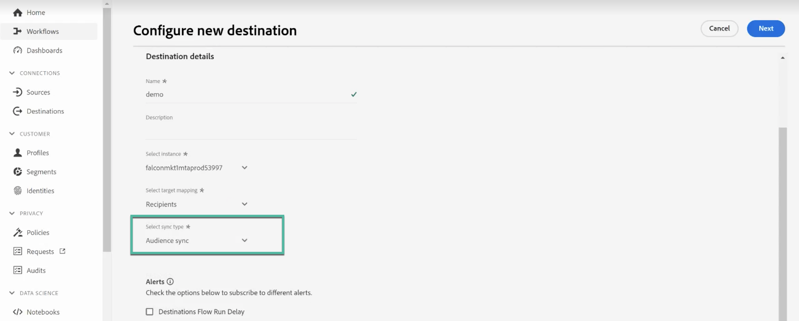

# 使用Campaign和Adobe Experience Platform

Adobe Campaign托管Cloud Service目标和源连接器允许Adobe Campaign与Adobe Experience Platform之间的无缝集成。 通过此集成，您可以：

* 将Adobe Experience Platform受众发送到Adobe Campaign，并将投放和跟踪日志发回到Adobe Experience Platform以进行分析，
* 将Adobe Experience Platform配置文件属性引入Adobe Campaign并实施同步流程，以便定期更新这些属性。

## 将Adobe Experience Platform受众发送到Campaign {#audiences}

将Adobe Experience Platform受众发送到Adobe Campaign并发送回投放和跟踪日志的主要步骤如下：

* 使用Adobe Campaign Managed Cloud Services **目标连接** 要将Experience Platform区段发送到Adobe Campaign，请执行以下操作：

   1. 访问Adobe Experience Platform目标目录并创建新 **[!UICONTROL Adobe Campaign Managed Cloud Services]** 连接。
   1. 提供要使用的Campaign实例的详细信息，然后选择 **[!UICONTROL Audience sync]** 作为同步类型。

      {width="800" align="center"}

   1. 选择要发送到Adobe Campaign的区段。
   1. 配置要在受众中导出的属性。
   1. 配置流后，即可将选定的受众激活到Adobe Campaign中。

      {width="800" align="center"}

  有关如何配置目标的详细信息，请参阅 [Adobe Campaign Managed Cloud Services连接文档](https://www.adobe.com/go/destinations-adobe-campaign-managed-cloud-services-en){target="_blank"}

* 使用Adobe Campaign Managed Cloud Services **源连接** 要将Adobe Campaign投放和跟踪日志发送到Adobe Experience Platform，请执行以下操作：

  为此，请配置新的Adobe Campaign Managed Cloud Services **源连接** 将Campaign事件摄取到AdobeExperience Platform。 提供有关Campaign实例和要使用的架构的详细信息，选择应在其中摄取数据的数据集，然后配置要检索的字段。 [了解如何创建Adobe Campaign Managed Cloud Services源连接](https://www.adobe.com/go/sources-campaign-ui-en)

  {width="800" align="center"}

## 在Adobe Experience Platform和Adobe Campaign之间同步配置文件属性 {#profile}

通过将Adobe Campaign与Adobe Experience Platform连接，您可以引入其他配置文件属性，这些属性与Adobe Experience Platform上的某个配置文件相关联，并且已实施同步流程，以便在Adobe Campaign数据库中更新它们。

例如，假设您在Adobe Experience Platform中捕获了选择启用和选择禁用值。 通过此连接，您可以将这些值引入Adobe Campaign并实施同步过程，以便定期更新它们。

>[!NOTE]
>
>配置文件属性同步适用于Adobe Campaign数据库中已存在的配置文件。

将Adobe Experience Platform配置文件属性与Adobe Campaign同步的主要步骤如下：

1. 访问Adobe Experience Platform目标目录并创建新 **[!UICONTROL Adobe Campaign Managed Cloud Services]** 连接。
1. 提供要使用的Campaign实例的详细信息，然后选择 **[!UICONTROL Profile sync (Update only)]** 作为同步类型。

   {width="800" align="center"}

1. 选择定向要更新到Adobe Campaign数据库中的用户档案的区段。
1. 配置要更新到Adobe Campaign中的配置文件属性。
1. 配置流后，选定的配置文件属性将与Adobe Campaign同步，并针对目标中配置的区段定向的所有配置文件进行更新。

有关如何配置目标的详细信息，请参阅 [Adobe Campaign Managed Cloud Services连接文档](https://www.adobe.com/go/destinations-adobe-campaign-managed-cloud-services-en){target="_blank"}