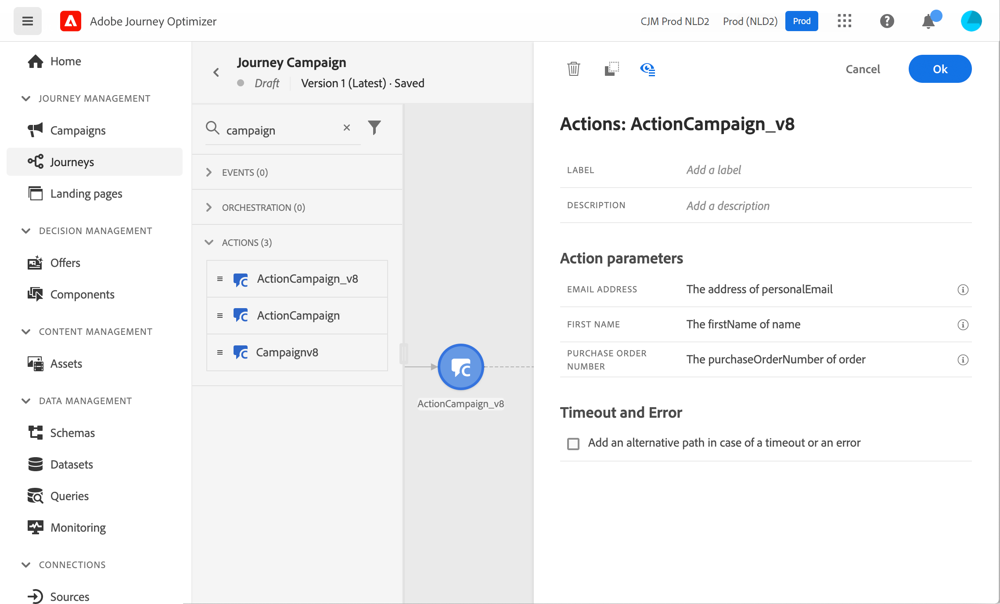

# 使用Campaign和Adobe Journey Optimizer

Adobe Campaign与Adobe Journey Optimizer之间的集成允许您在Adobe Journey Optimizer中编排客户历程，并使用Adobe Campaign事务性消息传送功能发送电子邮件、推送通知和/或短信。

基本步骤是在Campaign中创建事务性消息模板，然后在Adobe Journey Optimizer中创建事件、操作并设计历程。

[在此端到端示例中发现此集成](https://experienceleague.adobe.com/en/docs/journey-optimizer/using/orchestrate-journeys/journey-use-cases/business-use-cases/ajo-ac){target="_blank"}。

[请参阅Journey Optimizer文档以了解详情](https://experienceleague.adobe.com/zh-hans/docs/journey-optimizer/using/orchestrate-journeys/about-journey-building/using-adobe-campaign-v7-v8){target="_blank"}。
