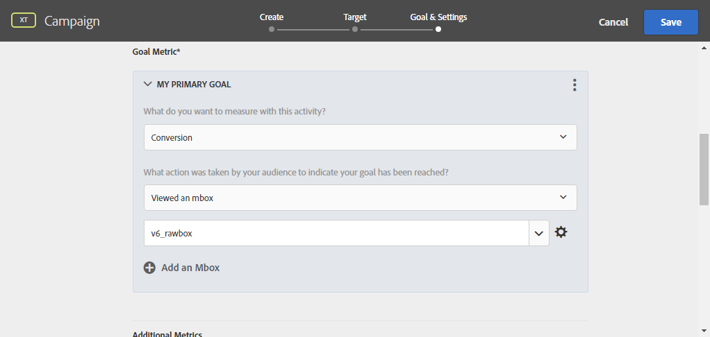

# 使用Campaign和Adobe Target

连接Campaign和Target以在Adobe Campaign电子邮件投放中包含来自Adobe Target的选件。

此集成可帮助您实施如下用例：当收件人打开通过Adobe Campaign发送的电子邮件时，您可通过调用Adobe Target来显示内容的动态版本。 此动态版本根据创建电子邮件时预先指定的规则进行计算。

>[!NOTE]
>该集成仅支持静态图像。 其他类型的内容无法个性化。

  作为托管Cloud Service用户， [联系人Adobe](../start/campaign-faq.md#support) 通过Campaign实施Experience Cloud触发器。

Adobe Target可以使用以下类型的数据：

* Adobe Campaign数据库中的数据
* 在Adobe Target中，仅当使用的数据不受法律限制时，才会链接到访客ID的区段
* Adobe Target数据：用户代理、IP地址、地理本地化数据

## 插入动态内容

在以下示例中，您将了解如何集成 **动态选件** 从Adobe Target转化为Adobe Campaign电子邮件。

我们希望创建一个包含图像且图像会根据收件人所在国家/地区动态更改的消息。 数据随每个mbox请求一起发送，具体取决于访客的IP地址。

在此电子邮件中，我们希望其中一个图像能够根据以下用户体验动态变化：

* 该电子邮件在法国开立。
* 此电子邮件在美国开立。
* 如果这些条件都不适用，则会显示默认图像。

需要在Adobe Campaign和Adobe Target中完成以下步骤：

1. [在电子邮件中插入动态选件](#inserting-dynamic-offer)
1. [创建重定向选件](#create-redirect-offers)
1. [创建受众](#audiences-target)
1. [创建体验定位活动](#creating-targeting-activity)
1. [预览和发送消息](#preview-send-email)

### 在电子邮件中插入动态选件 {#inserting-dynamic-offer}

在Adobe Campaign中，定义电子邮件的目标和内容。 您可以从Adobe Target插入动态图像。

为此，请指定默认图像的URL、位置名称以及要传输到Adobe Target的字段。

在Adobe Campaign中，可通过两种方式将动态图像从Target插入到电子邮件中：

* 如果您使用的是数字内容编辑器，请选择现有图像并选择 **[!UICONTROL Insert]** > **[!UICONTROL Dynamic image served by Adobe Target]** 工具栏中。

  

* 如果使用标准编辑器，请将光标置于要插入图像的位置，然后选择 **[!UICONTROL Include]** > **[!UICONTROL Dynamic image served by Adobe Target...]** 从个性化下拉菜单中。

  

然后，您可以定义图像参数：

* 此 **[!UICONTROL Default image]**&#x200B;的URL是在任何条件都不满足时将显示的图像。 您还可以从资源库中选择图像。
* 此 **[!UICONTROL Target location]** 是动态选件位置的名称。 您必须在Adobe Target活动中选择此位置。
* 此 **[!UICONTROL Landing Page]** 用于将默认图像重定向到默认登陆页面。 此URL仅在最终电子邮件中显示默认图像时适用。 它是可选的。
* 此 **[!UICONTROL Additional decision parameters]**  定义Adobe Target区段中定义的字段与Adobe Campaign字段之间的映射。 使用的Adobe Campaign字段必须在rawbox中指定。 在我们的示例中，我们添加了“国家/地区”字段。

如果您在Adobe Target的设置中使用企业权限，请在此字段中添加相应的资产。 在中了解有关Target企业权限的更多信息 [此页面](https://experienceleague.adobe.com/docs/target/using/administer/manage-users/enterprise/properties-overview.html#administer).

### 创建重定向选件 {#create-redirect-offers}

在Adobe Target中，您可以创建选件的其他版本。 根据每个用户体验，可以创建重定向选件，您可以指定要显示的图像。

在我们的示例中，我们需要两个重定向选件，第三个选件（默认选件）将在Adobe Campaign中定义。

1. 要在Target Standard中创建新重定向选件，请通过 **[!UICONTROL Content]** 选项卡，单击 **[!UICONTROL Code offers]**.

1. 单击 **[!UICONTROL Create]**，然后单击 **[!UICONTROL Redirect Offer]**。

   

1. 输入选件的名称和图像的URL。

   

1. 对其余重定向选件执行相同的过程。 有关详细信息，请参见此 [ 页面](https://experienceleague.adobe.com/docs/target/using/experiences/offers/offer-redirect.html#experiences)。

### 创建受众 {#audiences-target}

在Adobe Target中，您需要创建两个受众，对于要交付的不同内容，访问您的选件的用户将分类到该两个受众中。 为每个受众添加规则以定义能够查看选件的人员。

1. 要在Target中创建新受众，请执行以下操作： **[!UICONTROL Audiences]** 选项卡，单击 **[!UICONTROL Create Audience]**.

   

1. 向受众添加名称。

   

1. 单击 **[!UICONTROL Add a rule]** 并选择类别。 规则使用特定标准来定位访客。 您可以通过添加条件或其他类别中创建新规则来优化规则。

1. 对其余受众执行相同的过程。

### 创建体验定位活动 {#creating-targeting-activity}

在Adobe Target中，我们需要创建体验定位活动，定义各种体验，并将它们与相应的选件相关联。

首先，您需要定义受众：

1. 要创建体验定位活动，请从 **[!UICONTROL Activities]** 选项卡，单击 **[!UICONTROL Create Activity]** 则 **[!UICONTROL Experience Targeting]**.

   

1. 选择 **[!UICONTROL Form]** 作为 **[!UICONTROL Experience Composer]**.

1. 通过单击 **[!UICONTROL Change audience]** 按钮。

   

1. 选择在上一步中创建的受众。

   

1. 通过单击创建其他体验 **[!UICONTROL Add Experience Targeting]**.

然后，为每个受众添加内容：

1. 选择在Adobe Campaign中插入动态选件时选择的位置名称。

   

1. 单击下拉按钮并选择 **[!UICONTROL Change Redirect Offer]**.

   

1. 选择您之前创建的重定向选件。

   

1. 对第二个体验执行相同的步骤。

此 **[!UICONTROL Target]** 窗口将汇总您的活动。 如有必要，您可以添加其他体验。

此 **[!UICONTROL Goal & Settings]** 窗口允许您通过设置优先级、目标或持续时间来个性化活动。

此 **[!UICONTROL Reporting Settings]** 部分允许您选择操作并编辑将决定何时实现目标的参数。

## 预览和发送消息 {#preview-send-email}

在Adobe Campaign中，您现在可以预览电子邮件并测试其针对不同收件人的呈现方式。

您会注意到图像会根据创建的不同体验而发生更改。

您现在可以发送包含Target动态选件的电子邮件。

