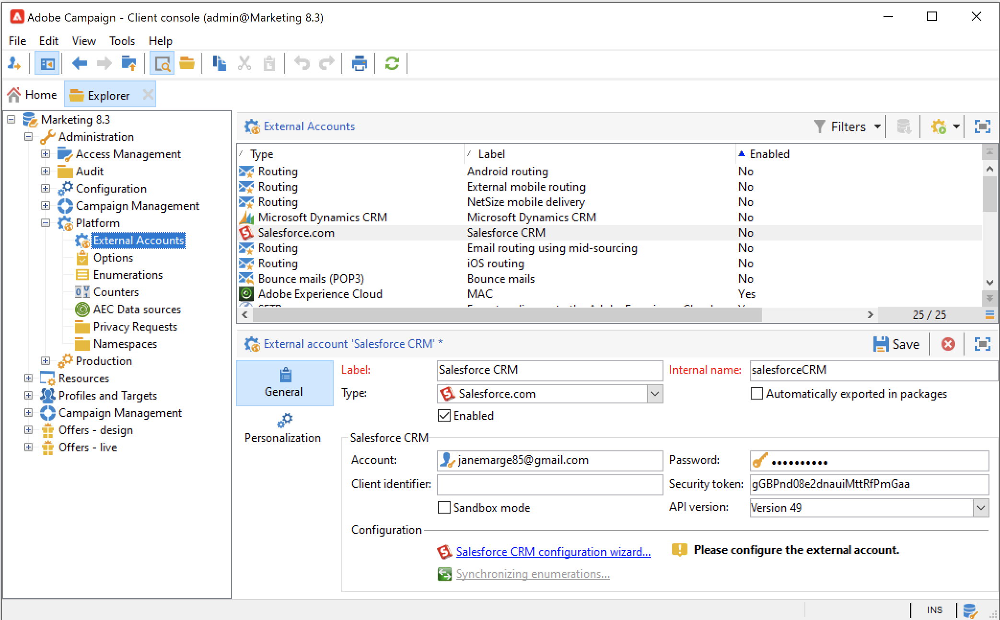

# 使用Campaign和SFDC{#crm-sfdc}

了解如何配置Campaign CRM连接器以将Campaign v8连接到 **Salesforce.com**.

完成配置后，系统之间的数据同步将通过专用的工作流活动进行。 [了解详情](crm-data-sync.md)。

>[!NOTE]
>
>Campaign中详细介绍了支持的SFDC版本 [兼容性矩阵](../start/compatibility-matrix.md).

请按照以下步骤配置专用的外部帐户，以将Salesforce数据导入和导出到Adobe Campaign。

## 创建连接{#new-sfdc-external-account}

首先，必须创建Salesforce外部帐户。

1. 浏览 **[!UICONTROL Administration > Platform > External accounts]** 节点，并创建外部帐户。
1. 选择 **[!UICONTROL Salesforce.com]** 外部帐户(位于 **类型** 中。
1. 输入设置以启用连接。

   

   要配置Salesforce CRM外部帐户以与Adobe Campaign配合使用，您需要提供以下详细信息：

   * 在 **[!UICONTROL Account]** 字段。
   * 输入您的Salesforce密码。
   * 您可以忽略 **[!UICONTROL Client identifier]** 字段。
   * 复制/粘贴您的Salesforce **[!UICONTROL Security token]**
   * 选择 **[!UICONTROL API version]**. Campaign中列出了受支持的SFDC API版本 [兼容性矩阵](../start/compatibility-matrix.md).

1. 选择 **启用** 选项在Campaign中激活帐户。

>[!NOTE]
>
>要批准该设置，您需要注销并重新启动Adobe Campaign控制台。

## 选择要同步的表{#sfdc-create-tables}

您现在可以配置表以进行同步。

1. 单击 **[!UICONTROL Salesforce CRM configuration wizard...]**.
1. 选择要同步并启动进程的表。
1. 检查在Adobe Campaign中生成的架构(位于 **[!UICONTROL Administration > Configuration > Data schemas]** 节点。

   示例 **Salesforce** 在Campaign中导入的架构：

   

## 同步枚举{#sfdc-enum-sync}

创建架构后，您可以自动将枚举从Salesforce同步到Adobe Campaign。

1. 从  **[!UICONTROL Synchronizing enumerations...]** 链接。
1. 选择与Salesforce枚举匹配的Adobe Campaign枚举。
您可以将Adobe Campaign枚举的所有值替换为CRM的值：要执行此操作，请选择 **[!UICONTROL Yes]** 在 **[!UICONTROL Replace]** 列。

   

1. 单击 **[!UICONTROL Next]** 然后 **[!UICONTROL Start]** 开始导入枚举。

1. 浏览 **[!UICONTROL Administration > Platform > Enumerations]** 用于检查导入值的节点。

Adobe Campaign和Salesforce.com现已连接。 您可以在两个系统之间设置数据同步。

要在Adobe Campaign数据和SFDC之间同步数据，请创建工作流并使用 **[!UICONTROL CRM connector]** 活动。

了解有关数据同步的更多信息 [本页](crm-data-sync.md).
