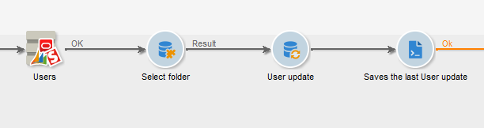
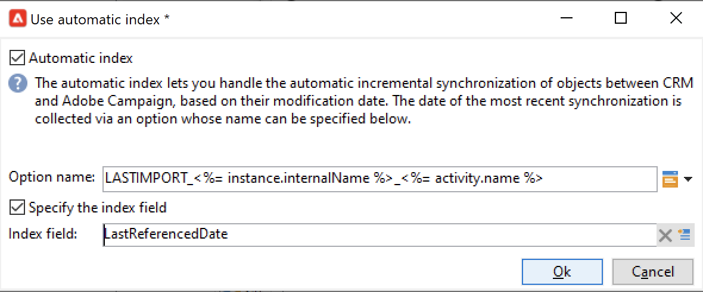

# 在Campaign和CRM之间同步数据 {#data-synchronization}

Adobe Campaign与CRM之间的数据同步由 **CRM Connector** 工作流活动。

例如，要将Microsoft Dynamics数据导入Adobe Campaign，请创建以下类型的工作流：

此工作流通过Microsoft Dynamics导入联系人，将其与现有Adobe Campaign数据同步，删除重复的联系人，并更新Adobe Campaign数据库。

的 **[!UICONTROL CRM Connector]** 活动需要配置为同步数据。

通过此活动，您可以：

* 从CRM导入 —  [了解更多](#importing-from-the-crm)
* 导出到CRM - [了解更多](#exporting-to-the-crm)
* 导入在CRM中删除的对象 —  [了解更多](#importing-objects-deleted-in-the-crm)
* 删除CRM中的对象 —  [了解更多](#deleting-objects-in-the-crm)

选择与要配置同步的CRM匹配的外部帐户，然后选择要同步的对象：帐户、机会、商机、联系人等

此活动的配置取决于要执行的流程。 下面详细介绍了各种配置。

## 从CRM导入 {#importing-from-the-crm}

要在Adobe Campaign中通过CRM导入数据，您需要创建以下类型的工作流：

1. 选择 **[!UICONTROL Import from the CRM]** 操作。
1. 在 **[!UICONTROL Remote object]** 下拉列表中，选择要导入的对象。 此对象与连接器配置期间在Adobe Campaign中创建的一个表匹配。
1. 在 **[!UICONTROL Remote fields]** ，输入要导入的字段。

   要添加字段，请单击 **[!UICONTROL Add]** 按钮，然后单击 **[!UICONTROL Edit expression]** 图标。

   如有必要，请使用 **[!UICONTROL Conversion]** 列。 可能的转化类型详见 [此部分](#data-format).

   >[!CAUTION]
   >
   >对于在CRM和Adobe Campaign中链接对象，CRM中记录的标识符是必需的。 该复选框在获得批准后会自动添加。
   >
   >对于增量数据导入，CRM端的上次修改日期也是必需的。

1. 您可以根据需要过滤要导入的数据。 为此，请单击 **[!UICONTROL Edit the filter...]** 链接。

   在以下示例中，Adobe Campaign将只导入自2021年11月1日起为其记录了某些活动的联系人。

   

   >[!CAUTION]
   >
   >有关数据过滤模式的限制详情，请参阅 [此部分](#filtering-data).

1. 选择 **[!UICONTROL Use automatic index...]** 选项，根据CRM和Adobe Campaign的上次修改日期自动管理增量对象同步。

   如需详细信息，请参阅[此部分](#variable-management)。

### 管理变量 {#variable-management}

激活 **[!UICONTROL Automatic index]** 选项，以仅收集自上次导入以来修改的对象。

默认情况下，上次同步的日期会存储在配置窗口中指定的选项中： **LASTIMPORT_&lt;%=instance.internalName%>_&lt;%=activityName%>**.

>[!NOTE]
>
>此注释仅适用于类属 **[!UICONTROL CRM Connector]** 活动。 对于其他CRM活动，该过程是自动的。
>
>必须手动创建并填充此选项 **[!UICONTROL Administration]** > **[!UICONTROL Platform]** > **[!UICONTROL Options]**. 它必须是文本选项，其值需要与以下格式匹配： **yyyy/MM/dd hh:mm:ss**.
> 
>您需要手动更新此选项才能进行进一步的导入。

您可以指定要考虑的远程CRM字段，以识别最新更改。

默认情况下，会使用以下字段（按指定顺序）：

* 对于Microsoft Dynamics: **已修改**,
* 对于Salesforce.com: **LastModifiedDate**, **SystemModstamp**.

激活 **[!UICONTROL Automatic index]** 选项会生成三个变量，这些变量可通过 **[!UICONTROL JavaScript code]** 键入活动。 这些活动包括：

* **vars.crmOptionName**:包含上次导入日期的选项的名称。
* **vars.crmStartImport**:上次数据导入的开始日期（包含）。
* **vars.crmEndDate**:上次数据导入的结束日期（排除）。

   >[!NOTE]
   >
   >这些日期以以下格式显示： **yyyy/MM/dd hh:mm:ss**.

### 筛选数据 {#filtering-data}

为确保对各种CRM进行高效操作，需要使用以下规则创建过滤器：

* 每个筛选级别只能使用一种类型的运算符。
* 不支持AND NOT运算符。
* 比较可能只涉及空值（“为空”/“不为空”类型）或数字。 这表示将评估值（右列），并且此评估的结果必须为数字。 因此，不支持连接类型比较。
* 右侧列中包含的值将在JavaScript中进行评估。
* 不支持连接比较。
* 左侧列中的表达式必须是字段。 它不能是多个表达式、数字等的组合。

### 订购依据 {#order-by}

在Microsoft Dynamics和Salesforce.com中，您可以对要导入的远程字段进行升序或降序排序。

为此，请单击 **[!UICONTROL Order by]** 链接，并将列添加到列表。

列表中列的顺序是排序顺序：

### 记录标识 {#record-identification}

您可以使用在工作流中预先计算的群体，而不是导入CRM中包含的（可能已过滤）元素。

为此，请选择 **[!UICONTROL Use the population calculated upstream]** 选项，并指定包含远程标识符的字段。

然后，选择要导入的集客群体字段，如下所示：

## 导出到CRM {#exporting-to-the-crm}

将Adobe Campaign数据导出到CRM，以将其整个内容复制到CRM数据库。

要将数据导出到CRM，请创建以下类型的工作流：

1. 选择 **[!UICONTROL Export to CRM]** 操作。
1. 转到 **[!UICONTROL Remote object]** 下拉列表，然后选择要导出的对象。 此对象与连接器配置期间在Adobe Campaign中创建的一个表匹配。

   >[!CAUTION]
   >
   >的导出功能 **[!UICONTROL CRM Connector]** 活动可在您的CRM上插入或更新字段。 要在CRM中启用字段更新，请指定远程表的主键。 如果缺少键，则将插入数据，而不是更新数据。

1. 如果需要执行更快的导出，请检查  **[!UICONTROL Export in Batches]** 选项。

   

1. 在 **[!UICONTROL Mapping]** ，单击 **[!UICONTROL New]** ，以在CRM中指定要导出的字段及其映射。

   要添加字段，请单击 **[!UICONTROL Add]** 按钮，然后单击 **[!UICONTROL Edit expression]** 图标。

   >[!NOTE]
   >
   >如果没有为字段定义匹配项，则无法更新值：它们会直接插入到您的CRM中。

   如有必要，请使用 **[!UICONTROL Conversion]** 列。 可能的转化类型详见 [此部分](#data-format).

   >[!NOTE]
   >
   >要导出的记录列表和导出结果将保存在临时文件中，在工作流完成或重新启动之前，该临时文件将一直保持可访问状态。 这样，您就可以在发生错误时安全地启动该进程。

## 其他配置 {#additional-configurations}

### 数据格式 {#data-format}

在将数据格式导入CRM或从CRM导入数据格式时，您可以即时转换这些格式。

为此，请选择要在匹配列中应用的转化。

的 **[!UICONTROL Default]** 模式会应用自动数据转换，在大多数情况下，自动转换等于数据的复制/粘贴。 但是，应用时区管理。

其他可能的转化包括：

* **[!UICONTROL Date only]**:删除日期+时间类型字段。
* **[!UICONTROL Without time offset]**:取消在默认模式下应用的时区管理。
* **[!UICONTROL Copy/Paste]**:使用原始数据，如字符串（无转化）。

### 错误处理 {#error-processing}

在数据导入或导出的框架内，您可以对错误和拒绝应用特定流程。 为此，请选择 **[!UICONTROL Keep the rejections in a file]** 和 **[!UICONTROL Process errors]** 选项 **[!UICONTROL Behavior]** 选项卡。

这些选项可添加相关的输出过渡。

然后插入相关活动以处理数据。 例如，添加 **等待** 活动并计划重试错误。

的 **[!UICONTROL Reject]** 输出过渡允许您访问包含与错误消息和代码相关的特定列的输出架构。 对于Salesforce.com，此列为 **errorSymbol** （错误符号，与错误代码不同）， **errorMessage** （错误上下文的描述）。

## 导入在CRM中删除的对象 {#importing-objects-deleted-in-the-crm}

您可以将CRM中已删除的对象导入Adobe Campaign。

1. 选择 **[!UICONTROL Import objects deleted in the CRM]** 操作。
1. 转到 **[!UICONTROL Remote object]** 下拉列表，然后选择与进程相关的对象。 此对象与连接器配置期间在Adobe Campaign中创建的一个表匹配。
1. 指定要在 **[!UICONTROL Start date]** 和 **[!UICONTROL End date]** 字段（包含日期）。

   >[!CAUTION]
   >
   >删除期限必须与CRM特定限制一致。 例如，对于Salesforce.com，30天前删除的元素将无法恢复。

## 删除CRM中的对象 {#deleting-objects-in-the-crm}

要删除CRM上的对象，请指定要删除的远程元素的主键。

的 **[!UICONTROL Behavior]** 选项卡允许您启用拒绝处理。 此选项为 **[!UICONTROL CRM connector]** 活动。 有关更多信息，请参阅 [错误处理](#error-processing).
