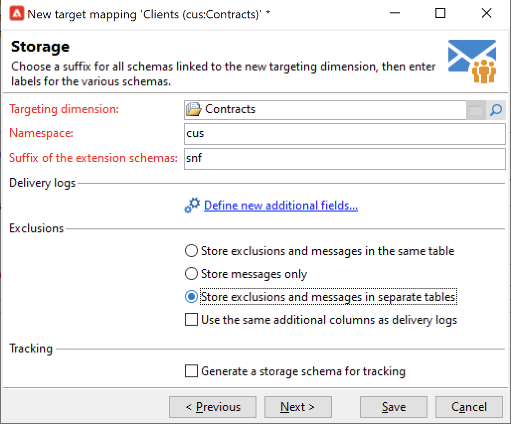

# 联合数据访问 (FDA){#gs-fda}

使用FDA连接器（联合数据访问）将Campaign连接到一个或多个&#x200B;**外部数据库**，并处理存储到它们中的信息，而不会影响您的Campaign云数据库数据。 然后，您便可以访问外部数据，而无需更改Adobe Campaign数据的结构。

>[!NOTE]
>
>[兼容性矩阵](../start/compatibility-matrix.md)中列出了FDA的兼容数据库。

利用促销活动联合数据访问选项，可在第三方数据库中扩展您的数据模型。 它将自动检测目标表的结构并使用SQL源中的数据。

在[!DNL Adobe Campaign]和外部数据库上需要特定的&#x200B;**权限**&#x200B;才能进行交互。 在[此部分](#fda-permissions)中了解详情。

## 最佳实践和限制

* **使用外部数据优化电子邮件个性化**

   您可以在专用工作流中预处理消息个性化。 要执行此操作，请使用投放属性的&#x200B;**[!UICONTROL Analysis]**&#x200B;选项卡中提供的&#x200B;**[!UICONTROL Prepare the personalization data with a workflow]**&#x200B;选项。

   在投放分析期间，此选项会自动创建并执行一个工作流，该工作流将链接到目标的所有数据存储在临时表中，包括来自外部数据库中链接的表的数据。

   此选项可显着提高执行个性化步骤时的性能。

* **FDA限制**

   FDA选项用于在工作流中以批处理模式处理外部数据库中的数据。 为避免出现性能问题，不建议在统一操作的背景下使用FDA模块，例如：个性化、互动、实时消息传送等。

   尽量避免同时使用Adobe Campaign和外部数据库所需的操作。 为此，您可以：

   * 将Adobe Campaign数据库导出到外部数据库，并仅在从外部数据库执行操作后再将结果重新导入Adobe Campaign。

   * 从外部Adobe Campaign数据库收集数据并在本地执行操作。

   如果要使用外部数据库中的数据在投放中进行个性化，请收集要在工作流中使用的数据，以在临时表格中提供。 然后，使用临时表格中的数据对投放进行个性化。

   FDA选项受您使用的外部数据库系统的限制。

## 配置步骤{#fda-configuration-steps}

要使用FDA设置对外部数据库的访问，配置步骤如下：

1. 作为Adobe Managed Services用户，请联系Adobe以在Campaign实例上安装驱动程序。
1. 安装驱动程序后，在Adobe Campaign服务器上设置与数据库对应的外部帐户并测试外部帐户。 [了解详情](#fda-external-account)。
1. 在Adobe Campaign中创建外部数据库的模式。 这允许您标识外部数据库的数据结构。 [了解详情](#create-data-schema)
1. 如果需要，从之前创建的架构创建新的目标映射。 如果投放的收件人来自外部数据库，则需要此参数。 此实施具有与消息个性化相关的限制。 [了解详情](#define-data-mapping)

## 外部数据库外部帐户{#fda-external-account}

您需要创建特定的外部帐户，以将Campaign实例连接到外部数据库。

要实现此目的，请执行以下步骤：

1. 从Campaign **[!UICONTROL Explorer]**&#x200B;中，浏览到&#x200B;**[!UICONTROL Administration]** `>` **[!UICONTROL Platform]** `>` **[!UICONTROL External accounts]**。

1. 单击 **[!UICONTROL New]**。

   >[!NOTE]
   >
   > 要处于活动状态，必须选中&#x200B;**[!UICONTROL Enabled]**&#x200B;选项。 如有必要，请取消选中此选项，以禁用对此数据库的访问，而不删除其配置。

1. 选择&#x200B;**[!UICONTROL External database]**&#x200B;作为外部帐户的&#x200B;**[!UICONTROL Type]**。

1. 在下拉列表中选择外部数据库，然后配置外部帐户。 您必须指定：

   * **[!UICONTROL Server]**:服务器的URL

   * **[!UICONTROL Account]**:用户的名称

   * **[!UICONTROL Password]**:用户帐户密码

   * **[!UICONTROL Database]**:数据库的名称

      

1. 单击&#x200B;**[!UICONTROL Parameters]**&#x200B;选项卡，然后单击&#x200B;**[!UICONTROL Deploy functions]**&#x200B;按钮以创建函数。

1. 输入参数后，单击&#x200B;**[!UICONTROL Test the connection]**&#x200B;按钮以批准这些参数。

1. 要允许Adobe Campaign访问此数据库，必须部署SQL函数。 单击&#x200B;**[!UICONTROL Parameters]**&#x200B;选项卡，然后单击&#x200B;**[!UICONTROL Deploy functions]**&#x200B;按钮。

您可以在&#x200B;**[!UICONTROL Parameters]**&#x200B;选项卡中为表和索引定义特定的工作表空间。

对于[!DNL Snowflake]，连接器支持以下选项：

| 选项 | 说明 |
|---|---|
| 工作模式 | 用于工作表的数据库模式 |
| 仓库 | 要使用的默认仓库的名称。 它将覆盖用户的默认设置。 |
| 时区名称 | 默认为空，这表示使用Campaign Classic应用程序服务器的系统时区。 可以使用选项强制使用TIMEZONE会话参数。  有关详细信息，请参见[此页面](https://docs.snowflake.net/manuals/sql-reference/parameters.html#timezone)。 |
| WeekStart | WEEK_START会话参数。 默认情况下，设置为0。  有关详细信息，请参见[此页面](https://docs.snowflake.com/en/sql-reference/parameters.html#week-start)。 |
| UseCachedResult | USE_CACHED_RESULTS会话参数。 默认情况下，设置为TRUE。 此选项可用于禁用Snowflake缓存结果。  有关详细信息，请参见[此页面](https://docs.snowflake.net/manuals/user-guide/querying-persisted-results.html)。 |

## 创建数据架构{#create-data-schema}

要在Adobe Campaign中创建外部数据库的模式，请执行以下步骤：

1. 单击数据架构列表上方的&#x200B;**[!UICONTROL New]**&#x200B;按钮，然后选择&#x200B;**[!UICONTROL Access external data]**。

   

1. 输入架构的名称和说明，然后选择将启用与数据库连接的外部帐户。 这允许访问外部库中可用的表列表。 选择包含要收集的数据的表。

   

1. 单击&#x200B;**[!UICONTROL OK]**&#x200B;确认。 Adobe Campaign会自动检测所选表的结构并生成逻辑架构。 请注意，Adobe Campaign不生成链接。

1. 单击&#x200B;**[!UICONTROL Save]**&#x200B;以确认创建。

## 定义目标映射{#define-data-mapping}

您可以在外部表中定义数据的映射。

为此，在创建外部表的架构后，您需要创建新的投放映射，以将此表中的数据用作投放目标。

为此，请执行以下步骤：

1. 从Adobe Campaign资源管理器浏览到&#x200B;**[!UICONTROL Administration]** `>` **[!UICONTROL Campaign Management]** `>` **[!UICONTROL Target mappings]**。

1. 创建新的目标映射，然后选择之前创建的架构作为目标维度。

   

1. 指示存储投放信息的字段（姓氏、名字、电子邮件、地址等）。

   

1. 指定信息存储的参数，包括扩展架构的后缀，以便它们易于识别。

   

   您可以选择是存储包含消息的排除项(**excludelog**)(**broadlog**)，还是存储在单独的表中。

   您还可以选择是否管理此投放映射的跟踪(**trackinglog**)。

1. 然后，选择要考虑的扩展。 扩展类型取决于您平台的参数和选项（查看您的许可合同）。

   

   单击&#x200B;**[!UICONTROL Save]**&#x200B;按钮以启动投放映射创建：所有链接的表都会根据所选参数自动创建。

## 权限{#fda-permissions}

在[!DNL Adobe Campaign]和外部数据库上需要特定的&#x200B;**权限**&#x200B;才能进行交互。

首先，为了用户能够通过FDA对外部数据库执行操作，运算符必须在[!DNL Adobe Campaign]中具有特定的命名权限。

1. 在Adobe Campaign资源管理器中选择&#x200B;**[!UICONTROL Administration > Access Management > Named Rights]**&#x200B;节点。
1. 通过指定所选标签创建新权限。
1. 使用以下格式&#x200B;**user:base@server**&#x200B;输入“已命名”权限的名称，其中：

   * **** user是外部数据库中用户的名称
   * **** base是外部数据库的名称
   * **** server是外部数据库服务器的名称

1. 保存“已命名”权限，并将其链接到Adobe Campaign资源管理器的&#x200B;**[!UICONTROL Administration > Access Management > Operators]**&#x200B;节点中的选定运算符。

然后，要处理外部数据库中包含的数据，Adobe Campaign操作员必须对数据库至少具有“写入”权限才能创建工作表。 这些表将由Adobe Campaign自动删除。

需要以下权限：

* **CONNECT**:与远程数据库的连接
* **读取数据**:对包含客户数据的表的只读访问权限
* **阅读“MetaData**”：访问服务器数据目录以获取表结构
* **加载**:在工作表中批量加载（处理集合和联接时需要）
* **为表/** 索引/ **过程/函数创建/删除** (仅适用于由Adobe Campaign生成的工作表)
* **说明** （推荐）：在出现问题时监控性能
* **写入数据** （取决于集成方案）

数据库管理员需要使这些权限与每个数据库引擎的特定权限相匹配，如下所述。

|   | Snowflake | Amazon Redshift |
|:-:|:-:|:-:|
| **连接到远程数据库** | 仓库的使用情况、数据库的使用情况和架构权限的使用情况 | 创建链接到AWS帐户的用户 |
| **创建表** | 创建关于架构权限的表 | 创建权限 |
| **创建索引** | N/A | 创建权限 |
| **创建函数** | 创建关于架构权限的函数 | 使用语言plpythonu权限可调用外部python脚本 |
| **创建过程** | 不适用 | 使用语言python权限来调用外部python脚本 |
| **删除对象（表、索引、函数、过程）** | 拥有对象 | 拥有对象或是超级用户 |
| **监控执行** | 所需对象的MONITOR权限 | 使用EXPLAIN命令无需任何权限 |
| **写入数据** | INSERT和/或UPDATE权限（取决于写入操作） | 插入和更新权限 |
| **将数据加载到表中** | 在架构上创建暂存，选择并插入目标表权限 | 选择和插入权限 |
| **访问客户端数据** | 选择“开（未来）表”或“查看”权限 | 选择权限 |
| **访问元数据** | 选择INFORMATION_SCHEMA权限 | 选择权限 |

## 在工作流中使用外部数据

创建数据架构后，即可在Adobe Campaign工作流中处理数据。

利用多个活动，可与外部数据库中的数据交互：

* **根据外部数据进行过滤**  — 利用活 **[!UICONTROL Query]** 动，可添加外部数据并在定义的过滤配置中使用。

* **创建子集**  — 利用 **[!UICONTROL Split]** 活动，可创建子集。您可以使用外部数据定义要使用的筛选条件。

* **加载外部数据库**  — 您可以在活动中使用外部数 **[!UICONTROL Data loading (RDBMS)]** 据。

* **添加信息和链接**  — 利用 **[!UICONTROL Enrichment]** 活动，可向工作流的工作台添加其他数据，以及链接到外部表。在此上下文中，它可以使用外部数据库中的数据。

您还可以通过这些工作流活动直接定义与外部数据库的连接，以便用于临时用途。 在这种情况下，它将位于本地外部数据库上，保留用于当前工作流：它不会保存在外部帐户上。

>[!CAUTION]
>
>此类配置只能临时用于收集数据。 对于任何其他用法，最好使用外部帐户配置。

例如，在&#x200B;**[!UICONTROL Query]**&#x200B;活动中，您可以定义与外部数据库的临时连接，如下所示：

1. 打开活动，然后单击&#x200B;**[!UICONTROL Add data...]**
1. 选择&#x200B;**[!UICONTROL External data]**&#x200B;选项
1. 选择&#x200B;**[!UICONTROL Locally defining the data source]**&#x200B;选项
1. 在下拉列表中选择目标数据库引擎。 输入服务器的名称并提供身份验证参数。 还指定外部数据库的名称。
1. 选择存储数据的表。 您可以直接在相应的字段中输入表的名称，也可以单击编辑图标以访问数据库表的列表。
1. 单击&#x200B;**[!UICONTROL Add]**&#x200B;按钮可在外部数据库数据与Adobe Campaign数据库中的数据之间定义一个或多个协调字段。 通过&#x200B;**[!UICONTROL Remote field]**&#x200B;和&#x200B;**[!UICONTROL Local field]**&#x200B;的&#x200B;**[!UICONTROL Edit expression]**&#x200B;图标，您可以访问每个表的字段列表。
1. 如有必要，请指定筛选条件和数据排序模式。
1. 选择要在外部数据库中收集的附加数据。 为此，请双击要添加以在&#x200B;**[!UICONTROL Output columns]**&#x200B;中显示这些字段的字段。
1. 单击&#x200B;**[!UICONTROL Finish]**&#x200B;以确认此配置。
