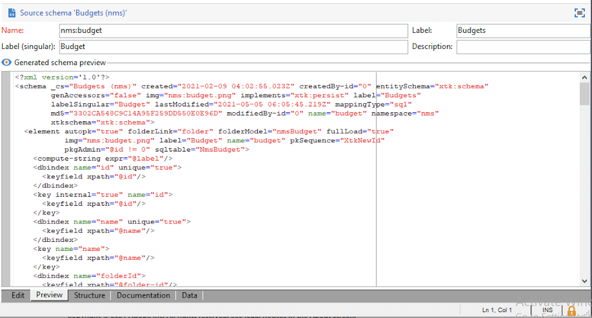

# 创建新架构{#create-new-schema}

要编辑、创建和配置架构，请单击 **[!UICONTROL Administration > Configuration > Data schemas]** Adobe Campaign客户端控制台的节点。

>[!NOTE]
>
>内置数据架构只能由Adobe Campaign控制台的管理员删除。


的 **[!UICONTROL Edit]** 选项卡显示架构的XML内容：


>[!NOTE]
>
>“名称”编辑控件允许您输入由名称和命名空间组成的架构键。 架构根元素的“name”和“namespace”属性会在架构的XML编辑区中自动更新。 请注意，某些命名空间仅是内部命名空间。 [了解详情](schemas.md#reserved-namespaces)

的 **[!UICONTROL Preview]** 选项卡会自动生成扩展架构：



>[!NOTE]
>
>保存源架构后，将自动启动扩展架构的生成。

如果需要检查架构的完整结构，可以使用 **[!UICONTROL Preview]** 选项卡。 如果架构已扩展，则将能够显示其所有扩展。 作为补充， **[!UICONTROL Documentation]** 选项卡显示所有架构属性和元素及其属性（SQL字段、类型/长度、标签、描述）。 的 **[!UICONTROL Documentation]** 选项卡仅适用于生成的架构。

## 用例：创建合同表 {#example--creating-a-contract-table}

在以下示例中，您为 **合同** 在数据库中。 此表允许您存储每个合同的持有人和共同持有人的名字和姓氏以及电子邮件地址。

为此，需要创建表的模式并更新数据库结构以生成相应的表。 下面列出了详细步骤。

1. 编辑 **[!UICONTROL Administration > Configuration > Data schemas]** Adobe Campaign树的节点，然后单击 **[!UICONTROL New]**.
1. 选择 **[!UICONTROL Create a new table in the data template]** 选项并单击 **[!UICONTROL Next]** .

   

1. 指定表的名称和命名空间。

   

   >[!NOTE]
   >
   >默认情况下，用户创建的架构存储在“cus”命名空间中。 有关更多信息，请参阅 [模式的标识](extend-schema.md#identification-of-a-schema).

1. 创建表的内容。 我们建议使用专用助手，以确保不缺少任何设置。 为此，请单击 **[!UICONTROL Insert]** 按钮，然后选择要添加的设置类型。

   

1. 为合同表定义设置。

   最佳做法是，通过在Cloud数据库中添加 `dataSource="nms:extAccount:ffda"` 属性。 默认情况下，在创建新表时会添加此属性。

   ```
   <srcSchema created="YYYY-MM-DD HH:MM:SS.TZ" desc="Active contracts" img="crm:crm/mscrm/mscrm_account_16x16.png"
           label="Contracts" labelSingular="Contract" lastModified="YYYY-MM-DD HH:MM:SS.TZ"
           mappingType="sql" name="Contracts" namespace="cus" xtkschema="xtk:srcSchema">
      <element dataSource="nms:extAccount:ffda" desc="Active contracts" img="crm:crm/mscrm/mscrm_account_16x16.png"
           label="Contracts" labelSingular="Contract" name="Contracts">
           <attribute name="holderName" label="Holder last name" type="string"/>
           <attribute name="holderFirstName" label="Holder first name" type="string"/>
           <attribute name="holderEmail" label="Holder email" type="string"/>
           <attribute name="co-holderName" label="Co-holder last name" type="string"/>           
           <attribute name="co-holderFirstName" label="Co-holder first name" type="string"/>           
           <attribute name="co-holderEmail" label="Co-holder email" type="string"/>    
           <attribute name="date" label="Subscription date" type="date"/>     
           <attribute name="noContract" label="Contract number" type="long"/> 
      </element>
   </srcSchema>
   ```

   添加合同明细列表的类型。

   ```
   <srcSchema created="AA-MM-DD HH:MM:SS.TZ" desc="Active contracts" img="crm:crm/mscrm/mscrm_account_16x16.png" label="Contracts" labelSingular="Contract" AA-MM-DD HH:MM:SS.TZ"mappingType="sql" name="Contracts" namespace="cus" xtkschema="xtk:srcSchema">
      <enumeration basetype="byte" name="typeContract">
         <value label="Home" name="home" value="0"/>
         <value label="Car" name="car" value="1"/>
         <value label="Health" name="health" value="2"/>
         <value label="Pension fund" name="pension fund" value="2"/>
      </enumeration>
      <element dataSource="nms:extAccount:ffda" desc="Active contracts" img="crm:crm/mscrm/mscrm_account_16x16.png"
           label="Contracts" labelSingular="Contract" name="Contracts">
           <attribute name="holderName" label="Holder last name" type="string"/>
           <attribute name="holderFirstName" label="Holder first name" type="string"/>
           <attribute name="holderEmail" label="Holder email" type="string"/>
           <attribute name="co-holderName" label="Co-holder last name" type="string"/>           
           <attribute name="co-holderFirstName" label="Co-holder first name" type="string"/>           
           <attribute name="co-holderEmail" label="Co-holder email" type="string"/>    
           <attribute name="date" label="Subscription date" type="date"/>     
           <attribute name="noContract" label="Contract number" type="long"/> 
      </element>
   </srcSchema>
   ```

1. 保存架构，然后单击 **[!UICONTROL Structure]** 选项卡以生成结构：

   

1. 更新数据库结构以创建模式将链接到的表。 如需详细信息，请参阅[此部分](update-database-structure.md)。
