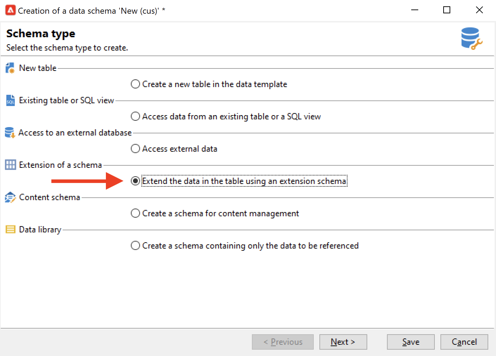
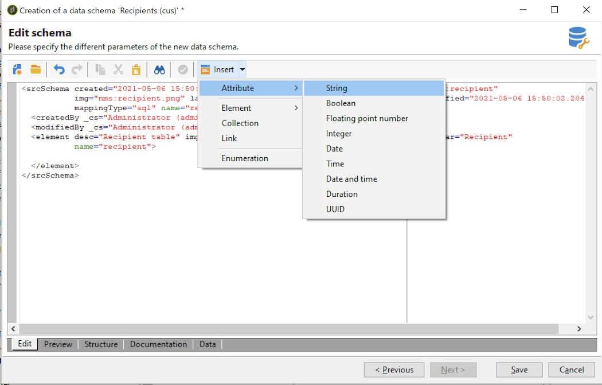
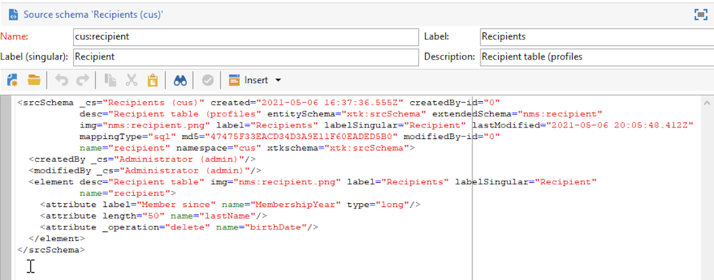

# 扩展模式{#extend-schemas}

作为技术用户，您可以自定义Campaign数据模型以满足实施的需求：将元素添加到现有架构、修改架构中的元素或删除元素。

自定义Campaign数据模型的关键步骤包括：

1. 创建扩展架构
1. 更新Campaign数据库
1. 调整输入表单

>[!CAUTION]
>不得直接修改内置架构。 如果您需要调整内置模式，则必须对其进行扩展。

要更好地了解Campaign内置表及其交互，请参阅[此页面](datamodel.md)。 在[此页面](create-schema.md)中创建新架构时，另请参阅建议。

要扩展架构，请执行以下步骤：

1. 在资源管理器中导航到&#x200B;**[!UICONTROL Administration > Configuration > Data schemas]**&#x200B;文件夹。
1. 单击“**新建**”按钮并选择&#x200B;**[!UICONTROL Extend the data in a table using an extension schema]**。

   

1. 标识要扩展的内置模式并将其选定。

   

   按照惯例，将扩展模式命名为与内置模式相同的名称，并使用自定义命名空间。  请注意，某些命名空间仅是内部命名空间。 [了解详情](schemas.md#reserved-namespaces)

   

1. 在架构编辑器中，使用上下文菜单添加所需的元素并保存。

   

   在以下示例中，我们添加了&#x200B;**MembershipYear**&#x200B;属性，为姓氏设置了长度限制（此限制将覆盖默认长度限制），并从内置架构中删除了出生日期。

   

   ```
   <srcSchema created="YYYY-MM-DD" desc="Recipient table" extendedSchema="nms:recipient"
           img="nms:recipient.png" label="Recipients" labelSingular="Recipient" lastModified="YYYY-MM-DD"
           mappingType="sql" name="recipient" namespace="cus" xtkschema="xtk:srcSchema">
    <element desc="Recipient table" img="nms:recipient.png" label="Recipients" labelSingular="Recipient" name="recipient">
       <attribute label="Member since" name="MembershipYear" type="long"/>
       <attribute length="50" name="lastName"/>
       <attribute _operation="delete" name="birthDate"/>
   </element>
   </srcSchema>
   ```

1. 断开连接并重新连接到Campaign，以检查&#x200B;**[!UICONTROL Structure]**&#x200B;选项卡中的架构结构更新。

   

1. 更新数据库结构以应用更改。 [了解详情](update-database-structure.md)

1. 在数据库中实施更改后，您可以调整收件人输入表单以使更改可见。 [了解详情](forms.md)
