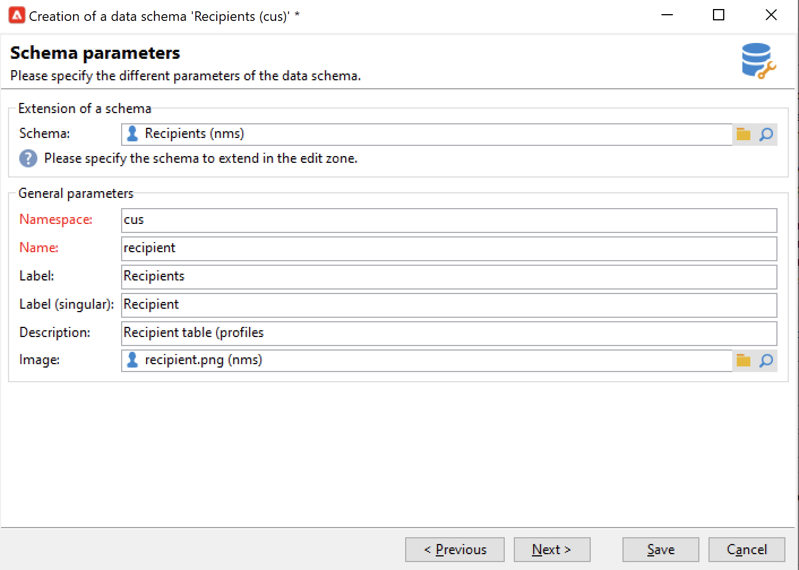

# 扩展模式{#extend-schemas}

作为技术用户，您可以自定义活动数据模型以满足您的实施需求：向现有模式添加元素、在模式中修改元素或删除元素。

自定义活动数据模型的关键步骤有：

1. 创建扩展模式
1. 更新活动数据库
1. 调整输入表单

>[!CAUTION]
>内置模式不得直接修改。 如果您需要调整内置模式，则必须扩展它。

：灯泡：要更好地了解活动内置表及其交互，请参阅[此页](datamodel.md)。

要扩展模式，请执行以下步骤：

1. 导览至资源管理器中的&#x200B;**[!UICONTROL Administration > Configuration > Data schemas]**&#x200B;文件夹。
1. 单击&#x200B;**新建**&#x200B;按钮并选择&#x200B;**[!UICONTROL Extend the data in a table using an extension schema]**。

   

1. 确定要扩展的内置模式并选择它。

   

   根据惯例，将扩展模式命名为与内置模式相同的命名空间，并使用自定义。

   

1. 进入模式编辑器后，使用上下文菜单添加所需的元素并进行保存。

   

   在以下示例中，我们添加“成员年”属性，为姓氏设置长度限制（此限制将覆盖默认的姓氏），并从内置模式中删除出生日期。

   ```
   <srcSchema created="YY-MM-DD" desc="Recipient table" extendedSchema="nms:recipient"
           img="nms:recipient.png" label="Recipients" labelSingular="Recipient" lastModified="YY-MM-DD"
           mappingType="sql" name="recipient" namespace="cus" xtkschema="xtk:srcSchema">
   <element desc="Recipient table" img="nms:recipient.png" label="Recipients" labelSingular="Recipient"
           name="recipient">
   <attribute name="Membership Year" label="memberYear" type="long"/>
   <attribute length="50" name="lastName"/>
   <attribute _operation="delete" name="birthDate"/>
   </element>
   </srcSchema> 
   ```

1. 更新数据库结构以应用更改。 [了解详情](update-database-structure.md)
1. 在收件人库中实施更改后，您可以调整数据输入表单以使更改可见。 [了解详情](forms.md)