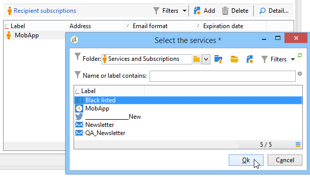

# 输入表单入门{#gs-ac-forms}

创建或扩展架构时，您需要创建或修改关联的输入表单，以使这些更改对最终用户可见。

通过输入表单，您可以从Adobe Campaign客户端控制台编辑与数据架构关联的实例。 表单通过其名称和命名空间进行标识。

表单的标识键是由命名空间和用冒号分隔的名称组成的字符串，例如：&quot;cus:contact&quot;。

## 编辑输入表单

从 **[!UICONTROL Administration]> [!UICONTROL Configuration] >[!UICONTROL Input forms]** 客户端控制台的文件夹：


编辑区域允许您输入输入表单的XML内容：


预览会生成输入表单的显示：


## 窗体结构

表单的描述是一种结构化XML文档，用于观察表单模式的语法 **xtk:form**.

输入表单的XML文档必须包含 `<form>` 根元素，其中  **name** 和  **命名空间** 属性来填充表单名称和命名空间。

```
<form name="form_name" namespace="name_space">
...
</form>
```

默认情况下，表单与具有相同名称和命名空间的数据架构相关联。 要将表单与其他名称关联，请将 **实体模式** 属性 `<form>` 元素。 为了说明输入表单的结构，让我们使用“cus:recipient”示例模式描述接口：

```
<srcSchema name="recipient" namespace="cus">
  <enumeration name="gender" basetype="byte">    
    <value name="unknown" label="Not specified" value="0"/>    
    <value name="male" label="Male" value="1"/>   
    <value name="female" label="Female" value="2"/>   
  </enumeration>

  <element name="recipient">
    <attribute name="email" type="string" length="80" label="Email" desc="E-mail address of recipient"/>
    <attribute name="birthDate" type="datetime" label="Date"/>
    <attribute name="gender" type="byte" label="Gender" enum="gender"/>
  </element>
</srcSchema>
```

基于示例架构的输入表单：


```
<form name="recipient" namespace="cus">
  <input xpath="@gender"/>
  <input xpath="@birthDate"/>
  <input xpath="@email"/>
</form>
```

编辑控件的描述从 `<form>` 根元素。 在 **`<input>`** 元素 **xpath** 属性，其中包含其架构中字段的路径。

编辑控件会自动适应相应的数据类型，并使用架构中定义的标签。

>[!NOTE]
>
>您可以通过添加 **标签** 属性 `<input>` 元素：\
>`<input label="E-mail address" xpath="@name" />`

默认情况下，每个字段都显示在一行中，并根据数据类型占用所有可用空间。

 所有表单属性均列在 [Campaign Classicv7文档](https://experienceleague.adobe.com/developer/campaign-api/api/control-Button.html).

## 格式化 {#formatting}

控件的布局类似于HTML表中使用的布局，它可以将控件划分为多列、隔行元素或指定可用空间的占用。 但是，请记住，格式仅允许您按比例划分区域；不能为对象指定固定维度。

要在两列中显示上述示例的控件：


```
<form name="recipient" namespace="cus">
  <container colcount="2">
    <input xpath="@gender"/>
    <input xpath="@birthDate"/>
    <input xpath="@email"/>
  </container>
</form>
```

的 **`<container>`** 元素 **colcount** 属性允许您将子控件的显示强制显示到两列上。

的 **colspan** 属性会按值中输入的列数来扩展控件：


```
<form name="recipient" namespace="cus">
  <container colcount="2">
    <input xpath="@gender"/>
    <input xpath="@birthDate"/>
    <input xpath="@email" colspan="2"/>
  </container>
</form> 
```

通过填充 **type=&quot;frame&quot;** 属性时，容器会在子控件周围添加一个框架，该框架中的标签包含在 **标签** 属性：


```
<form name="recipient" namespace="cus">
  <container colcount="2" type="frame" label="General">
    <input xpath="@gender"/>
    <input xpath="@birthDate"/>
    <input xpath="@email" colspan="2"/>
  </container>
</form>
```

A **`<static>`** 元素可用于设置输入表单的格式：


```
<form name="recipient" namespace="cus">
  <static type="separator" colspan="2" label="General"/>
  <input xpath="@gender"/>
  <input xpath="@birthDate"/>
  <input xpath="@email" colspan="2"/>
  <static type="help" label="General information about recipient with date of birth, gender, and e-mail address." colspan="2"/>
</form>
```

的 **`<static>`** 标记 **分隔符** 使用类型，可添加带有 **标签** 属性。

使用 `<static>` 标记。 文本的内容是在 **标签** 属性。

## 使用容器 {#containers}

使用 **容器** 对一组控件进行分组。 它们由 **`<container>`** 元素。 上面使用它们设置多列控件的格式。

的 **xpath** 属性 `<container>` 允许您简化子控件的引用。 然后，控件的引用将相对于父项 `<container>` 父项。

不带“xpath”的容器示例：

```
<container colcount="2">
  <input xpath="location/@zipCode"/>
  <input xpath="location/@city"/>
</container>
```

在名为“location”的元素中添加“xpath”的示例：

```
<container colcount="2" xpath="location">
  <input xpath="@zipCode"/>
  <input xpath="@city"/>
</container>
```

容器用于使用一组在页面中格式的字段来构建复杂的控件。

### 添加选项卡（笔记本） {#tab-container}

使用 **笔记本** 容器，以在可从选项卡访问的页面中设置数据格式。


```
<container type="notebook">
  <container colcount="2" label="General">
    <input xpath="@gender"/>
    <input xpath="@birthDate"/>
    <input xpath="@email" colspan="2"/>
  </container>
  <container colcount="2" label="Location">
    ...
  </container>
</container>
```

主容器由 **type=&quot;notebook&quot;** 属性。 在子容器中声明制表符，并从 **标签** 属性。

添加 **style=&quot;down&quot;** 属性强制选项卡标签在控件下方垂直定位。 此属性是可选的。 默认值为 **&quot;up&quot;**.


`<container style="down" type="notebook">  ... </container>`

### 添加图标（图标框） {#icon-list}

使用此容器可显示垂直图标栏，以选择要显示的页面。


```
<container type="iconbox">
  <container colcount="2" label="General" img="xtk:properties.png">
    <input xpath="@gender"/>
    <input xpath="@birthDate"/>
    <input xpath="@email" colspan="2"/>
  </container>
  <container colcount="2" label="Location" img="nms:msgfolder.png">
    ...
  </container>
</container>
```

主容器由 **type=&quot;iconbox&quot;** 属性。 与图标关联的页面在子容器中声明。 图标的标签将从 **标签** 属性。

页面的图标将从 `img="<image>"` 属性，其中 `<image>` 是与其由名称和命名空间组成的键值对应的图像名称（例如，“xtk:properties.png”）。

图像可从 **[!UICONTROL Administration > Configuration > Images]** 节点。

### 隐藏容器(visibleGroup) {#visibility-container}

您可以通过动态条件隐藏一组控件。

此示例说明了“性别”字段值控件的可见性：

```
<container type="visibleGroup" visibleIf="@gender=1">
  ...
</container>
<container type="visibleGroup" visibleIf="@gender=2">
  ...
</container>
```

可见性容器由属性定义 **type=&quot;visibleGroup&quot;**. 的 **visibleIf** 属性包含可见性条件。

条件语法的示例：

* **visibleIf=&quot;@email=&#39;peter.martinezATneeolane.net&#39;&quot;**:测试字符串类型数据上的等同性。 比较值必须用引号括起来。
* **visibleIf=&quot;@gender >= 1和@gender != 2”**:条件。
* **visibleIf=&quot;@boolean1=true或@boolean2=false&quot;**:测试布尔字段。

### 条件显示(enabledGroup) {#enabling-container}

利用此容器，可启用或禁用动态条件中的一组数据。 禁用控件会阻止对其进行编辑。 以下示例说明如何启用“Gender”字段值中的控件：

```
<container type="enabledGroup" enabledIf="@gender=1">
  ...
</container>
<container type="enabledGroup" enabledIf="@gender=2">
  ...
</container>
```

启用容器由 **type=&quot;enabledGroup&quot;** 属性。 的 **enabledIf** 属性包含激活条件。

## 编辑链接 {#editing-a-link}

请记住，链接在数据架构中声明如下：

```
<element label="Company" name="company" target="cus:company" type="link"/>
```

链接在其输入表单中的编辑控制如下：


```
<input xpath="company"/>
```

可通过编辑字段访问目标选择。 输入由提前键入辅助，以便能够从输入的前几个字符中轻松找到目标元素。 然后，搜索将基于 **计算字符串** 在目标架构中定义。 如果在控件中进行验证后架构不存在，则会显示即时创建目标的确认消息。 确认后，将在目标表中创建新记录，并将其与链接关联。

下拉列表用于从已创建的记录列表中选择目标元素。

的 **[!UICONTROL Modify the link]** （文件夹）图标可启动一个选择表单，其中包含目标元素列表和过滤器区域。

的 **[!UICONTROL Edit link]** （放大镜）图标可启动链接元素的编辑表单。 默认情况下，目标模式的键上会推导使用的形式。 的 **表单** 属性允许您强制编辑表单的名称(例如，“cus:company2”)。

您可以通过添加 **`<sysfilter>`** 元素：

```
<input xpath="company">
  <sysFilter>
    <condition expr="[location/@city] =  'Newton"/>
  </sysFilter>
</input>
```

您还可以使用 **`<orderby>`** 元素：

```
<input xpath="company">
  <orderBy>
    <node expr="[location/@zipCode]"/>
  </orderBy>
</input>
```

## 控制属性 {#control-properties}

* **noAutoComplete**:禁用“提前键入”（值为“true”）
* **createMode**:如果链接不存在，则即时创建该链接。 可能的值包括：

   * **无**:禁用创建。 如果链接不存在，则会显示错误消息
   * **内嵌**:创建与编辑字段中的内容的链接
   * **版本**:在链接上显示编辑表单。 验证表单后，将保存数据（默认模式）

* **noZoom**:链接上没有编辑窗体（值为“true”）
* **表单**:覆盖目标元素的编辑表单

## 添加链接列表（未绑定） {#list-of-links}

在数据架构中作为收集元素输入的链接(unbound=&quot;true&quot;)必须经过列表才能查看与其关联的所有元素。

其原理是显示具有优化数据加载的链接元素列表（通过数据批量下载，仅当列表可见时才执行）。

架构中的集合链接示例：

```
<element label="Events" name="rcpEvent" target="cus:event" type="link" unbound="true">
...
</element>
```

其输入形式的列表：

```
 <input xpath="rcpEvent" type="linklist">
  <input xpath="@label"/>
  <input xpath="@date"/>
</input>
```

列表控件由 **type=&quot;linklist&quot;** 属性。 列表路径必须引用集合链接。

通过 **`<input>`** 列表的元素。 的 **xpath** 属性是指目标架构中字段的路径。

带有标签的工具栏（在架构的链接上定义）会自动置于列表上方。

该列表可通过 **[!UICONTROL Filters]** 按钮，并配置为添加和排序列。

的 **[!UICONTROL Add]** 和 **[!UICONTROL Delete]** 通过按钮，您可以在链接上添加和删除收藏集元素。 默认情况下，添加元素会启动目标架构的编辑表单。

的 **[!UICONTROL Detail]** 按钮 **zoom=&quot;true&quot;** 属性已在 **`<input>`** 列表的标记：它允许您启动选定行的编辑表单。

在加载列表时，可以应用过滤和排序：

```
 <input xpath="rcpEvent" type="linklist">
  <input xpath="@label"/>
  <input xpath="@date"/>
  <sysFilter>
    <condition expr="@type = 1"/>
  </sysFilter>
  <orderBy>
    <node expr="@date" sortDesc="true"/>
  </orderBy>
</input>
```

## 定义关系表 {#relationship-table}

使用关系表可以将两个表与N-N基数链接。 关系表仅包含两个表的链接。

因此，向列表添加元素应允许您从关系表中的两个链接之一完成列表。

模式中的关系表示例：

```
<srcSchema name="subscription" namespace="cus">
  <element name="recipient" type="link" target="cus:recipient" label="Recipient"/>
  <element name="service" type="link" target="cus:service" label="Subscription service"/>
</srcSchema>
```

例如，我们首先从“cus:recipient”架构的输入形式开始。 该列表必须显示与服务订阅的关联，并且必须允许您通过选择现有服务来添加订阅。



```
<input type="linklist" xpath="subscription" xpathChoiceTarget="service" xpathEditTarget="service" zoom="true">
  <input xpath="recipient"/>
  <input xpath="service"/>
</input>
```

的 **xpathChoiceTarget** 属性允许您从输入的链接中启动选择表单。 创建关系表记录将自动更新指向当前收件人和选定服务的链接。

>[!NOTE]
>
>的 **xpathEditTarget** 属性允许您对输入的链接上的选定行进行强制编辑。

### 列表属性 {#list-properties}

* **noToolbar**:隐藏工具栏（其值为“true”）
* **toolbarCaption**:过载工具栏标签
* **工具栏对齐**:修改工具栏的垂直或水平几何(可能值：&quot;vertical&quot;|&quot;horizontal&quot;)
* **img**:显示与列表关联的图像
* **表单**:覆盖目标元素的编辑表单
* **缩放**:添加 **[!UICONTROL Zoom]** 按钮以编辑目标元素
* **xpathEditTarget**:设置对输入的链接的编辑
* **xpathChoiceTarget**:此外，在输入的链接上启动选择表单

## 添加内存列表控件 {#memory-list-controls}

内存列表允许您使用列表数据预加载功能编辑收集元素。 此列表无法过滤或配置。

这些列表用于XML映射的集合元素或低容量链接。

## 添加列列表 {#column-list}

此控件显示可编辑的列列表，其中的工具栏包含“添加”和“删除”按钮。

```
<input xpath="rcpEvent" type="list">
  <input xpath="@label"/>
  <input xpath="@date"/>
</input>
```

必须使用 **type=&quot;list&quot;** 属性，且列表路径必须引用收集元素。

列在子项中声明 **`<input>`** 列表的标记。 列标签和大小可以强制使用 **标签** 和 **colSize** 属性。

>[!NOTE]
>
>排序箭头在 **ordered=&quot;true&quot;** 属性会添加到数据架构的收集元素中。

工具栏按钮可水平对齐：

```
<input nolabel="true" toolbarCaption="List of events" type="list" xpath="rcpEvent" zoom="true">
  <input xpath="@label"/>
  <input xpath="@date"/>
</input>
```

的 **toolbarCaption** 属性会强制工具栏的水平对齐方式并在列表上方输入标题。

### 允许放大列表 {#zoom-in-a-list}

可以在单独的编辑表单中输入列表中数据的插入和编辑。

```
<input nolabel="true" toolbarCaption="List of events" type="list" xpath="rcpEvent" zoom="true" zoomOnAdd="true">
  <input xpath="@label"/>
  <input xpath="@date"/>

  <form colcount="2" label="Event">
    <input xpath="@label"/>
    <input xpath="@date"/>
  </form>
</input>
```

编辑表单已从 `<form>`  元素。 其结构与输入形式的结构相同。 的 **[!UICONTROL Detail]** 按钮 **zoom=&quot;true&quot;** 属性已在 **`<input>`** 标记。 此属性允许您启动选定行的编辑表单。

>[!NOTE]
>
>添加 **zoomOnAdd=&quot;true&quot;** 属性强制在插入列表元素时调用编辑表单。

### 列表属性 {#list-properties-1}

* **noToolbar**:隐藏工具栏（其值为“true”）
* **toolbarCaption**:过载工具栏标签
* **工具栏对齐**:修改工具栏的位置(可能值：&quot;vertical&quot;|&quot;horizontal&quot;)
* **img**:显示与列表关联的图像
* **表单**:覆盖目标元素的编辑表单
* **缩放**:添加 **[!UICONTROL Zoom]** 按钮以编辑目标元素
* **zoomOnAdd**:在添加的
* **xpathChoiceTarget**:此外，在输入的链接上启动选择表单

## 添加不可编辑的字段 {#non-editable-fields}

要显示字段并阻止对其进行编辑，请使用 **`<value>`** 标记或完成 **readOnly=&quot;true&quot;** 属性 **`<input>`** 标记。

“性别”字段示例：


```
<value value="@gender"/>
<input xpath="@gender" readOnly="true"/>
```

## “添加”单选按钮 {#radio-button}

单选按钮允许您从多个选项中进行选择。 的 **`<input>`** 标记用于列出可能的选项， **checkedValue** 属性指定与选项关联的值。

“性别”字段示例：

```
<input type="RadioButton" xpath="@gender" checkedValue="0" label="Choice 1"/>
<input type="RadioButton" xpath="@gender" checkedValue="1" label="Choice 2"/>
<input type="RadioButton" xpath="@gender" checkedValue="2" label="Choice 3"/>
```


## 添加复选框 {#checkbox}

复选框反映布尔状态（选中或未选中）。 默认情况下，此控件由“Boolean”(true/false)字段使用。 默认值为0或1的变量可与此按钮关联。 此值可通过 **checkValue** 属性。

```
<input xpath="@boolean1"/>
<input xpath="@field1" type="checkbox" checkedValue="Y"/>
```


## 编辑导航层次结构 {#navigation-hierarchy-edit}

此控件在要编辑的一组字段上构建树。

要编辑的控件将分组为 **`<container>`** 在 **`<input>`** 标记：

```
<input nolabel="true" type="treeEdit">
  <container label="Text fields">
    <input xpath="@text1"/>
    <input xpath="@text2"/>
  </container>
  <container label="Boolean fields">
    <input xpath="@boolean1"/>
    <input xpath="@boolean2"/>
  </container>
</input>
```


## 添加表达式字段 {#expression-field}

表达式字段会从表达式动态更新字段；the **`<input>`** 标记与 **xpath** 属性，以输入要更新的字段的路径以及 **expr** 包含更新表达式的属性。

```
<!-- Example: updating the boolean1 field from the value contained in the field with path /tmp/@flag -->
<input expr="Iif([/tmp/@flag]=='On', true, false)" type="expr" xpath="@boolean1"/>
<input expr="[/ignored/@action] == 'FCP'" type="expr" xpath="@launchFCP"/>
```

## 表单上下文 {#context-of-forms}

输入表单的执行初始化包含被编辑实体数据的XML文档。 本文档表示表单的上下文，可用作工作区。

### 更新上下文 {#updating-the-context}

要修改表单的上下文，请使用 `<set expr="<value>" xpath="<field>"/>` 标记，其中 `<field>` 是目标字段， `<value>` 是更新表达式或值。

使用的示例 `<set>` 标记：

* **`<set expr="'Test'" xpath="/tmp/@test" />`**:将“测试”值定位在临时位置/tmp/@test1
* **`<set expr="'Test'" xpath="@lastName" />`**:使用“Test”值更新“lastName”属性上的实体
* **`<set expr="true" xpath="@boolean1" />`**:将“boolean1”字段的值设置为“true”
* **`<set expr="@lastName" xpath="/tmp/@test" />`**:更新了“lastName”属性的内容

通过初始化和关闭表单时，可以更新表单的上下文 **`<enter>`** 和 **`<leave>`** 标记。

```
<form name="recipient" namespace="cus">
  <enter>
    <set...
  </enter>
  ...
  <leave>
    <set...
  </leave>
</form>
```

>[!NOTE]
>
>的 `<enter>`  和  `<leave>`   标记可用于 `<container>` 页面类型（“notebook”和“iconbox”类型）。

### 表达语言 {#expression-language-}

可以在表单定义中使用宏语言来执行条件测试。

的 **`<if expr="<expression>" />`** 如果验证了表达式，则标记会执行标记下指定的说明：

```
<if expr="([/tmp/@test] == 'Test' or @lastName != 'Doe') and @boolean2 == true">
  <set xpath="@boolean1" expr="true"/>
</if>
```

的 **`<check expr="<condition>" />`** 与 **`<error>`** 标记会阻止验证表单，并在不满足条件时显示错误消息：

```
<leave>
  <check expr="/tmp/@test != ''">
    <error>You must populate the 'Test' field!</error> 
  </check>
</leave>
```

## 助手（向导） {#wizards}

助手可指导您完成页面形式的一组数据输入步骤。 验证表单时，将保存输入的数据。

要添加助理，请使用以下类型的结构：

```
<form type="wizard" name="example" namespace="cus" img="nms:rcpgroup32.png" label="Wizard example" entity-schema="nms:recipient">
  <container title="Title of page 1" desc="Long description of page 1">
    <input xpath="@lastName"/>
    <input xpath="comment"/>
  </container>
  <container title="Title of page 2" desc="Long description of page 2">
    ...
  </container>
  ...
</form>
```

存在 **type=&quot;wizard&quot;** 属性 `<form>` 元素允许您在表单结构中定义向导模式。 页面从 `<container>` 元素，即 `<form>` 元素。 的 `<container>` 页面的元素会填充标题的标题属性，并且desc会在页面标题下显示描述。 的 **[!UICONTROL Previous]** 和 **[!UICONTROL Next]** 会自动添加按钮以允许在页面之间浏览。

的 **[!UICONTROL Finish]** 按钮保存输入的数据并关闭表单。

### SOAP方法 {#soap-methods}

SOAP方法可从填充的 **`<leave>`** 标记。

的 **`<soapcall>`** 标记包含对具有以下输入参数的方法的调用：

```
<soapCall name="<name>" service="<schema>">
  <param type="<type>" exprIn="<xpath>"/>  
  ...
</soapCall>
```

服务的名称及其实施架构通过 **name** 和 **服务** 属性 **`<soapcall>`** 标记。

输入参数在 **`<param>`** 元素 **`<soapcall>`** 标记。

必须通过 **type** 属性。 可能的类型如下：

* **字符串**:字符串
* **布尔**:布尔值
* **字节**:8位整数
* **短**:16位整数
* **long**:32位整数
* **短**:16位整数
* **多次**:双精度浮点数
* **DOMElement**:元素类型节点

的 **exprIn** 属性包含要作为参数传递的数据的位置。

**示例**:

```
<leave>
  <soapCall name="RegisterGroup" service="nms:recipient">         
    <param type="DOMElement" exprIn="/tmp/entityList"/>         
    <param type="DOMElement" exprIn="/tmp/choiceList"/>         
    <param type="boolean"    exprIn="true"/>       
  </soapCall>
</leave>
```
