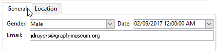
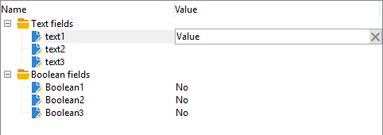

# 输入表单入门{#gs-ac-forms}

在创建或扩展模式时，您需要创建或修改关联的输入表单以使这些更改对最终用户可见。

通过输入表单，您可以从Adobe Campaign客户端控制台编辑与模式关联的实例。 表单由其名称和命名空间标识。

表单的标识键是由命名空间和冒号分隔的名称组成的字符串，例如：“cus:contact”。

## 编辑输入表单

从客户端控制台的&#x200B;**[!UICONTROL Administration]> [!UICONTROL Configuration] >[!UICONTROL Input forms]**&#x200B;文件夹创建和配置输入表单：


编辑区域允许您输入输入表单的XML内容：


预览生成输入表单的显示：


## 窗体结构

表单的描述是一种结构化XML文档，它观察表单模式&#x200B;**xtk:form**&#x200B;的语法。

输入表单的XML文档必须包含`<form>`根元素，其中&#x200B;**name**&#x200B;和&#x200B;**命名空间**&#x200B;属性用于填充表单名称和命名空间。

```
<form name="form_name" namespace="name_space">
...
</form>
```

默认情况下，表单与具有相同名称和命名空间的模式关联。 要将表单与其他名称关联，请将`<form>`元素的&#x200B;**entity-模式**&#x200B;属性设置为模式键的名称。 为了说明输入表单的结构，让我们使用“cus:收件人”示例模式描述一个接口：

```
<srcSchema name="recipient" namespace="cus">
  <enumeration name="gender" basetype="byte">    
    <value name="unknown" label="Not specified" value="0"/>    
    <value name="male" label="Male" value="1"/>   
    <value name="female" label="Female" value="2"/>   
  </enumeration>

  <element name="recipient">
    <attribute name="email" type="string" length="80" label="Email" desc="E-mail address of recipient"/>
    <attribute name="birthDate" type="datetime" label="Date"/>
    <attribute name="gender" type="byte" label="Gender" enum="gender"/>
  </element>
</srcSchema>
```

基于示例模式的输入表单：


```
<form name="recipient" namespace="cus">
  <input xpath="@gender"/>
  <input xpath="@birthDate"/>
  <input xpath="@email"/>
</form>
```

编辑的说明控制`<form>`根元素中的开始。 在&#x200B;**`<input>`**&#x200B;元素中输入编辑控件，该元素具有&#x200B;**xpath**&#x200B;属性，该属性包含字段在其模式中的路径。

编辑控件自动适应相应的数据类型，并使用在模式中定义的标签。

>[!NOTE]
>
>可以通过向`<input>`元素添加&#x200B;**label**&#x200B;属性来覆盖其数据模式中定义的标签：\
>`<input label="E-mail address" xpath="@name" />`

默认情况下，每个字段都显示在单行上，并根据数据类型占用所有可用空间。

:arrow_upper_right:所有表单属性都列在[Campaign Classic文档](https://docs.adobe.com/content/help/en/campaign-classic/technicalresources/api/control-Button.html)中。

## 格式化 {#formatting}

控件的布局与HTML表中使用的布局类似，可以将控件分为几列、交错元素或指定可用空间的占用。 但是，请记住，格式设置只允许您按比例将区域拆分；不能为对象指定固定尺寸。

要在两列中显示上述示例的控件：


```
<form name="recipient" namespace="cus">
  <container colcount="2">
    <input xpath="@gender"/>
    <input xpath="@birthDate"/>
    <input xpath="@email"/>
  </container>
</form>
```

具有&#x200B;**colcount**&#x200B;属性的&#x200B;**`<container>`**&#x200B;元素允许您将子控件的显示强制到两列上。

控件上的&#x200B;**colspan**&#x200B;属性按在其值中输入的列数扩展控件：


```
<form name="recipient" namespace="cus">
  <container colcount="2">
    <input xpath="@gender"/>
    <input xpath="@birthDate"/>
    <input xpath="@email" colspan="2"/>
  </container>
</form> 
```

通过填充&#x200B;**type=&quot;frame&quot;**&#x200B;属性，容器使用&#x200B;**label**&#x200B;属性中包含的标签在子控件周围添加一个帧：


```
<form name="recipient" namespace="cus">
  <container colcount="2" type="frame" label="General">
    <input xpath="@gender"/>
    <input xpath="@birthDate"/>
    <input xpath="@email" colspan="2"/>
  </container>
</form>
```

**`<static>`**&#x200B;元素可用于格式化输入表单：


```
<form name="recipient" namespace="cus">
  <static type="separator" colspan="2" label="General"/>
  <input xpath="@gender"/>
  <input xpath="@birthDate"/>
  <input xpath="@email" colspan="2"/>
  <static type="help" label="General information about recipient with date of birth, gender, and e-mail address." colspan="2"/>
</form>
```

具有&#x200B;**separator**&#x200B;类型的&#x200B;**`<static>`**&#x200B;标记允许您添加一个分隔栏，其标签包含在&#x200B;**label**&#x200B;属性中。

使用帮助类型的`<static>`标签添加了帮助文本。 文本的内容输入到&#x200B;**label**&#x200B;属性中。

## 使用容器{#containers}

使用&#x200B;**容器**&#x200B;对一组控件进行分组。 它们由&#x200B;**`<container>`**&#x200B;元素表示。 上面用于设置对多个列的控件的格式。

`<container>`上的&#x200B;**xpath**&#x200B;属性可简化子控件的引用。 然后，控件的引用相对于父级`<container>`父级。

不带“xpath”的容器示例：

```
<container colcount="2">
  <input xpath="location/@zipCode"/>
  <input xpath="location/@city"/>
</container>
```

例如，在名为“location”的元素中添加了“xpath”：

```
<container colcount="2" xpath="location">
  <input xpath="@zipCode"/>
  <input xpath="@city"/>
</container>
```

容器用于使用页面中格式化的一组字段来构建复杂控件。

### 添加选项卡（笔记本）{#tab-container}

使用&#x200B;**笔记本**&#x200B;容器设置可从选项卡访问的页面中的数据格式。



```
<container type="notebook">
  <container colcount="2" label="General">
    <input xpath="@gender"/>
    <input xpath="@birthDate"/>
    <input xpath="@email" colspan="2"/>
  </container>
  <container colcount="2" label="Location">
    ...
  </container>
</container>
```

主容器由&#x200B;**type=&quot;notebook&quot;**&#x200B;属性定义。 在子容器中声明制表符，并从&#x200B;**label**&#x200B;属性填充制表符的标签。

添加&#x200B;**style=&quot;down&quot;**&#x200B;属性以强制选项卡标签在控件下的垂直位置。 此属性是可选的。 默认值为&#x200B;**&quot;up&quot;**。


`<container style="down" type="notebook">  ... </container>`

### 添加图标（图标框）{#icon-list}

使用此容器可显示一个垂直图标栏，通过该图标栏可选择要显示的页面。


```
<container type="iconbox">
  <container colcount="2" label="General" img="xtk:properties.png">
    <input xpath="@gender"/>
    <input xpath="@birthDate"/>
    <input xpath="@email" colspan="2"/>
  </container>
  <container colcount="2" label="Location" img="nms:msgfolder.png">
    ...
  </container>
</container>
```

主容器由&#x200B;**type=&quot;iconbox&quot;**&#x200B;属性定义。 在子容器中声明与图标关联的页面。 图标的标签由&#x200B;**label**&#x200B;属性填充。

页面的图标会从`img="<image>"`属性填充，其中`<image>`是与由名称和命名空间组成的键相对应的图像的名称（例如，“xtk:properties.png”）。

可从&#x200B;**[!UICONTROL Administration > Configuration > Images]**&#x200B;节点访问映像。

### 隐藏容器(visibleGroup){#visibility-container}

您可以通过动态条件隐藏一组控件。

此示例说明了对“性别”字段值的控件的可见性：

```
<container type="visibleGroup" visibleIf="@gender=1">
  ...
</container>
<container type="visibleGroup" visibleIf="@gender=2">
  ...
</container>
```

可见性容器由属性&#x200B;**type=&quot;visibleGroup&quot;**&#x200B;定义。 **visibleIf**&#x200B;属性包含可见性条件。

条件语法示例：

* **visibleIf=&quot;@email=&#39;peter.martinezATneeolane.net&#39;&quot;**:测试字符串类型数据的等式。比较值必须用引号括起来。
* **visibleIf=&quot;@gender >= 1和@gender != 2&quot;**:条件。
* **visibleIf=&quot;@boolean1=true或@boolean2=false&quot;**:测试布尔字段。

### 条件显示(enabledGroup){#enabling-container}

此容器允许您启用或禁用动态条件中的一组数据。 禁用控件可阻止编辑它。 以下示例说明如何启用“性别”字段值中的控件：

```
<container type="enabledGroup" enabledIf="@gender=1">
  ...
</container>
<container type="enabledGroup" enabledIf="@gender=2">
  ...
</container>
```

启用容器由&#x200B;**type=&quot;enabledGroup&quot;**&#x200B;属性定义。 **enabledIf**&#x200B;属性包含激活条件。

## 编辑链接{#editing-a-link}

请记住，数据模式中声明了以下链接：

```
<element label="Company" name="company" target="cus:company" type="link"/>
```

链接在其输入表单中的编辑控制如下：


```
<input xpath="company"/>
```

目标选择可通过编辑字段访问。 输入由提前键入辅助，以便从输入的前几个字符中轻松找到目标元素。 然后，搜索基于目标模式中定义的&#x200B;**计算字符串**。 如果模式在控件中验证后不存在，将显示动态创建目标的确认消息。 确认会在目标表中创建新记录，并将其与链接关联。

下拉式列表用于从已创建记录的列表中选择目标元素。

**[!UICONTROL Modify the link]**（文件夹）图标将启动一个选择表单，其中包含目标元素的列表和筛选区域：


**[!UICONTROL Edit link]**（放大镜）图标可启动链接元素的编辑表单。 默认情况下，在目标模式的键上推导使用的形式。 通过&#x200B;**form**&#x200B;属性，可以强制使用编辑表单的名称(例如，“cus:公司2”)。

可以通过在输入表单中添加链接定义中的&#x200B;**`<sysfilter>`**&#x200B;元素来限制目标元素的选择：

```
<input xpath="company">
  <sysFilter>
    <condition expr="[location/@city] =  'Newton"/>
  </sysFilter>
</input>
```

您还可以使用&#x200B;**`<orderby>`**&#x200B;元素对列表进行排序：

```
<input xpath="company">
  <orderBy>
    <node expr="[location/@zipCode]"/>
  </orderBy>
</input>
```

## 控制属性{#control-properties}

* **noAutoComplete**:禁用预先键入（值为“true”）
* **createMode**:如果链接不存在，则立即创建该链接。可能的值有：

   * **无**:禁用创建。如果链接不存在，则显示错误消息
   * **内联**:创建与编辑字段中的内容链接
   * **edition**:在链接上显示编辑表单。验证表单后，将保存数据（默认模式）

* **noZoom**:链接上没有编辑表单（带有值“true”）
* **表单**:过载目标元素的编辑表单

## 添加链接列表（未绑定）{#list-of-links}

在模式中输入的作为收集元素的链接(unboind=&quot;true&quot;)必须通过列表，才能视图与其关联的所有元素。

其原理是显示链接元素的列表，以及优化的数据加载(通过数据批下载，仅在列表可见时执行该数据)。

模式中集合链接的示例：

```
<element label="Events" name="rcpEvent" target="cus:event" type="link" unbound="true">
...
</element>
```

列表输入形式：


```
 <input xpath="rcpEvent" type="linklist">
  <input xpath="@label"/>
  <input xpath="@date"/>
</input>
```

列表控件由&#x200B;**type=&quot;linklist&quot;**&#x200B;属性定义。 列表路径必须引用集合链接。

列通过列表的&#x200B;**`<input>`**&#x200B;元素声明。 **xpath**&#x200B;属性指目标模式中字段的路径。

带有标签的工具栏(在模式中的链接上定义)会自动放置在列表上方。

可以通过&#x200B;**[!UICONTROL Filters]**&#x200B;按钮过滤列表，并配置为添加列和对列进行排序。

使用&#x200B;**[!UICONTROL Add]**&#x200B;和&#x200B;**[!UICONTROL Delete]**&#x200B;按钮可以在链接上添加和删除集合元素。 默认情况下，添加元素会启动目标模式的编辑表单。

在列表的&#x200B;**`<input>`**&#x200B;标签上完成&#x200B;**zoom=&quot;true&quot;**&#x200B;属性时，会自动添加&#x200B;**[!UICONTROL Detail]**&#x200B;按钮：它允许您启动选定行的编辑表单。

加载列表时，可以应用过滤和排序：

```
 <input xpath="rcpEvent" type="linklist">
  <input xpath="@label"/>
  <input xpath="@date"/>
  <sysFilter>
    <condition expr="@type = 1"/>
  </sysFilter>
  <orderBy>
    <node expr="@date" sortDesc="true"/>
  </orderBy>
</input>
```

## 定义关系表{#relationship-table}

关系表允许您将两个表与N-N基数链接。 关系表只包含指向两个表的链接。

因此，向列表添加元素应允许您从关系表中的两个链接之一完成列表。

关系表在模式中的示例：

```
<srcSchema name="subscription" namespace="cus">
  <element name="recipient" type="link" target="cus:recipient" label="Recipient"/>
  <element name="service" type="link" target="cus:service" label="Subscription service"/>
</srcSchema>
```

例如，我们使用“cus:收件人”模式的输入形式进行开始。 列表必须显示与服务订阅的关联，并且必须允许您通过选择现有服务来添加订阅。


```
<input type="linklist" xpath="subscription" xpathChoiceTarget="service" xpathEditTarget="service" zoom="true">
  <input xpath="recipient"/>
  <input xpath="service"/>
</input>
```

通过&#x200B;**xpathChoiceTarget**&#x200B;属性，可以从输入的链接启动选择表单。 创建关系表记录将自动更新指向当前收件人和选定服务的链接。

>[!NOTE]
>
>通过&#x200B;**xpathEditTarget**&#x200B;属性，可以强制编辑所输入链接上的选定行。

### 列表属性{#list-properties}

* **noToolbar**:隐藏工具栏（值为&quot;true&quot;）
* **toolbarCaption**:过载工具栏标签
* **工具栏对齐**:修改工具栏的垂直或水平几何(可能的值：&quot;vertical&quot;|&quot;horizontal&quot;)
* **img**:显示与列表关联的图像
* **表单**:过载目标元素的编辑表单
* **缩放**:添加用 **[!UICONTROL Zoom]** 于编辑目标元素的按钮
* **xpathEditTarget**:设置对所输入链接的编辑
* **xpathChoiceTarget**:此外，在输入的链接上启动选择表单

## 添加内存列表控件{#memory-list-controls}

内存列表允许您使用列表数据预加载来编辑收集元素。 无法筛选或配置此列表。

这些列表用于XML映射的集合元素或低容量链接。

## 添加列列表{#column-list}

此控件显示一个可编辑的列列表，其工具栏包含“添加”和“删除”按钮。


```
<input xpath="rcpEvent" type="list">
  <input xpath="@label"/>
  <input xpath="@date"/>
</input>
```

必须使用&#x200B;**type=&quot;列表&quot;**&#x200B;属性填充列表控件，列表的路径必须引用集合元素。

列在列表的子&#x200B;**`<input>`**&#x200B;标签中声明。 可以使用&#x200B;**label**&#x200B;和&#x200B;**colSize**&#x200B;属性强制显示列标签和大小。

>[!NOTE]
>
>将&#x200B;**ordered=&quot;true&quot;**&#x200B;属性添加到数据模式中的集合元素时，会自动添加排序箭头。

工具栏按钮可以水平对齐：


```
<input nolabel="true" toolbarCaption="List of events" type="list" xpath="rcpEvent" zoom="true">
  <input xpath="@label"/>
  <input xpath="@date"/>
</input>
```

**toolbarCaption**&#x200B;属性强制工具栏的水平对齐方式并在列表上方输入标题。

### 启用列表{#zoom-in-a-list}

在列表中插入和编辑数据可以在单独的编辑表单中输入。


```
<input nolabel="true" toolbarCaption="List of events" type="list" xpath="rcpEvent" zoom="true" zoomOnAdd="true">
  <input xpath="@label"/>
  <input xpath="@date"/>

  <form colcount="2" label="Event">
    <input xpath="@label"/>
    <input xpath="@date"/>
  </form>
</input>
```

编辑表单是从列表定义下的`<form>`元素中完成的。 其结构与输入形式相同。 在列表的&#x200B;**`<input>`**&#x200B;标签上完成&#x200B;**zoom=&quot;true&quot;**&#x200B;属性时，会自动添加&#x200B;**[!UICONTROL Detail]**&#x200B;按钮。 此属性允许您启动所选行的编辑表单。

>[!NOTE]
>
>添加&#x200B;**zoomOnAdd=&quot;true&quot;**&#x200B;属性会强制在插入列表元素时调用编辑表单。

### 列表属性{#list-properties-1}

* **noToolbar**:隐藏工具栏（值为&quot;true&quot;）
* **toolbarCaption**:过载工具栏标签
* **工具栏对齐**:修改工具栏的位置(可能的值：&quot;vertical&quot;|&quot;horizontal&quot;)
* **img**:显示与列表关联的图像
* **表单**:过载目标元素的编辑表单
* **缩放**:添加用 **[!UICONTROL Zoom]** 于编辑目标元素的按钮
* **zoomOnAdd**:在添加
* **xpathChoiceTarget**:此外，在输入的链接上启动选择表单

## 添加不可编辑的字段{#non-editable-fields}

要显示字段并防止其被编辑，请使用&#x200B;**`<value>`**&#x200B;标签或完成&#x200B;**`<input>`**&#x200B;标签上的&#x200B;**readOnly=&quot;true&quot;**&#x200B;属性。

&quot;性别&quot;领域的示例：


```
<value value="@gender"/>
<input xpath="@gender" readOnly="true"/>
```

## 添加单选按钮{#radio-button}

单选按钮允许您从多个选项中进行选择。 **`<input>`**&#x200B;标签用于列表可能的选项，而&#x200B;**checkedValue**&#x200B;属性指定与选项关联的值。

&quot;性别&quot;领域的示例：

```
<input type="RadioButton" xpath="@gender" checkedValue="0" label="Choice 1"/>
<input type="RadioButton" xpath="@gender" checkedValue="1" label="Choice 2"/>
<input type="RadioButton" xpath="@gender" checkedValue="2" label="Choice 3"/>
```


## 添加复选框{#checkbox}

复选框反映布尔状态（无论是否已选中）。 默认情况下，此控件由“Boolean”(true/false)字段使用。 默认值为0或1的变量可与此按钮关联。 可以通过&#x200B;**checkValue**&#x200B;属性来重载此值。

```
<input xpath="@boolean1"/>
<input xpath="@field1" type="checkbox" checkedValue="Y"/>
```


## 编辑导航层次结构{#navigation-hierarchy-edit}

此控件在一组要编辑的字段上构建树。

要编辑的控件将分组在树状控件&#x200B;**`<input>`**&#x200B;标记下输入的&#x200B;**`<container>`**&#x200B;中：

```
<input nolabel="true" type="treeEdit">
  <container label="Text fields">
    <input xpath="@text1"/>
    <input xpath="@text2"/>
  </container>
  <container label="Boolean fields">
    <input xpath="@boolean1"/>
    <input xpath="@boolean2"/>
  </container>
</input>
```



## 添加表达式字段{#expression-field}

表达式字段会从表达式动态更新字段；**`<input>`**&#x200B;标记与&#x200B;**xpath**&#x200B;属性一起使用，以输入要更新的字段的路径和包含更新表达式的&#x200B;**expr**&#x200B;属性。

```
<!-- Example: updating the boolean1 field from the value contained in the field with path /tmp/@flag -->
<input expr="Iif([/tmp/@flag]=='On', true, false)" type="expr" xpath="@boolean1"/>
<input expr="[/ignored/@action] == 'FCP'" type="expr" xpath="@launchFCP"/>
```

## 表单{#context-of-forms}的上下文

输入表单的执行初始化包含被编辑实体数据的XML文档。 此文档表示表单的上下文，并可用作工作区。

### 更新上下文{#updating-the-context}

要修改表单的上下文，请使用`<set expr="<value>" xpath="<field>"/>`标签，其中`<field>`是目标字段，`<value>`是更新表达式或值。

`<set>`标签的使用示例：

* **`<set expr="'Test'" xpath="/tmp/@test" />`**:将“Test”值定位在临时位置/tmp/@test1
* **`<set expr="'Test'" xpath="@lastName" />`**:使用“Test”值更新“lastName”属性上的实体
* **`<set expr="true" xpath="@boolean1" />`**:将“boolean1”字段的值设置为“true”
* **`<set expr="@lastName" xpath="/tmp/@test" />`**:使用“lastName”属性的内容进行更新

通过&#x200B;**`<enter>`**&#x200B;和&#x200B;**`<leave>`**&#x200B;标签在初始化和关闭表单时，可以更新表单的上下文。

```
<form name="recipient" namespace="cus">
  <enter>
    <set...
  </enter>
  ...
  <leave>
    <set...
  </leave>
</form>
```

>[!NOTE]
>
>`<enter>`和`<leave>`   标记可用于页面的`<container>`（“notebook”和“iconbox”类型）。

### 表达式语言{#expression-language-}

可以在表单定义中使用宏语言来执行条件测试。

如果验证了表达式,**`<if expr="<expression>" />`**&#x200B;标签将执行标签下指定的指令：

```
<if expr="([/tmp/@test] == 'Test' or @lastName != 'Doe') and @boolean2 == true">
  <set xpath="@boolean1" expr="true"/>
</if>
```

与&#x200B;**`<error>`**&#x200B;标签组合的&#x200B;**`<check expr="<condition>" />`**&#x200B;标签会阻止对表单的验证，并在条件不满足时显示错误消息：

```
<leave>
  <check expr="/tmp/@test != ''">
    <error>You must populate the 'Test' field!</error> 
  </check>
</leave>
```

## 助手（向导）{#wizards}

助手将指导您完成页面形式的一组数据输入步骤。 验证表单时，将保存输入的数据。

要添加助手，请使用以下类型的结构：

```
<form type="wizard" name="example" namespace="cus" img="nms:rcpgroup32.png" label="Wizard example" entity-schema="nms:recipient">
  <container title="Title of page 1" desc="Long description of page 1">
    <input xpath="@lastName"/>
    <input xpath="comment"/>
  </container>
  <container title="Title of page 2" desc="Long description of page 2">
    ...
  </container>
  ...
</form>
```


`<form>`元素上存在&#x200B;**type=&quot;wizard&quot;**&#x200B;属性，允许您在表单构造中定义向导模式。 这些页面是从`<container>`元素（是`<form>`元素的子元素）完成的。 页面的`<container>`元素将填充标题的标题属性，并设计用于在页面标题下显示说明。 会自动添加&#x200B;**[!UICONTROL Previous]**&#x200B;和&#x200B;**[!UICONTROL Next]**&#x200B;按钮，以允许在页面之间进行浏览。

**[!UICONTROL Finish]**&#x200B;按钮保存输入的数据并关闭表单。

### SOAP方法{#soap-methods}

可以从页面末尾的已填充&#x200B;**`<leave>`**&#x200B;标记启动SOAP方法执行。

**`<soapcall>`**&#x200B;标记包含对具有以下输入参数的方法的调用：

```
<soapCall name="<name>" service="<schema>">
  <param type="<type>" exprIn="<xpath>"/>  
  ...
</soapCall>
```

通过&#x200B;**`<soapcall>`**&#x200B;标签的&#x200B;**name**&#x200B;和&#x200B;**service**&#x200B;属性输入服务的名称及其实现模式。

在&#x200B;**`<soapcall>`**&#x200B;标记下的&#x200B;**`<param>`**&#x200B;元素上描述了输入参数。

必须通过&#x200B;**type**&#x200B;属性指定参数类型。 可能的类型如下：

* **字符串**:字符串
* **布尔**:布尔值
* **字节**:8位整数
* **简短**:16位整数
* **长**:32位整数
* **简短**:16位整数
* **多次**:多次精度浮点数
* **DOMElement**:元素型节点

**exprIn**&#x200B;属性包含要作为参数传递的数据的位置。

**示例**:

```
<leave>
  <soapCall name="RegisterGroup" service="nms:recipient">         
    <param type="DOMElement" exprIn="/tmp/entityList"/>         
    <param type="DOMElement" exprIn="/tmp/choiceList"/>         
    <param type="boolean"    exprIn="true"/>       
  </soapCall>
</leave>
```

