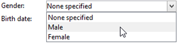

# 模式结构{#schema-structure}

的基本结构 `<srcschema>` 如下所示：

```
<srcSchema>
    <enumeration>
        ...          //definition of enumerations
    </enumeration>
   
    <element>         //definition of the root <element>    (mandatory)

        <compute-string/>  //definition of a compute-string
        <key>
            ...        //definition of keys
        </key>
        <sysFilter>
            ...           //definition of filters
        </sysFilter>
        <attribute>
            ...             //definition of fields
        </attribute>
    
            <element>           //definition of sub-<element> 
                  <attribute>           //(collection, links or XML)
                  ...                         //and additional fields
                  </attribute>
                ...
            </element>
      
    </element> 

        <methods>                 //definition of SOAP methods
            <method>
                ...
            </method>
            ...
    </methods>  
          
</srcSchema>
```

数据架构的XML文档必须包含 **`<srcschema>`** 根元素具有 **name** 和 **命名空间** 属性，用于填充架构名称及其命名空间。

```
<srcSchema name="schema_name" namespace="namespace">
...
</srcSchema>
```

让我们使用以下XML内容来说明数据模式的结构：

```
<recipient email="John.doe@aol.com" created="AAAA/DD/MM" gender="1"> 
  <location city="London"/>
</recipient>
```

及其相应的数据架构：

```
<srcSchema name="recipient" namespace="cus">
  <element name="recipient">
    <attribute name="email"/>
    <attribute name="created"/>
    <attribute name="gender"/>
    <element name="location">
      <attribute name="city"/>
   </element>
  </element>
</srcSchema>
```

## 说明 {#description}

架构的入口点是其主要元素。 它易于识别，因为它与架构具有相同的名称，并且应该是根元素的子元素。 内容的描述以此元素开头。

在本例中，主元素由以下行表示：

```
<element name="recipient">
```

元素 **`<attribute>`** 和 **`<element>`** 通过主元素后面的字段，可以定义XML结构中数据项的位置和名称。

在我们的示例模式中，这些规则包括：

```
<attribute name="email"/>
<attribute name="created"/>
<attribute name="gender"/>
<element name="location">
  <attribute name="city"/>
</element>
```

必须遵循以下规则：

* 每个 **`<element>`** 和 **`<attribute>`** 必须通过名称进行标识 **name** 属性。

   >[!CAUTION]
   >
   >元素的名称应简洁，最好是英文，并且仅包括符合XML命名规则的授权字符。

* 仅 **`<element>`** 元素可以包含 **`<attribute>`** 元素和 **`<element>`** XML结构中的元素。
* An **`<attribute>`** 元素在 **`<element>`**.
* 使用 **`<elements>`** 在多行数据字符串中，建议使用。

## 数据类型 {#data-types}

数据类型是通过 **type** 中的属性 **`<attribute>`** 和 **`<element>`** 元素。

有关详细列表，请参阅 [Campaign Classicv7文档](https://experienceleague.adobe.com/docs/campaign-classic/using/configuring-campaign-classic/schema-reference/elements-attributes/schema-introduction.html#configuring-campaign-classic).

如果未填充此属性， **字符串** 是默认数据类型，除非元素包含子元素。 如果是，则它仅用于按层级结构元素(**`<location>`** 元素)。

架构支持以下数据类型：

* **字符串**：字符串。 示例：名字、城镇等。

   可以通过以下方式指定大小 **长度** 属性（可选，默认值为“255”）。

* **布尔型**：布尔字段。 可能值的示例：true/false、0/1、yes/no等。
* **字节**， **短**， **长**：整数（1字节、2字节、4字节）。 示例：年龄、帐号、点数等。
* **多次**：双精度浮点数。 示例：价格、费率等。
* **日期**， **datetime**：日期和日期+时间。 示例：出生日期、购买日期等。
* **datemenotz**：没有时区数据的日期+时间。
* **时间跨度**：持续时间。 例如：资历。
* **备忘录**：长文本字段（多行）。 示例：描述、评论等。
* **uuid**：“uniqueidentifier”字段

   >[!NOTE]
   >
   >包含 **uuid** 字段，则必须添加“newuuid()”函数并使用其默认值完成该函数。

以下是输入的类型的模式示例：

```
<srcSchema name="recipient" namespace="cus">
  <element name="recipient">
    <attribute name="email" type="string" length="80"/>
    <attribute name="created" type="datetime"/>
    <attribute name="gender" type="byte"/>
    <element name="location">
      <attribute name="city" type="string" length="50"/>
   </element>
  </element>
</srcSchema>
```

## 属性 {#properties}

此 **`<elements>`** 和 **`<attributes>`** 可以使用各种属性扩充数据模式的元素。 您可以填充标签以描述当前元素。

### 标签和描述 {#labels-and-descriptions}

* 此 **标签** 属性允许您输入简短描述。

   >[!NOTE]
   >
   >标签与实例的当前语言关联。

   **示例**:

   ```
   <attribute name="email" type="string" length="80" label="Email"/>
   ```

   可以从Adobe Campaign客户端控制台输入表单中看到标签：

   

* 此 **desc** 属性允许您输入详细说明。

   可以从Adobe Campaign客户端控制台主窗口状态栏中的输入表单查看描述。

   >[!NOTE]
   >
   >该描述与实例的当前语言相关联。

   **示例**:

   ```
   <attribute name="email" type="string" length="80" label="Email" desc="Email of recipient"/>
   ```

### 默认值 {#default-values}

此 **默认** 属性允许您定义在内容创建时返回默认值的表达式。

该值必须是符合XPath语言的表达式。 如需详细信息，请参阅[此部分](#reference-with-xpath)。

**示例**:

* 当前日期： **default=&quot;GetDate()&quot;**
* 计数器： **default=&quot;&#39;FRM&#39;+CounterValue(&#39;myCounter&#39;)&quot;**

   在本例中，默认值是使用字符串连接并调用 **计数器值** 具有免费计数器名称的函数。 每次插入时，返回的数字会递增1。

   >[!NOTE]
   >
   >在Adobe Campaign Client Console中， **[!UICONTROL Administration>Counters]** 节点用于管理计数器。

要将默认值链接到字段，您可以使用 `<default>  or  <sqldefault>   field.  </sqldefault> </default>`

`<default>` ：用于在创建实体时使用默认值预填充字段。 该值将不会是默认SQL值。

`<sqldefault>` ：用于在创建字段时增加值。 此值显示为SQL结果。 在架构更新期间，只有新记录将受此值影响。

### 明细列表 {#enumerations}

#### 自由明细列表 {#free-enumeration}

此 **userEnum** 属性允许您定义一个自由明细列表，以记忆和显示通过此字段输入的值。 语法如下：

**userEnum=&quot;枚举的名称&quot;**

为枚举指定的名称可以自由选择并与其他字段共享。

这些值显示在输入表单的下拉列表中：


>[!NOTE]
>
>在Adobe Campaign Client Console中， **[!UICONTROL Administration > Enumerations]** 节点用于管理枚举。

#### 设置明细列表 {#set-enumeration}

此 **枚举** 属性允许您定义事先知道可能值的列表时使用的固定枚举。

此 **枚举** attribute是指在主元素之外的架构中填充的枚举类的定义。

枚举允许用户从下拉列表中选择一个值，而不是在常规输入字段中输入值：



数据架构中的枚举声明示例：

```
<enumeration name="gender" basetype="byte" default="0">    
  <value name="unknown" label="Not specified" value="0"/>    
  <value name="male" label="male" value="1"/>   
  <value name="female" label="female" value="2"/>   
</enumeration>
```

枚举是通过 **`<enumeration>`** 元素。

枚举属性如下：

* **基本类型**：与值关联的数据类型，
* **标签**：枚举的描述，
* **name**：枚举的名称，
* **默认**：枚举的默认值。

枚举值在 **`<value>`** 元素具有以下属性：

* **name**：内部存储的值的名称，
* **标签**：通过图形界面显示的标签。

#### dbenum明细列表 {#dbenum-enumeration}

* 此 **德贝南** 属性允许您定义一个枚举，其属性与 **枚举** 属性。

   但是， **name** 属性不会在内部存储值，而是存储一个代码，通过该代码，无需修改相关表的架构即可扩展相关表。

   值是通过 **[!UICONTROL Administration>Enumerations]** 节点。

   例如，此枚举用于指定营销活动的性质。

   

### 示例 {#example}

以下是填充了属性的示例架构：

```
<srcSchema name="recipient" namespace="cus">
  <enumeration name="gender" basetype="byte">    
    <value name="unknown" label="Not specified" value="0"/>    
    <value name="male" label="male" value="1"/>   
    <value name="female" label="female" value="2"/>   
  </enumeration>

  <element name="recipient">
    <attribute name="email" type="string" length="80" label="Email" desc="Email of recipient"/>
    <attribute name="created" type="datetime" label="Date of creation" default="GetDate()"/>
    <attribute name="gender" type="byte" label="gender" enum="gender"/>
    <element name="location" label="Location">
      <attribute name="city" type="string" length="50" label="City" userEnum="city"/>
   </element>
  </element>
</srcSchema>
```

## 集合 {#collections}

集合是具有相同名称和相同层次级别的元素的列表。

此 **未绑定** 值为“true”的属性允许您填充收集元素。

**示例**：的定义 **`<group>`** 架构中的收藏集元素。

```
<element name="group" unbound="true" label="List of groups">
  <attribute name="label" type="string" label="Label"/>
</element>
```

使用XML内容的投影：

```
<group label="Group1"/>
<group label="Group2"/>
```

## 引用XPath {#reference-with-xpath}

XPath语言在Adobe Campaign中用于引用属于数据架构的元素或属性。

XPath是一种语法，允许您在XML文档的树中查找节点。

元素由名称指定，属性由名称指定，名称前面加有字符“@”。

**示例**:

* **@email**：选择电子邮件，
* **location/@city**：选择“city”属性，位于 **`<location>`** 元素
* **../@email**：从当前元素的父元素中选择电子邮件地址
* **群组`[1]/@label`**：选择第一个标签的子项属性 **`<group>`** 收集要素
* **群组`[@label='test1']`**：选择作为的子“标签”属性 **`<group>`** 元素并包含值“test1”

>[!NOTE]
>
>当路径穿过子元素时，会添加一个附加约束。 在这种情况下，必须将以下表达式放在括号中：
>
>* **location/@city** 无效；请使用 **`[location/@city]`**
>* **`[@email]`** 和 **@email** 等效
>


也可以定义复杂的表达式，例如以下算术运算：

* **@gender+1**：将1添加到的内容 **性别** 属性，
* **@email + &#39;(&#39;+@created+&#39;)&#39;**：构造一个字符串，其方法是在括号之间使用添加到创建日期的电子邮件地址值（对于字符串类型，请将常量放在引号中）。

在表达式中增加了高级函数，丰富了此语言的潜力。

您可以通过Adobe Campaign客户端控制台中的任意表达式编辑器访问可用函数的列表：


**示例**:

* **GetDate()**：返回当前日期
* **年(@created)**：返回“已创建”属性中包含的日期的年份。
* **GetEmailDomain(@email)**：返回电子邮件地址的域。

## 通过计算字符串构建字符串 {#building-a-string-via-the-compute-string}

A **计算字符串** 是一个XPath表达式，用于构造一个字符串，该字符串表示与架构关联的表中的记录。 **计算字符串** 主要用于图形界面显示选定记录的标签。

此 **计算字符串** 是通过 **`<compute-string>`** 数据架构的主元素下的元素。 An **表达式** 属性包含用于计算显示的XPath表达式。

**示例**：收件人表的计算字符串。

```
<srcSchema name="recipient" namespace="nms">  
  <element name="recipient">
    <compute-string expr="@lastName + ' ' + @firstName +' (' + @email + ')' "/>
    ...
  </element>
</srcSchema>
```

收件人计算字符串的结果： **Doe John (john.doe@aol.com)**

>[!NOTE]
>
>如果架构不包含计算字符串，则默认情况下将使用架构的主键值填充计算字符串。
