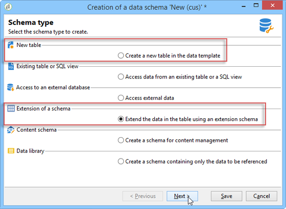

# 使用模式{#gs-ac-schemas}

应用中所承载数据的物理和逻辑结构以 XML 格式进行描述。它遵循Adobe Campaign特有的语法，称为 **架构**.

架构是与数据库表关联的XML文档。 它定义数据结构并描述表的SQL定义：

* 表的名称
* 字段
* 与其他表的链接

它还描述了用于存储数据的XML结构：

* 元素和属性
* 元素层次结构
* 元素和属性类型
* 默认值
* 标签、描述和其他属性。

使用架构可在数据库中定义实体。 每个实体都有一个架构。

Adobe Campaign使用数据架构来：

* 定义应用程序中的数据对象如何与底层数据库表绑定。
* 定义 Campaign 应用程序中不同数据对象之间的链接。
* 定义并描述每个对象中包含的个别字段。

要更好地了解Campaign内置表及其交互，请参阅 [本节](datamodel.md).

>[!CAUTION]
>
>某些内置Campaign架构在云数据库上具有关联的架构。 这些架构由以下代码标识 **Xxl** 且不得修改或扩展。

## 架构的语法 {#syntax-of-schemas}

架构的根元素为 **`<srcschema>`**. 它包含 **`<element>`** 和 **`<attribute>`** 子元素。

第一个 **`<element>`** 子元素与实体的根一致。

```
<srcSchema name="recipient" namespace="cus">
  <element name="recipient">  
    <attribute name="lastName"/>
    <attribute name="email"/>
    <element name="location">
      <attribute name="city"/>
   </element>
  </element>
</srcSchema>
```

>[!NOTE]
>
>实体的根元素与架构具有相同的名称。


此 **`<element>`** 标记定义实体元素的名称。 **`<attribute>`** 架构的标记定义 **`<element>`** 已链接到的标记。

## 架构的标识 {#identification-of-a-schema}

数据架构由其名称和命名空间来标识。

命名空间允许您按感兴趣的区域对一组架构进行分组。 例如， **cus** 命名空间用于特定于客户的配置(**客户**)。

>[!CAUTION]
>
>作为标准，命名空间的名称必须简洁，并且根据XML命名规则只能包含授权字符。
>
>标识符不能以数字字符开头。

## 保留的命名空间 {#reserved-namespaces}

某些命名空间是保留空间，用于描述Adobe Campaign应用程序操作所需的系统实体。 以下命名空间 **不得使用** 要识别新架构，请在任意大写/小写组合中执行以下操作：

* **xxl**：保留给云数据库架构
* **xtk**：保留给平台系统数据
* **nl**：保留给应用程序的总体使用
* **nms**：为投放预留（收件人、投放、跟踪等）
* **ncm**：保留给内容管理
* **临时**：保留给临时架构
* **crm**：保留给CRM连接器集成

架构的标识键是使用命名空间和名称构建的字符串，名称之间用冒号分隔；例如： **nms：recipient**.

## 创建或扩展Campaign模式 {#create-or-extend-schemas}

要将字段或其他元素添加到Campaign中的某个核心数据架构，例如收件人表(nms：recipient)，您必须扩展该架构。

有关详细信息，请参见 [扩展模式](extend-schema.md).

要添加Adobe Campaign中不存在的全新类型数据（例如合同表），您可以直接创建自定义架构。

有关详细信息，请参见 [创建新架构](create-schema.md).




创建或扩展要在其中工作的架构后，最佳做法是按照下面显示的XML内容元素顺序来定义其XML内容元素。

## 明细列表 {#enumerations}

枚举先于架构的主元素之前定义。 它们允许您在列表中显示值，以限制用户对给定字段的选择。

例如：

```
<enumeration basetype="byte" name="exTransactionTypeEnum" default="store">
<value label="Website" name="web" value="0"/>
<value label="Call Center" name="phone" value="1"/>
<value label="In Store" name="store" value="2"/>
</enumeration>
```

在定义字段时，您可以使用此枚举，如下所示：

```
<attribute desc="Type of Transaction" label="Transaction Type" name="transactionType" 
type="string" enum="exTransactionTypeEnum"/>
```

>[!NOTE]
>
>您还可以使用用户管理的枚举(通常位于 **[!UICONTROL Administration]** > **[!UICONTROL Platform]** )，指定给定字段的值。 这些实际上是全局枚举，如果您可以在所使用的特定架构之外使用枚举，则最好选择它们。

<!--
## Index {#index} 

In the context of a [FDA Snowflake deployment](../architecture/fda-deployment.md), you need to declare indexes. Indexes are the first elements declared in the main element of the schema. 

They can be unique or not, and reference one or more fields.

Examples:

```
<dbindex name="email" unique="true">
  <keyfield xpath="@email"/>
</dbindex>
```

```
<dbindex name="lastNameAndZip">
  <keyfield xpath="@lastName"/>
  <keyfield xpath="location/@zipCode"/>
</dbindex>
```

The **xpath** attribute points to the field in your schema that you wish to index.

>[!IMPORTANT]
>
>It is important to remember that the SQL query read performance gains provided by indexes also come with a performance hit on writing records. The indexes should therefore be used with precaution.

For more on indexes, refer to the [Indexed fields](database-mapping.md#indexed-fields) section.

-->

## 键 {#keys}

每个表必须至少有一个键，通常使用在架构的主元素中自动建立它 **autopk** 属性设置为 **true**.

此外，在 [企业(FFDA)部署](../architecture/enterprise-deployment.md)，使用 **@autouuid** 并将其设置为 **true**.

也可使用定义主键 **内部** 属性。

例如：

```
<key name="householdId" internal="true">
  <keyfield xpath="@householdId"/>
</key>
```

在此示例中，不要让 **@autopk** 或 **@autouuid** 属性创建一个名为“id”的默认主键，我们将指定自己的“householdId”主键。

>[!CAUTION]
>
>创建新架构或在架构扩展期间，您需要为整个架构保留相同的主键序列值(@pkSequence)。

了解中有关键的更多信息 [本节](database-mapping.md#management-of-keys).

## 属性（字段） {#attributes--fields-}

属性允许您定义组成数据对象的字段。 您可以使用 **[!UICONTROL Insert]** 模式版工具栏中的按钮，将空属性模板拖放到光标所在的XML中。 可在[此部分](create-schema.md)中了解详情。


完整的属性列表可在 `<attribute>` 中的元素部分 [Campaign Classicv7文档](https://experienceleague.adobe.com/docs/campaign-classic/using/configuring-campaign-classic/schema-reference/elements-attributes/attribute.html#content-model){target="_blank"}. 以下是一些更常用的属性： **@advanced**， **@dataPolicy**， **@default**， **@desc**， **@enum**， **@expr**， **@label**， **@length**， **@name**， **@notNull**， **@required**， **@ref**， **@xml**， **@type**.

有关每个属性的详细信息，请参阅中的属性说明 [Campaign Classicv7文档](https://experienceleague.adobe.com/docs/campaign-classic/using/configuring-campaign-classic/schema-reference/elements-attributes/schema-introduction.html#configuring-campaign-classic){target="_blank"}.

### 示例 {#examples}

定义默认值的示例：

```
<attribute name="transactionDate" label="Transaction Date" type="datetime" default="GetDate()"/>
```

将公共属性用作标记为必填字段的模板的示例：

```
<attribute name="mobile" label="Mobile" template="nms:common:phone" required="true" />
```

使用隐藏的计算字段示例 **@advanced** 属性：

```
<attribute name="domain" label="Email domain" desc="Domain of recipient email address" expr="GetEmailDomain([@email])" advanced="true" />
```

XML字段的示例也存储在SQL字段中，该字段具有 **@dataPolicy** 属性。

```
<attribute name="secondaryEmail" label="Secondary email address" length="100" xml="true" sql="true" dataPolicy="email" />
```

>[!CAUTION]
>
>尽管大多数属性根据1-1基数与数据库的物理字段相关联，但XML字段或计算字段并非如此。\
>XML字段存储在表的备注字段(“mData”)中。\
>但是，计算字段是在每次启动查询时动态创建的，因此它仅存在于应用层中。

## 链接 {#links}

链接是架构主元素的最后几个元素之一。 它们定义实例中所有不同的架构如何相互关联。

在包含 **外键** 所链接到的表的URL值。

基数有三种类型：1-1、1-N和N-N。默认使用1-N类型。

### 示例 {#examples-1}

收件人表（现成模式）和自定义事务表之间的1-N链接示例：

```
<element label="Recipient" name="lnkRecipient" revLink="lnkTransactions" target="nms:recipient" type="link"/>
```

自定义模式“Car”（位于“cus”命名空间中）和收件人表之间的1-1链接示例：

```
<element label="Car" name="lnkCar" revCardinality="single" revLink="recipient" target="cus:car" type="link"/>
```

收件人表和地址表之间的外部联接示例，该表基于电子邮件地址而不是主键：

```
<element name="emailInfo" label="Email Info" revLink="recipient" target="nms:address" type="link" externalJoin="true">
  <join xpath-dst="@address" xpath-src="@email"/>
</element>
```

此处，“xpath-dst”对应于目标架构中的主键，“xpath-src”对应于源架构中的外键。

## 审核跟踪 {#audit-trail}

架构底部可能想要包含一个有用元素，即跟踪元素（审核跟踪）。

使用下面的示例包含与创建日期、创建数据的用户、日期和表格中所有数据的上次修改的作者相关的字段：

```
<element aggregate="xtk:common:auditTrail" name="auditTrail"/>
```

## 更新数据库结构 {#updating-the-database-structure}

完成并保存更改后，任何可能影响SQL结构的更改都需要应用到数据库。 为此，请使用数据库更新助手。


如需详细信息，请参阅[此小节](update-database-structure.md)。

>[!NOTE]
>
>当修改不会影响数据库结构时，只需重新生成模式即可。 要执行此操作，请选择要更新的架构，右键单击并选择 **[!UICONTROL Actions > Regenerate selected schemas...]**.
