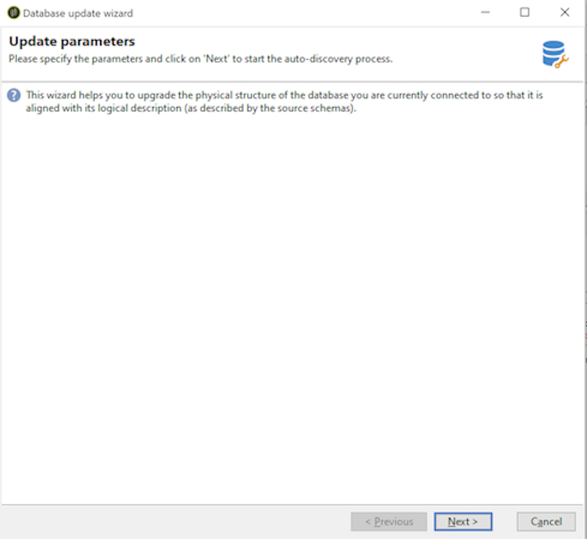
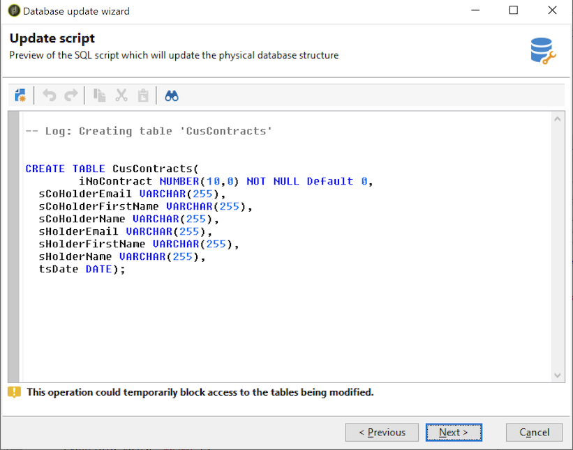

# 更新数据库结构 {#updating-the-database-structure}

要应用对架构所做的修改，请启动数据库更新向导。 可以通过&#x200B;**[!UICONTROL Tools > Advanced > Update database structure]**&#x200B;访问此助手。 它检查数据库的物理结构是否与其逻辑描述匹配，并执行SQL更新脚本。

数据库中的模块将自动填充和激活。

按照以下步骤操作并查看数据库更新SQL脚本：

>[!NOTE]
>
>此代码位于编辑字段中，可以修改以删除或添加SQL代码。

接下来，启动数据库更新：

