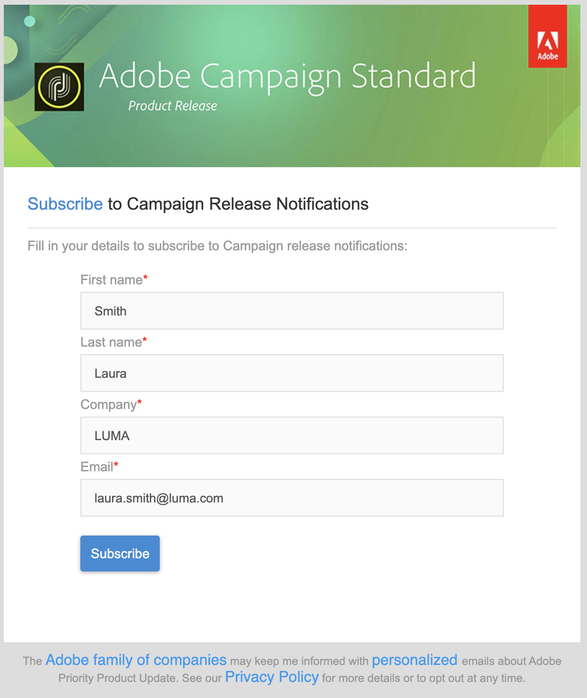

# Web应用程序和Web窗体入门{#gs-ac-web}

Adobe Campaign集成了一个图形模块，用于定义和发布&#x200B;**Web窗体**，以创建包含输入和选择字段的页面，其中可能包含来自数据库的数据。 这样，您就可以设计并发布用户可访问的网页，以便查看或输入信息。

请参阅[Campaign Classic v7文档](https://experienceleague.adobe.com/docs/campaign-classic/using/designing-content/web-forms/about-web-forms.html#designing-content){target="_blank"}以了解如何创建和发布Web窗体

Adobe Campaign还允许您创建和发布动态和交互式&#x200B;**Web应用程序**，其中包含来自数据库的数据和适合已连接用户权限的内容。

您可以创建页面，例如外部网上的编辑表单，或者创建通知表单，其中包含来自具有表、图表、输入表单等数据库的数据。此功能允许您设计和发布网页，用户可以在其中查找或输入信息。

请参阅[Campaign Classic v7文档](https://experienceleague.adobe.com/docs/campaign-classic/using/designing-content/web-applications/about-web-applications.html#designing-content){target="_blank"}以了解如何创建和发布Web应用程序
