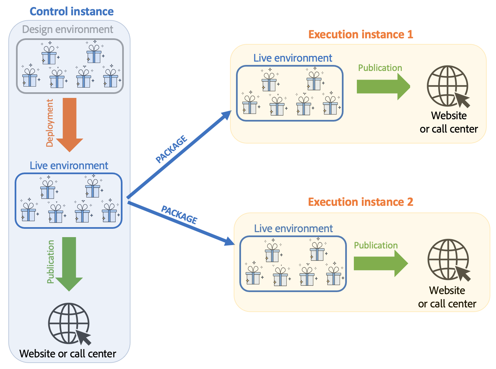

# 了解Campaign交互环境和架构

## 环境 {#environments}

在管理选件时，所使用的每个定向维度都有两个环境：

* A **设计** 优惠管理器负责创建和分类优惠、编辑优惠以及启动审批流程以便使用的环境。 此环境中还定义了每个类别的规则、可在其中显示优惠的优惠空间，以及用于定义优惠资格的预定义过滤器。

  类别也可以在在线环境中手动发布。

  详细说明了批准优惠的过程 [在此部分中](interaction-offer.md#approve-offers).

* A **实时** 在其中可以找到设计环境中的已批准选件，以及设计环境中配置的各种选件空间、过滤器、类别和规则。 在调用优惠引擎期间，引擎将始终使用实时环境中的优惠。

选件仅部署在批准流程期间选择的选件空间上。 因此，选件可能是实时的，但无法用于同时处于实时状态的选件空间。

## 入站和出站交互 {#interaction-types}

Adobe Campaign交互模块提出了两种类型的交互：

* **入站** 交互，由联系人启动。 [了解详情](interaction-present-offers.md)
* **出站** 交互，由Campaign投放经理启动。 [了解详情](interaction-send-offers.md)

这两种类型的交互可以在以下任一位置执行： **单一模式** （选件是针对单个联系人计算的），或在 **批处理模式** （为一组联系人计算选件）。 通常，入站交互以单一模式执行，出站交互以批处理模式执行。 然而，可能有一些例外，例如 [事务性消息](../send/transactional.md) 例如，由此在单一模式下执行出站交互。

一旦能够或必须提供选件（根据执行的配置），选件引擎就会充当中介角色：它通过组合接收到的有关联系人的数据和可在应用程序中应用的不同规则，自动计算可用联系人中可能的最佳选件。


## 分布式架构

为了能够支持可扩展性并在入站渠道上提供全天候服务， **互动** 模块在分布式架构中实现。 此类型的架构已与 [消息中心](../architecture/architecture.md#transac-msg-archi) 并且由多个实例组成：

* 一个或多个专用于出站渠道并包含营销和环境设计基础的控制实例
* 专用于入站渠道的一个或多个执行实例



控制实例专用于集客渠道，并包含目录的在线版本。 每个执行实例都是独立的，并且专用于一个联系区段（例如，每个国家/地区一个执行实例）。 对选件引擎的调用必须在执行上直接执行（每个执行实例一个特定URL）。 由于实例之间的同步不是自动的，来自同一联系人的交互必须通过同一实例发送。

### 同步 {#synchronization}

通过包执行选件同步。 在执行实例上，所有目录对象都使用外部帐户名称作为前缀。 这意味着可以在一个执行实例上支持多个控制实例（例如开发和生产实例）。

>[!CAUTION]
>
>使用简短和明确的内部名称。

选件会自动部署，然后在执行和控制实例上发布。

在所有联机实例上，将禁用在设计环境中删除的选件。 在清除时段（在每个实例的部署助理中指定）和滑动时段（在传入命题的类型规则中指定）之后，所有实例上都会自动删除过时的命题和选件。


将为每个环境和外部帐户创建工作流，以进行建议同步。 可以为每个环境和外部帐户调整同步频率。

您必须了解以下同步机制：

* 如果您使用从匿名环境到已识别环境的回退函数，则这两个环境必须位于同一执行实例上。
* 多个执行实例之间的同步不会实时执行。 同一联系人的交互必须发送到同一实例。 控制实例必须专用于出站渠道（非实时）。
* 营销数据库不会自动同步。 在执行实例上，必须在权重和资格规则中使用的营销数据重复。 此过程不符合标准，您必须在集成期间对其进行开发。
* 建议同步仅通过FDA连接执行。
* 如果您在同一实例上使用交互和消息中心，则在这两种情况下都将通过FDA协议进行同步。

### 包配置 {#packages-configuration}

任何直接链接到的架构扩展 **互动** （优惠、建议、收件人等） 必须在执行实例上部署。

此 **互动** 软件包安装在所有实例（控制和执行）上。 提供了两个其他包：一个包用于控制实例，另一个用于每个执行实例。

>[!NOTE]
>
>安装软件包时， **长** 键入字段 **nms：proposition** 表，例如建议ID， **int64** 键入字段。 有关此类数据的详情，请参阅 [Campaign Classicv7文档](https://experienceleague.adobe.com/docs/campaign-classic/using/configuring-campaign-classic/schema-reference/schema-structure.html#mapping-the-types-of-adobe-campaign-dbms-data){target="_blank"}.

在每个实例上配置数据保留持续时间(通过 **[!UICONTROL Data purge]** 窗口)。 在执行实例上，此期间必须对应于要计算的分类规则（滑动期间）和资格规则所需的历史深度。

在控制实例上：

1. 为每个执行实例创建一个外部帐户：

   

   * 填写标签并添加一个简短且明确的内部名称。
   * 选择 **[!UICONTROL Execution instance]**。
   * 勾选 **[!UICONTROL Enabled]** 选项。
   * 完成执行实例的连接参数。
   * 每个执行实例都必须链接到一个ID。 此ID是在您单击 **[!UICONTROL Initialize connection]** 按钮。
   * 检查使用的应用程序类型： **[!UICONTROL Message Center]**， **[!UICONTROL Interaction]**，或同时使用两者。
   * 输入使用的FDA帐户。 必须在执行实例上创建运算符，并且必须对相关实例的数据库具有以下读写权限：

     ```
     grant SELECT ON nmspropositionrcp, nmsoffer, nmsofferspace, xtkoption, xtkfolder TO user;
     grant DELETE, INSERT, UPDATE ON nmspropositionrcp TO user;
     ```

   >[!NOTE]
   >
   >必须在执行实例上授权控制实例的IP地址。

1. 配置环境：

   

   * 添加执行实例列表。
   * 对于每个事件，指定同步周期和过滤条件（例如，按国家/地区）。

     >[!NOTE]
     >
     >如果遇到错误，您可以查阅同步工作流和选件通知。 您可以在应用程序的技术工作流中找到这些内容。

如果出于优化原因，在执行实例上仅复制部分营销数据库，则可以指定链接到环境的受限架构，以允许用户仅使用执行实例上可用的数据。 您可以使用执行实例上不可用的数据创建选件。 要实现此目的，您必须通过在出站渠道上限制此规则(**[!UICONTROL Taken into account if]** 字段)。


### 维护选项 {#maintenance-options}

以下是控制实例上可用的维护选项列表：

>[!CAUTION]
>
>这些选项只能用于特定的维护案例。

* **`NmsInteraction_LastOfferEnvSynch_<offerEnvId>_<executionInstanceId>`**：环境在给定实例上同步的最后日期。
* **`NmsInteraction_LastPropositionSynch_<propositionSchema>_<executionInstanceIdSource>_<executionInstanceIdTarget>`**：给定架构中的建议从一个实例同步到另一个实例的上次日期。
* **`NmsInteraction_MapWorkflowId`**：一个选项，其中包含生成的所有同步工作流的列表。

以下选项在执行实例上可用：

**NmsExecutionInstanceId**：包含实例ID的选项。

### 软件包安装 {#packages-installation}

如果您的实例之前没有 **互动** 包，无需迁移。 默认情况下，安装包后，建议表将为64位。

>[!CAUTION]
>
>根据实例中现有建议的数量，此操作可能需要花费一些时间。

* 如果您的实例只有少量建议或没有建议，则无需手动修改建议表。 修改将在安装包时完成。
* 如果您的实例有很多建议，则最好在安装控制包并运行它们之前更改建议表的结构。 我们建议在低活动期间运行查询。

>[!NOTE]
>
>如果您在建议表中执行了特定配置，请相应地调整查询。


有两种方法：

**工作表** （推荐）

```
CREATE TABLE NmsPropositionRcp_tmp AS SELECT * FROM nmspropositionrcp WHERE 0=1;
ALTER TABLE nmspropositionrcp_tmp
  ALTER COLUMN ipropositionid TYPE bigint,
  ALTER COLUMN iinteractionid TYPE bigint;
INSERT INTO nmspropositionrcp_tmp SELECT * FROM nmspropositionrcp;
DROP TABLE nmspropositionrcp;
CREATE INDEX proposition_id ON NmsPropositionRcp (ipropositionid);
CREATE INDEX nmspropositionrcp_deliveryid ON NmsPropositionRcp (ideliveryid);
CREATE INDEX nmspropositionrcp_lastmodified ON NmsPropositionRcp (tslastmodified);
CREATE INDEX nmspropositionrcp_offerid ON NmsPropositionRcp (iofferid);
CREATE INDEX nmspropositionrcp_offerspaceid ON NmsPropositionRcp (iofferspaceid);
CREATE INDEX nmspropositionrcp_recipientidid ON NmsPropositionRcp (irecipientid);
ALTER TABLE nmspropositionrcp_tmp RENAME TO nmspropositionrcp;
```

**更改表**

```
ALTER TABLE nmspropositionrcp
  ALTER COLUMN ipropositionid TYPE bigint,
  ALTER COLUMN iinteractionid TYPE bigint;
```
