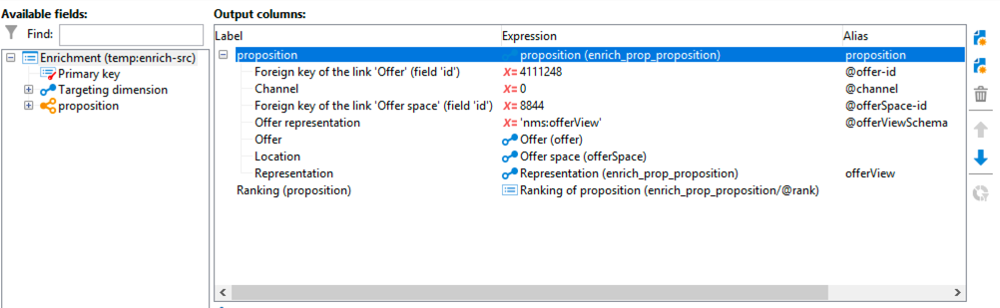
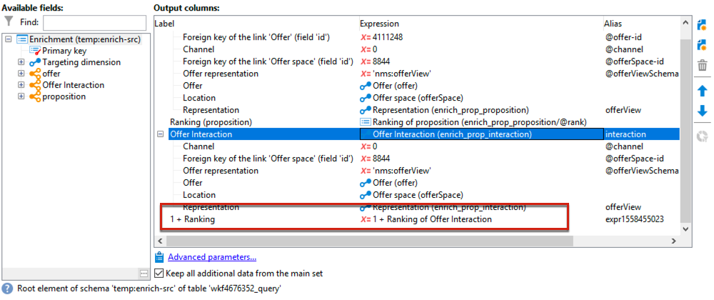

# 互动最佳实践{#interaction-best-practices}

## 一般建议 {#general-recommendations}

在Adobe Campaign中管理优惠需要谨慎管理才能高效运行。 要避免出现任何问题，您必须在联系人数量与选件类别和选件数量之间找到平衡。

本节介绍管理 **互动** 模块，包括资格规则、预定义过滤器、工作流活动和数据库选项。

* When **实施和配置交互**，则您必须了解以下建议：

   * 对于批处理引擎（通常用于出站通信，如电子邮件），吞吐量是主要考虑的问题，因为可以同时处理多个联系人。 典型的瓶颈是数据库性能。
   * 单一引擎（通常用于入站通信，如网站上的横幅）的主要约束是延迟，因为某人期望得到答案。 典型的瓶颈是CPU性能。
   * 选件目录设计对Adobe Campaign性能有巨大影响。
   * 使用多个选件时，最佳做法是将它们拆分为多个选件目录。

* 下面列出了使用时的一些最佳实践 **资格规则**:

   * 简化规则。 规则复杂性会随着查找的深入而影响性能。 复杂规则是指包含5个以上条件的任何规则。
   * 为了提高性能，可以在多个选件之间共享的不同预定义过滤器中划分规则。
   * 将限制最严格的选件类别规则放在树中尽可能高的位置。 这样，他们将首先过滤掉最多的联系人，从而减少目标数量并阻止进一步规则处理他们。
   * 在树的底部放置时间或处理方面最昂贵的规则。 这样，这些规则将仅在其余目标受众上运行。
   * 从特定类别开始，以避免扫描整个树。
   * 为了节省处理时间，请预先计算聚合，而不是使用连接构建复杂规则。 要实现此目的，请尝试将客户数据存储在可在资格规则中查找的参考表中。
   * 使用最小数量的权重来限制查询的数量。
   * 建议每个选件空间具有有限数量的选件。 这可确保在任何给定空间中更快地检索选件。
   * 使用索引，尤其是常用的查找列。

* 下面列出了一些与 **命题表**:

   * 使用最少数量的规则来尽可能快速地进行处理。
   * 限制建议表中的记录数：只保留跟踪其状态更新所需的记录以及规则所需的内容，然后将它们存档到另一个系统中。
   * 对建议表执行密集的数据库维护，如重建索引或重新创建表。
   * 限制每个目标要求的建议数。 请勿设置超出您实际要使用的设置。
   * 尽量避免在规则条件中加入连接。

## 管理优惠时的提示 {#tips-managing-offers}

本节包含有关管理优惠和使用Adobe Campaign中的交互模块的更多详细信息。

### 电子邮件中的多个选件空间 {#multiple-offer-spaces}

在投放中包含选件时，通常会通过 **扩充** 工作流活动（或其他类似活动）。

在 **扩充** 活动时，您可以选择要使用的选件空间。 但是，无论选择哪个选件空间，投放自定义菜单都取决于投放中设置的选件空间。

在以下示例中，投放中选择的选件空间为 **[!UICONTROL Email (Environment - Recipient)]**:


如果您在投放中选择的选件空间未设置HTML渲染功能，则您将不会在投放菜单中看到该选件空间，并且它将不可供选择。 这与 **扩充** 活动。

在以下示例中，HTML渲染功能在下拉列表中可用，因为投放中选择的选件空间具有渲染功能：


此函数插入代码，例如： `<%@ include proposition="targetData.proposition" view="rendering/html" %>`.

选择建议时， **[!UICONTROL view]** 属性如下所示：
* &quot;rendering/html&quot;:html渲染。 它使用HTML渲染功能。
* &quot;offer/view/html&quot;:html内容。 它不使用HTML渲染函数。 它仅包含HTML字段。

当您在单个电子邮件投放中包含多个选件空间，并且其中某些选件空间具有渲染功能而某些选件空间没有该功能时，您必须记住哪些选件使用了哪些选件空间，哪些选件空间具有渲染功能。

因此，为避免出现任何问题，建议所有选件空间都定义一个HTML渲染函数，即使您的选件空间仅需要HTML内容也是如此。

### 在命题日志表中设置排名 {#rank-proposition-log-table}

在生成或接受建议时，选件空间能够将数据存储在建议表中：


但是，这仅适用于集客交互。

在使用叫客交互时以及在不使用交互模块的情况下使用叫客选件时，还可以在建议表中存储其他数据。

工作流临时表中名称与建议表中的字段名称匹配的任何字段，都将复制到建议表中的相同字段。

例如，在 **扩充** 工作流活动中，标准字段的定义如下：


可以添加其他字段，如 `@rank` 字段：



因为命题表中有一个字段名为 `@rank`，则将复制工作流临时表中的值。

有关在建议表中存储其他字段的更多信息，请参阅 [此部分](interaction-send-offers.md#storing-offer-rankings-and-weights).

对于具有交互的出站选件，当选择了多个选件并且您想要记录它们在电子邮件中的显示顺序时，此功能非常有用。

您还可以直接在建议表中存储其他元数据（如当前支出级别），以在生成选件时保留有关支出的历史记录。

使用叫客互动时， `@rank` 字段，如上面的示例所示，但其值会根据交互返回的顺序自动设置。 例如，如果您使用交互选择三个选件，则 `@rank` 字段将返回值1、2和3。

使用交互和手动选择选件时，用户可以将这两种方法结合使用。 例如，用户可以手动设置 `@rank` 字段为1，则使用如下表达式 `"1 + @rank"` 交互返回的选件。 假定交互选择三个选件，则两种方法返回的选件将排名1-4:



### 扩展nms:offer模式 {#extending-nms-offer-schema}

扩展nms:offer模式时，请确保遵循已设置的现成结构：
* 为下的内容存储定义任何新字段 `<element name="view">`.
* 每个新字段需要定义两次。 一次作为常规XML字段，一次作为附加了“_jst”的CDATA XML字段。 例如：

   ```
   <element label="Price" name="price" type="long" xml="true"/>
   <element advanced="true" label="Script price" name="price_jst" type="CDATA" xml="true"/>
   ```

* 任何包含要跟踪的URL的字段都必须放在 `<element name="trackedUrls">` 在 `<element name="view" >`.
