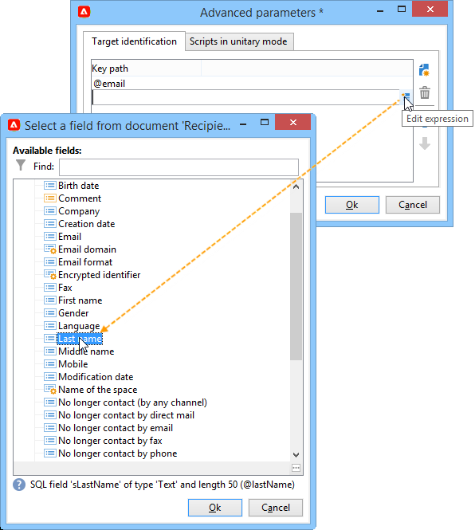

# 在网页中添加优惠{#add-an-offer-in-web}

要在网页中调用选件引擎，请直接在页面中插入对JavaScript代码的调用。 此调用会返回目标元素中的选件内容。

脚本调用URL如下所示：

```
<script id="interactionProposalScript" src="https://<SERVER_URL>/nl/interactionProposal.js?env=" type="text/javascript"></script>
```

“**env**”参数接收专用于匿名交互的实时环境的内部名称。

要呈现选件，我们需要在Adobe Campaign中创建环境和选件空间，然后配置HTML页面。

以下用例详细说明了通过JavaScript集成选件的可能选项。

## 选项1：HTML模式 {#html-mode}

### 提供匿名优惠 {#presenting-an-anonymous-offer}

**步骤1：准备优惠引擎**

1. 打开Adobe Campaign界面并准备匿名环境。
1. 创建链接到匿名环境的优惠空间。
1. 创建优惠及其链接到优惠空间的表示形式。

**步骤2：更新HTML页面的内容**

HTML页面必须包含一个元素，该元素的@id属性具有已创建选件空间的内部名称（“i_internal命名空间”）的值。 选件将由Interaction插入此元素中。

在我们的示例中，@id属性接收“i_SPC12”值，其中“SPC12”是之前创建的选件空间的内部名称：

```
<div id="i_SPC12"></div>
```

在我们的示例中，用于调用脚本的URL如下所示（“OE3”是实时环境的内部名称）：

```
<script id="interactionProposalScript" src="https://instance.adobe.org:8080/nl/interactionProposal.js?env=OE3" type="text/javascript"></script>
```

>[!CAUTION]
>
>`<script>`标记不能是自关闭的。

此静态调用将自动生成一个动态调用，其中包含选件引擎所需的所有参数。

通过此行为，您可以在同一页面上使用多个选件空间，以便通过调用选件引擎来管理。

**步骤3：在HTML页面中显示结果**

优惠呈现的内容由优惠引擎返回到HTML页面：

```
<div id="banner_header">
 <div id="i_SPC12">
   <table>
    <tbody>
        <tr>
            <td><h3>Fly to Japan!</h3></td>
        </tr>
        <tr>
            <td></td>
            <td>
            <p>Discover Japan for 2 weeks at an unbelievable price!!</p>
            <p><b>2345 Dollars - All inclusive</b></p>
        </td>
        </tr>
    </tbody>
    </table>
 </div>
<script src="https://instance.adobe.org:8080/nl/interactionProposal.js?env=OE3" id="interactionProposalScript" type="text/javascript"></script>
</div>
```

### 提供已识别的优惠 {#presenting-an-identified-offer}

若要向已识别的联系人提供选件，该过程类似于此部分[&#128279;](#presenting-an-anonymous-offer)中详细描述的过程。

在网页的内容中，您需要添加以下脚本，以在调用优惠引擎期间识别联系人：

```
<script type="text/javascript">
  interactionTarget = <contact_identifier>;
</script>
```

1. 转到网页将调用的优惠空间，单击&#x200B;**[!UICONTROL Advanced parameters]**&#x200B;并添加一个或多个标识键。

   

   在此示例中，标识键是复合键，因为它同时基于电子邮件和收件人名称。

1. 在网页显示期间，通过脚本评估，您可以将收件人ID传递到优惠引擎。 如果ID是复合的，则键的显示顺序与高级设置中使用的顺序相同，并且用 |。

   在以下示例中，联系人已登录到网站，并在致电优惠引擎期间因其电子邮件和姓名而被识别。

   ```
   <script type="text/javascript">
     interactionTarget = myEmail|myName;
   </script>
   ```

### 使用HTML渲染函数 {#using-an-html-rendering-function}

要自动生成HTML选件呈现，您可以使用渲染函数。

1. 转到优惠空间，然后单击&#x200B;**[!UICONTROL Edit functions]**&#x200B;链接。
1. 选择 **[!UICONTROL Overload the HTML rendering function]**。
1. 转到&#x200B;**[!UICONTROL HTML rendering]**&#x200B;选项卡，并在选件空间中插入与为选件内容定义的字段匹配的变量。

   

   在此示例中，选件以横幅的形式显示在网页中，并且由可单击的图像和与选件内容中定义的字段匹配的标题组成。

## 选项2：XML模式 {#xml-mode}

### 提供优惠 {#presenting-an-offer}

促销活动&#x200B;**交互**&#x200B;模块允许您将XML节点返回到调用优惠引擎的HTML页面。 该XML节点可以通过客户端开发的函数进行处理。

对优惠引擎的调用如下所示：

```
<script type="text/javascript" id="interactionProposalScript" src="https://<SERVER_URL>/nl/interactionProposal.js?env=&cb="></script>
```

* “**env**”参数接收实时环境的内部名称。

* “**cb**”参数接收函数的名称，该函数将读取包含（回调）建议的引擎返回的XML节点。 此参数是可选的。

* “**t**”参数仅接收已标识交互的目标值。 此参数还可以通过&#x200B;**interactionTarget**&#x200B;变量进行传递。 此参数是可选的。

* “**c**”参数接收类别的内部名称列表。 此参数是可选的。

* “**th**”参数接收主题列表。 此参数是可选的。

* “**gctx**”参数接收整个页面的全局调用数据（上下文）。 此参数是可选的。

返回的XML节点如下所示：

```
<propositions>
 <proposition id="" offer-id="" weight="" rank="" space="" div=""> //proposition identifiers
   ...XML content defined in Adobe Campaign...
 </proposition>
 ...
</propositions>
```

以下用例详细介绍了要在Adobe Campaign中执行的配置以启用XML模式，然后在HTML页面中显示调用引擎的结果。

1. **创建环境和优惠空间**

   有关创建环境的详细信息，请参阅[此页面](interaction-env.md)。

   有关创建优惠空间的详细信息，请参阅[此页面](interaction-offer-spaces.md)。

1. **扩展优惠架构以添加新字段**

   此架构将定义以下字段：标题编号2和价格。

   示例中架构的名称为&#x200B;**cus：offer**

   ```
   <srcSchema _cs="Marketing offers (cus)" created="2013-01-18 17:14:20.762Z" createdBy-id="0"
              desc="" entitySchema="xtk:srcSchema" extendedSchema="nms:offer" img="nms:offer.png"
              label="Marketing offers" labelSingular="Marketing offers" lastModified="2013-01-18 15:20:18.373Z"
              mappingType="sql" md5="F14A7AA009AE1FCE31B0611E72866AC3" modifiedBy-id="0"
              name="offer" namespace="cus" xtkschema="xtk:srcSchema">
     <createdBy _cs="Administrator (admin)"/>
     <modifiedBy _cs="Administrator (admin)"/>
     <element img="nms:offer.png" label="Marketing offers" labelSingular="Marketing offer"
              name="offer">
       <element label="Content" name="view">
         <element label="Price" name="price" type="long" xml="true"/>
         <element label="Title 2" name="title2" type="string" xml="true"/>
   
         <element advanced="true" desc="Price calculation script." label="Script price"
                  name="price_jst" type="CDATA" xml="true"/>
         <element advanced="true" desc="Title calculation script." label="Script title"
                  name="title2_jst" type="CDATA" xml="true"/>
       </element>
     </element>
   </srcSchema>
   ```

   >[!CAUTION]
   >
   >每个元素需要定义两次。 CDATA (“_jst”)类型元素可以包含个性化字段。
   >
   >不要忘记更新数据库结构。

   您可以扩展选件架构，以批处理模式和单一模式以及任何格式(文本、HTML和XML)添加新字段。

1. **扩展优惠公式以编辑新字段并修改现有字段**

   编辑&#x200B;**选件(nsm)**&#x200B;输入表单。

   在“视图”部分中，插入两个包含以下内容的新字段：

   ```
   <input label="Title 2" margin-right="5" prebuildSubForm="false" type="subFormLink" xpath="title2_jst">
        <form label="Edit title 2" name="editForm" nothingToSave="true">
            <input nolabel="true" toolbarAlign="horizontal" type="jstEdit" xpath="." xpathInsert="/ignored/customizeTitle2">
            <container>
                <input menuId="viewMenuBuilder" options="inbound" type="customizeBtn" xpath="/ignored/customizeTitle2"/>
            </container>
            </input>
        </form>
    </input>
    <input nolabel="true" type="edit" xpath="title2_jst"/>
    <input label="Price" margin-right="5" prebuildSubForm="false" type="subFormLink" xpath="price_jst">
        <form label="Edit price" name="editForm" nothingToSave="true">
        <input nolabel="true" toolbarAlign="horizontal" type="jstEdit" xpath="." xpathInsert="/ignored/customizePrice">
            <container>
                <input menuId="viewMenuBuilder" options="inbound" type="customizeBtn" xpath="/ignored/customizePrice"/>
            </container>
        </input>
        </form>
    </input>
    <input colspan="2" label="Prix" nolabel="true" type="number" xpath="price_jst"/>
   ```

   注释掉目标URL字段：

   

   >[!CAUTION]
   >
   >(`<input>`)表单的字段必须指向所创建架构中定义的CDATA类型元素。

   优惠呈现形式中的呈现如下所示：

   

   已添加&#x200B;**[!UICONTROL Title 2]**&#x200B;和&#x200B;**[!UICONTROL Price]**&#x200B;字段，并且不再显示&#x200B;**[!UICONTROL Destination URL]**&#x200B;字段。

1. **创建产品建议**

   有关创建选件的详细信息，请参阅[此页面](interaction-offer.md)。

   在以下用例中，输入选件如下：

   

1. **批准选件**

   批准优惠或由其他人批准优惠，然后在最后一步创建的优惠空间上激活它，以便它在链接的实时环境中可用。

1. HTML页面上的&#x200B;**引擎调用和结果**

   对HTML页面中选件引擎的调用如下所示：

   ```
   <script id="interactionProposalScript" src="https://<SERVER_URL>/nl/interactionProposal.js?env=OE7&cb=alert" type="text/javascript">
   ```

   “**env**”参数的值是实时环境的内部名称。

   “**cb**”参数的值是需要解释引擎返回的XML节点的函数的名称。 在我们的示例中，调用的函数会打开一个模式窗口(alert()函数)。

   选件引擎返回的XML节点如下所示：

   ```
   <propositions>
    <proposition id="a28002" offer-id="10322005" weight="1" rank="1" space="SPC14" div="i_SPC14">
     <xmlOfferView>
      <title>Travel to Russia</title>
      <price>3456</price>
      <description>Discover this vacation package!INCLUDES 10 nights. FEATURES buffet breakfast daily. BONUS 5th night free.</description>
      <image>
       <path>https://myinstance.com/res/Track/ae1d2113ed732d58a3beb441084e5960.jpg</path>
       <alt>Travel to Russia</alt>
      </image>
     </xmlOfferView>
    </proposition>
   </propositions>
   ```

### 使用渲染函数 {#using-a-rendering-function-}

可以使用XML渲染函数来创建优惠演示。 此函数将修改在调用优惠引擎期间返回到HTML页面的XML节点。

1. 转到优惠空间，然后单击&#x200B;**[!UICONTROL Edit functions]**&#x200B;链接。
1. 选择 **[!UICONTROL Overload the XML rendering function]**。
1. 转到&#x200B;**[!UICONTROL XML rendering]**&#x200B;选项卡并插入所需的函数。

   该函数可以如下所示：

   ```
   function (proposition) {
     delete proposition.@id;
     proposition.@newAttribute = "newValue";
   } 
   ```


## 设置SOAP集成

为选件管理提供的SOAP Web服务与Adobe Campaign中通常使用的服务不同。 您可以通过上一节所述的交互URL访问选件，并让您提供或更新给定联系人的选件。

### 产品建议提议 {#offer-proposition}

对于通过SOAP的优惠建议，请添加&#x200B;**nms：proposition#Propose**&#x200B;命令，后跟以下参数：

* **targetId**：收件人的主键（可以是组合键）。
* **maxCount**：指定联系人的优惠建议数。
* **上下文**：允许您在空间架构中添加上下文信息。 如果使用的架构是&#x200B;**nms：interaction**，则应添加&#x200B;**`<empty>`**。
* **类别**：指定选件必须属于的类别。
* **主题**：指定选件必须属于的主题。
* **uuid**： Adobe Campaign永久cookie的值(“uuid230”)。
* **nli**： Adobe Campaign会话Cookie的值(“nlid”)。
* **noProp**：使用“true”值停用建议插入。

>[!NOTE]
>
>**targetId**&#x200B;和&#x200B;**maxCount**&#x200B;设置是强制性的。 其他则是可选的。

为响应查询，SOAP服务将返回以下参数：

* **interactionId**：交互的ID。
* **建议**： XML元素，包含建议列表，每个建议都有自己的ID和HTML表示形式。

### 优惠更新 {#offer-update}

将&#x200B;**nms：interaction#UpdateStatus**&#x200B;命令添加到URL，后跟以下参数：

* **建议**：字符串，它包含在优惠建议期间作为输出提供的建议ID。 请参阅[优惠建议](#offer-proposition)。
* **状态**：字符串类型，它指定选件的新状态。 可能的值列在&#x200B;**nms：common**&#x200B;架构的&#x200B;**propositionStatus**&#x200B;枚举中。 例如，数字3是现成的，对应于&#x200B;**已接受**&#x200B;状态。
* **上下文**： XML元素，允许您在空间架构中添加上下文信息。 如果使用的架构是&#x200B;**nms：interaction**，则应添加&#x200B;**`<empty>`**。

### 使用SOAP调用的示例 {#example-using-a-soap-call}

以下是SOAP调用的代码示例：

```
<%
  var space = request.parameters.sp
  var cnx = new HttpSoapConnection(
    "https://" + request.serverName + ":" + request.serverPort + "/interaction/" + env + "/" + space,
    "utf-8",
    HttpSoapConnection.SOAP_12)
  var session = new SoapService(cnx, "nms:interaction")
  var action = request.parameters.a
  if( action == undefined )
    action = 'propose'

  try
  {
    switch( action )
    {
    case "update":
      var proposition = request.parameters.p
      var status      = request.parameters.st
      session.addMethod("UpdateStatus", "nms:interaction#UpdateStatus",
       ["proposition", "string",
        "status",      "string",
        "context",     "NLElement"],
       [])
      session.UpdateStatus(proposition, status, <undef/>)
      var redirect = request.parameters.r
      if( redirect != undefined )
        response.sendRedirect(redirect)
      break;

    case "propose":
      var count = request.parameters.n
      var target = request.parameters.t
      var categorie = request.parameters.c
      var theme = request.parameters.th
      var layout = request.parameters.l
      if( count == undefined )
        count = 1
      session.addMethod("Propose", "nms:proposition#Propose",
       ["targetId",      "string",
        "maxCount",      "string",
         "categories",    "string",
         "themes",        "string",
        "context",       "NLElement"],
       ["interactionId", "string",
        "propositions",  "NLElement"])
      response.setContentType("text/html")
      var result = session.Propose(target, count, category, theme, <empty/>)
      var props = result[1]
  %><table><tr><%
      for each( var propHtml in props.proposition.*.mdSource )
      {
        %><td><%=propHtml%></td><%
      }
  %></tr></table><%
      break;
    }
  }
  catch( e )
  {
  }
  %>
```
