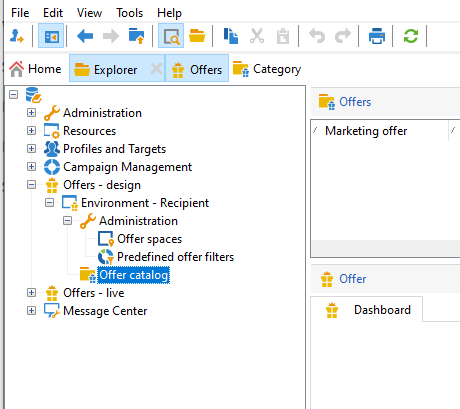

# 创建优惠目录

作为 **选件管理器**，则由您负责创建优惠目录。

优惠目录与单个预先存在的环境相关联。 此目录中的选件只能与此同一环境中指定的空间关联。

在创建选件之前，必须首先指定 [环境](interaction-env.md) 包含一组优惠的所有特征（资格、目标限制、呈现规则），按类别进行排序及其空间列表。

## 创建优惠类别{#creating-offer-categories}

选件会按类别/子类别进行整理。 类别创建于 **[!UICONTROL Design]** 环境，并在中自动部署 **[!UICONTROL Live]** 环境（即可用）。 此 **[!UICONTROL Design]** 环境包含一个默认类别，用于接收所有选件。 可以创建子类别以将层次结构添加到目录选件。

对于每个类别，您可以定义 **合格日期**，即可将类别中包含的优惠呈现给其目标的时段。 您还可以调整类别的权重，以优先考虑优惠演示。

要创建新类别，请执行以下步骤：

1. 浏览至 **[!UICONTROL Offer catalog]** 文件夹。

   

1. 右键单击并选择 **[!UICONTROL Create a new "Offer category" folder]** 下拉列表中。

   

1. 重新命名类别。 您可以稍后使用编辑标签 **[!UICONTROL General]** 选项卡。

   

   >[!NOTE]
   >
   >重复这些步骤以创建所需数量的类别。

   此后，您可以根据需要执行以下操作：

   * 从以下日期分配资格日期 **[!UICONTROL Eligibility]** 选项卡。

     

   * **[!UICONTROL Edit query]** 以将过滤器应用于选件目标。

   * 资格规则概述。要查看这些规则，请单击 **[!UICONTROL Schedule and eligibility rules of the offer]** 链接。

## 添加后备类别

为确保所有接受者都收到优惠建议，可以在建议中系统地添加一个或多种优惠类别。

这些后备优惠必须具有低（但非空）权重，以便只有在没有更高权重优惠符合条件时才会考虑它们。

此外，不得对这些优惠应用演示规则，以确保始终将优惠包含在推荐中。 这意味着，在建议期间，如果没有可用的较高权重优惠，则收件人将至少从此类别收到一个优惠。

要在建议中包含后备类别，请执行以下步骤：

1. 浏览到优惠目录。
1. 单击 **[!UICONTROL Eligibility]** 选项卡，然后选择 **[!UICONTROL Always include this category in the recommendations]** 选项。
1. 单击 **[!UICONTROL Save]**。

   
