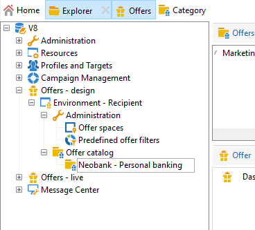

# 创建产品建议目录

作为&#x200B;**优惠经理**，您负责创建优惠目录。

优惠目录与单个预先存在的环境相关联。 此目录中的选件只能与此同一环境中指定的空间关联。

在创建选件之前，必须先指定一个[环境](interaction-env.md)，该环境包含一组选件的所有特征（资格、目标限制、呈现规则），这些特征将按类别排序，并且包含其空间列表。

## 创建产品建议类别{#creating-offer-categories}

选件会按类别/子类别进行整理。 类别是在&#x200B;**[!UICONTROL Design]**&#x200B;环境中创建的，并在其包含的选件获得批准时自动部署在&#x200B;**[!UICONTROL Live]**&#x200B;环境中（即使其可用）。 **[!UICONTROL Design]**&#x200B;环境包含接收所有选件的默认类别。 可以创建子类别以将层次结构添加到目录选件。

对于每个类别，您可以定义&#x200B;**资格日期**，该日期是类别中包含的优惠可以展示给其目标的时间段。 您还可以调整类别的权重，以优先考虑优惠演示。

要创建新类别，请执行以下步骤：

1. 浏览器到&#x200B;**[!UICONTROL Offer catalog]**&#x200B;文件夹。

   

1. 右键单击并从下拉列表中选择&#x200B;**[!UICONTROL Create a new "Offer category" folder]**。

   

1. 重新命名类别。 您稍后可以使用&#x200B;**[!UICONTROL General]**&#x200B;选项卡编辑标签。

   

   >[!NOTE]
   >
   >重复这些步骤以创建所需数量的类别。

   此后，您可以根据需要执行以下操作：

   * 从&#x200B;**[!UICONTROL Eligibility]**&#x200B;选项卡分配资格日期。

     

   * **[!UICONTROL Edit query]**&#x200B;以将筛选器应用到优惠目标。

   * 资格规则概述。要查看这些规则，请单击&#x200B;**[!UICONTROL Schedule and eligibility rules of the offer]**&#x200B;链接。

## 添加后备类别

为确保所有接受者都收到优惠建议，可以在建议中系统地添加一个或多种优惠类别。

这些后备优惠必须具有低（但非空）权重，以便只有在没有更高权重优惠符合条件时才会考虑它们。

此外，不得对这些优惠应用演示规则，以确保始终将优惠包含在推荐中。 这意味着，在建议期间，如果没有可用的较高权重优惠，则收件人将至少从此类别收到一个优惠。

要在建议中包含后备类别，请执行以下步骤：

1. 浏览到优惠目录。
1. 单击&#x200B;**[!UICONTROL Eligibility]**&#x200B;选项卡并选择&#x200B;**[!UICONTROL Always include this category in the recommendations]**&#x200B;选项。
1. 单击 **[!UICONTROL Save]**。

   
