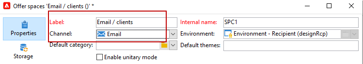

# 创建产品建议空间{#creating-offer-spaces}

优惠目录的内容在优惠空间中配置。 默认情况下，内容可以包含以下字段： **[!UICONTROL Title]**、**[!UICONTROL Destination URL]**、**[!UICONTROL Image URL]**、**[!UICONTROL HTML content]**&#x200B;和&#x200B;**[!UICONTROL Text content]**。 字段序列在选件空间中配置。

作为&#x200B;**技术管理员**，您可以在“设计”环境中创建选件空间。 您需要具有优惠空间子文件夹的访问权限。 创建后，在批准优惠期间，这些优惠空间会自动复制到实时环境中。

HTML渲染通过渲染函数创建。 渲染函数中定义的字段序列必须与内容中配置的序列相同。


要创建新的选件空间，请执行以下步骤：

1. 在选件空间列表中，单击&#x200B;**[!UICONTROL New]**。

   

1. 选择要使用的渠道并更改优惠空间的标签。

   

1. 选中&#x200B;**[!UICONTROL Enable unitary mode]**&#x200B;选项

1. 转到&#x200B;**[!UICONTROL Content field]**&#x200B;窗口并单击&#x200B;**[!UICONTROL Add]**。

   

1. 转到&#x200B;**[!UICONTROL Content]**&#x200B;节点并按以下顺序选择字段： **[!UICONTROL Title]**、**[!UICONTROL Image URL]**、**[!UICONTROL HTML content]**、**[!UICONTROL Destination URL]**。

   

1. 选中&#x200B;**[!UICONTROL Required]**&#x200B;选项，使每个字段成为必填字段。

   >[!NOTE]
   >
   >该选项在预览中使用，如果选件中缺少必填字段之一，则会在发布时使选件空格无效。 但是，如果优惠空间中已存在优惠，则不会考虑这些标准。

   

1. 单击&#x200B;**[!UICONTROL Edit functions]**&#x200B;以创建渲染函数。

   这些函数用于在优惠空间上生成优惠呈现。 有多种可能的格式：HTML或文本。

   **注意** - XML格式仅限于在此版本的产品中不可用的入站交互。 [了解详情](../start/v7-to-v8.md#gs-unavailable-features)

   _

1. 转到&#x200B;**[!UICONTROL HTML rendering]**&#x200B;选项卡并选择&#x200B;**[!UICONTROL Overload the HTML rendering function]**。
1. 插入渲染函数。

   

## 优惠建议状态 {#offer-proposition-statuses}

优惠建议状态因与目标群体的交互而异。 Campaign交互模块提供了一组值，可在优惠建议整个生命周期中应用于这些值。 您需要配置平台，以便在创建和接受优惠建议时更改状态。

>[!NOTE]
>
>状态更新是&#x200B;**异步**&#x200B;进程。 跟踪由跟踪工作流执行，跟踪工作流每小时触发一次。

### 优惠状态列表 {#status-list}

可用的优惠状态为：

* **[!UICONTROL Accepted]**
* **[!UICONTROL Scheduled]**
* **[!UICONTROL Generated]**
* **[!UICONTROL Interested]**
* **[!UICONTROL Presented]**
* **[!UICONTROL Rejected]**

默认情况下不应用这些值：必须配置这些值。

>[!NOTE]
>
>如果优惠与状态为“已发送”的投放关联，则优惠建议的状态将自动更改为“已呈现”。

### 创建建议时的优惠状态 {#configuring-the-status-when-the-proposition-is-created}

当优惠建议为&#x200B;**创建**&#x200B;时，其状态将更新。

在&#x200B;**[!UICONTROL Design]**&#x200B;环境中，根据要在优惠报表中显示的信息，为每个优惠空间配置创建建议时要应用的状态。

为此请执行以下操作步骤：

1. 转到所需空间的&#x200B;**[!UICONTROL Storage]**&#x200B;选项卡。
1. 选择建议在创建时应用于建议的状态。

   

### 建议被接受时的优惠状态 {#configuring-the-status-when-the-proposition-is-accepted}

一旦优惠建议被&#x200B;**接受**，请使用默认提供的值之一来配置建议的新状态。 当收件人单击优惠中的链接时，将应用更新。

为此请执行以下操作步骤：

1. 转到所需空间的&#x200B;**[!UICONTROL Storage]**&#x200B;选项卡。
1. 选择建议被接受时您希望应用于该建议的状态。

   


**入站交互**

**[!UICONTROL Storage]**&#x200B;选项卡允许您仅定义&#x200B;**建议的**&#x200B;和&#x200B;**接受的优惠建议**&#x200B;的状态。 对于入站交互，应直接在用于调用优惠引擎的URL中指定优惠建议的状态，而不是通过界面指定。 这样，您将能够指定在其他情况下要应用的状态，例如，如果优惠建议被拒绝。

```
<BASE_URL>?a=UpdateStatus&p=<PRIMARY_KEY_OF_THE_PROPOSITION>&st=<NEW_STATUS_OF_THE_PROPOSITION>&r=<REDIRECT_URL>
```

例如，与&#x200B;**Neobank400045&rbrace;网站上显示的**&#x200B;家庭保险&#x200B;**优惠匹配的建议（标识符**&#x200B;**）包含以下URL：**

```
<BASE_URL>?a=UpdateStatus&p=<40004>&st=<3>&r=<"http://www.neobank.com/insurance/subscribe.html">
```

只要访客单击了选件并因此单击了URL，就会将&#x200B;**[!UICONTROL Accepted]**&#x200B;状态（值&#x200B;**3**）应用于建议，并且访客将被重定向到&#x200B;**Neobank**&#x200B;网站的新页面以取消保险合同。

>[!NOTE]
>
>如果要在URL中指定其他状态（例如，如果优惠建议被拒绝），请使用与所需状态对应的值。 示例： **[!UICONTROL Rejected]** = &quot;5&quot;，**[!UICONTROL Presented]** = &quot;1&quot;，依此类推。
>
>可在&#x200B;**[!UICONTROL Offer propositions (nms)]**&#x200B;数据架构中检索状态及其值。 有关详细信息，请参见[此页面](../dev/create-schema.md)。

**出站交互**

当投放包含链接时，您可以自动将&#x200B;**[!UICONTROL Interested]**&#x200B;状态应用于优惠建议。 只需将&#x200B;**_urlType=&quot;11&quot;**&#x200B;值添加到链接即可：

```
<a _urlType="11" href="<DEST_URL>">Link inserted into the delivery</a>
```

## 每个空间的优惠预览 {#offer-preview-per-space}

在&#x200B;**[!UICONTROL Preview]**&#x200B;选项卡中，您可以查看收件人通过所选方法符合资格的优惠。 在下面的示例中，收件人可以通过邮件获得三个优惠建议。


如果收件人不符合任何优惠的条件，则会在预览中显示。


当上下文限制为空格时，预览可以忽略上下文。 扩展交互架构以使用入站渠道添加空间中引用的字段时，会出现这种情况。

有关详细信息，请参阅[Campaign Classic v7文档](https://experienceleague.adobe.com/docs/campaign-classic/using/managing-offers/advanced-parameters/extension-example.html){target="_blank"}中的此示例。