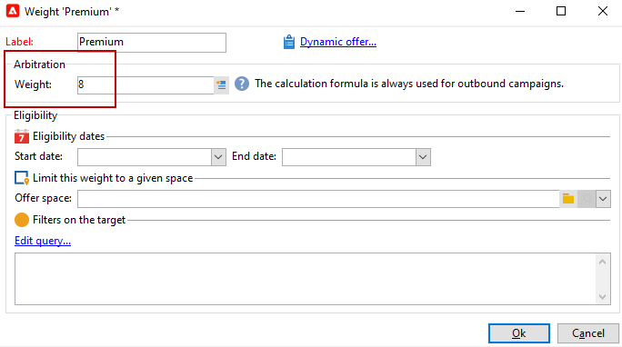
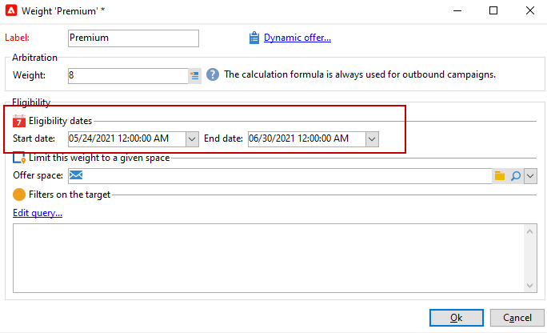
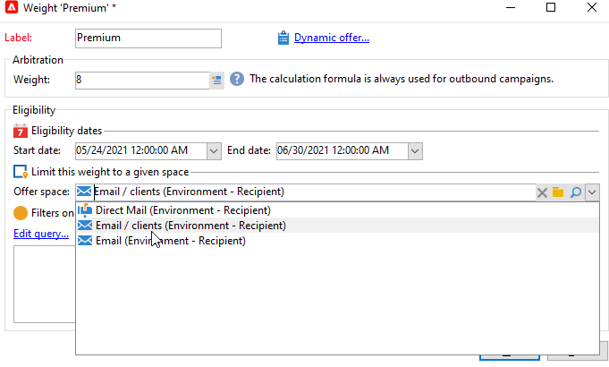

# 创建产品建议

要创建选件，请执行以下步骤：

1. 浏览到&#x200B;**[!UICONTROL Campaigns]**&#x200B;选项卡并单击&#x200B;**[!UICONTROL Offers]**&#x200B;链接。

1. 单击 **[!UICONTROL Create]** 按钮。

1. 更改标签并选择选件应属于的类别。

1. 单击&#x200B;**[!UICONTROL Save]**&#x200B;以创建选件。

   该选件可在平台中使用，并且可以配置其内容。

## 资格设置

您现在可以使用&#x200B;**[!UICONTROL Eligibility]**&#x200B;选项卡定义：

* 优惠的资格期限。 [了解详情](#eligibility-period)
* 优惠目标群体上的过滤器。 [了解详情](#filters-on-the-target)
* 优惠权重。 [了解详情](#offer-weight)

### 优惠资格期{#eligibility-period}

在优惠的&#x200B;**[!UICONTROL Eligibility]**&#x200B;选项卡中，定义优惠的资格期限。 使用下拉列表选择日历中的开始日期和结束日期。


在此时段之外，将不会选择选件。 如果您还为优惠类别配置了资格日期，则将应用最严格的时段。

### 在目标上添加过滤器 {#filters-on-the-target}

在优惠的&#x200B;**[!UICONTROL Eligibility]**&#x200B;选项卡中，将过滤器应用于优惠目标。

为此，请单击&#x200B;**[!UICONTROL Edit query]**&#x200B;链接，然后选择要应用的筛选器。


如果已经创建了预定义过滤器，则可以从用户过滤器列表中选择它们。 [了解详情](interaction-predefined-filters.md)


### 设置优惠权重 {#offer-weight}

要使引擎能够在目标有资格使用的多个优惠之间做出决定，您需要为该优惠分配一个或多个权重。 如有必要，您还可以将过滤器应用于目标，或限制将应用权重的选件空间。 权重较高的选件优先于权重较低的选件。

您可以为同一选件配置多个权重，例如为了区分超周期、特定目标甚至选件空间。

例如，选件可以具有18至25岁的触点的重量A和高于该范围的触点的重量B。 如果某个选件在整个夏季都符合条件，则它在7月份的权重可以是A，在8月份的权重可以是B。

>[!NOTE]
>
>分配的权重可以根据优惠所属的类别的参数临时修改。 [了解详情](interaction-offer-catalog.md#creating-offer-categories)

要在选件中创建权重，请应用以下步骤：

1. 在选件的&#x200B;**[!UICONTROL Eligibility]**&#x200B;选项卡中，单击&#x200B;**[!UICONTROL Add]**。

   

1. 更改标签并分配权重。 默认值为 1。

   

   >[!CAUTION]
   >
   >如果未输入权重(0)，则目标将不被视为符合优惠条件。

1. 如果要将加权应用于给定期间，请定义资格日期。

   

1. 如有必要，请将权重限制为特定优惠空间。

   

1. 将过滤器应用于目标。

   

1. 单击&#x200B;**[!UICONTROL OK]**&#x200B;以保存权重。

   

   >[!NOTE]
   >
   >如果目标符合选定优惠的多重资格，则引擎将保留最佳（最高）权重。 调用选件引擎时，最多为每个联系人选择一个选件。

### 优惠资格规则摘要 {#a-summary-of-offer-eligibility-rules}

配置完成后，资格规则的摘要将显示在优惠仪表板上。

要查看它，请单击&#x200B;**[!UICONTROL Schedule and eligibility rules]**&#x200B;链接。


## 创建选件内容 {#creating-the-offer-content}

使用&#x200B;**[!UICONTROL Content]**&#x200B;选项卡定义选件内容。


1. 定义选件内容的各种参数。

   * **[!UICONTROL Title]**：指定您希望显示在选件中的标题。 警告：这不是指在&#x200B;**[!UICONTROL General]**&#x200B;选项卡中定义的选件标签。
   * **[!UICONTROL Destination URL]**：指定选件的URL。 必须以“http://”或“https://”开头。
   * **[!UICONTROL Image URL]**：指定选件图像的URL或访问路径。
   * **[!UICONTROL HTML content]** / **[!UICONTROL Text content]**：在所需的选项卡中输入选件正文。 要生成跟踪，**[!UICONTROL HTML content]**&#x200B;必须由可以包含在`<div>`类型元素中的HTML元素组成。 例如，HTML页面中`<table>`元素的结果将如下所示：

   ```
      <div> 
       <table>
        <tr>
         <th>Month</th>
         <th>Savings</th>   
        </tr>   
        <tr>    
         <td>January</td>
         <td>$100</td>   
        </tr> 
       </table> 
      </div>
   ```

   在[本节](interaction-offer-spaces.md#configuring-the-status-when-the-proposition-is-accepted)中了解如何定义接受URL。

   

   要查找在优惠空间配置期间定义的必填字段，请单击&#x200B;**[!UICONTROL Content definitions]**&#x200B;链接以显示列表。 [了解详情](interaction-offer-spaces.md)

   

   在此示例中，选件必须包含标题、图像、HTML内容和目标URL。

## 预览优惠 {#previewing-the-offer}

配置优惠内容后，您可以预览该优惠对其收件人显示的内容。

操作步骤：

1. 单击&#x200B;**[!UICONTROL Preview]**&#x200B;选项卡。

   

1. 选择要查看的优惠的表示形式。

   

1. 如果您已个性化优惠内容，请选择优惠目标以查看个性化。

<!--

## Create a hypothesis on an offer {#creating-a-hypothesis-on-an-offer}

You can create hypotheses on your offer propositions. This lets you determine the impact of your offers on purchases carried out for the product concerned.

>[!NOTE]
>
>These hypotheses are carried out via Response Manager. Please check your license agreement.

Hypotheses carried out on an offer proposition are referenced in their **[!UICONTROL Measure]** tab.

Creating hypotheses is detailed in [this page](../../campaign/using/about-response-manager.md).

-->

## 批准和激活产品建议{#approve-offers}

您现在可以批准并激活选件以使其在&#x200B;**实时**&#x200B;环境中可用。

有关更多信息，请参阅 [Campaign Classic v7 文档](https://experienceleague.adobe.com/docs/campaign-classic/using/managing-offers/managing-an-offer-catalog/approving-and-activating-an-offer.html#approving-offer-content){target="_blank"}。

## 管理产品建议演示{#offer-presentation}

通过Campaign，您可以使用展示规则控制优惠建议的流程。 这些特定于营销活动交互的规则是&#x200B;**类型规则**。 它们允许您根据已对收件人作出的建议历史记录排除优惠。 它们会在环境中引用。

有关更多信息，请参阅 [Campaign Classic v7 文档](https://experienceleague.adobe.com/docs/campaign-classic/using/managing-offers/managing-an-offer-catalog/managing-offer-presentation.html#managing-offers){target="_blank"}。

## 优惠模拟

使用&#x200B;**Simulation**&#x200B;模块，您可以在向收件人发送建议之前测试属于某个类别或某个环境的选件分布。

模拟会考虑先前应用于优惠的上下文和资格规则及其呈现规则。 这样，您就可以测试和优化各种版本的优惠建议，而无需实际使用优惠或过度/缺征询目标，因为模拟对目标收件人没有影响。

有关选件模拟的详细信息，请参阅[Campaign Classic v7文档](https://experienceleague.adobe.com/docs/campaign-classic/using/managing-offers/simulating-offers/about-offers-simulation.html){target="_blank"}。
