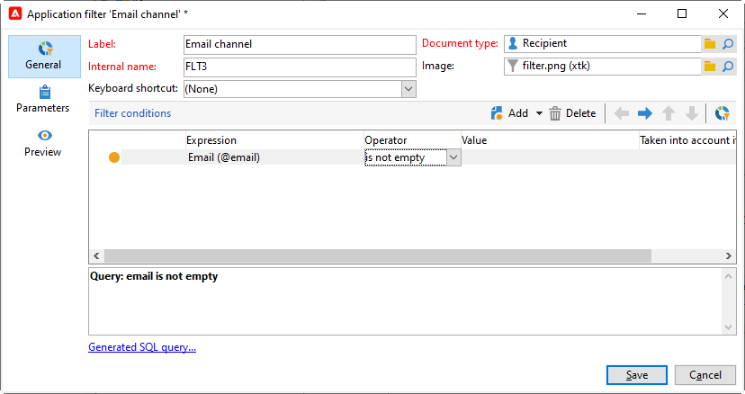

# 创建预定义过滤器{#creating-pre-defined-filters}

创建预定义过滤器，定义可在选件创建期间轻松重复使用的目标群体的资格规则。 它们特定于每个环境，并将选件参数考虑在内。

>[!NOTE]
>
>Adobe Campaign Web UI为您提供了一个用户友好的界面，可轻松管理和自定义预定义过滤器以满足您的特定需求。 创建一次并保存，以供将来使用。 要了解有关Web UI预定义过滤器的更多信息，请参阅[Adobe Campaign Web UI文档](https://experienceleague.adobe.com/zh-hans/docs/campaign-web/v8/start/predefined-filters){target=_blank}。

要创建预定义过滤器，请应用以下流程：

1. 浏览到&#x200B;**[!UICONTROL Administration]**&#x200B;文件夹并选择&#x200B;**[!UICONTROL Pre-defined offer filters]**。

   

1. 单击 **[!UICONTROL New]**。

   

1. 更改标签以便以后能够识别过滤器。

   

1. 选择筛选条件将关注的字段。

   

1. 根据需要选择运算符和值，然后保存查询。

   

1. 单击&#x200B;**[!UICONTROL Preview]**&#x200B;查看筛选结果。

   
