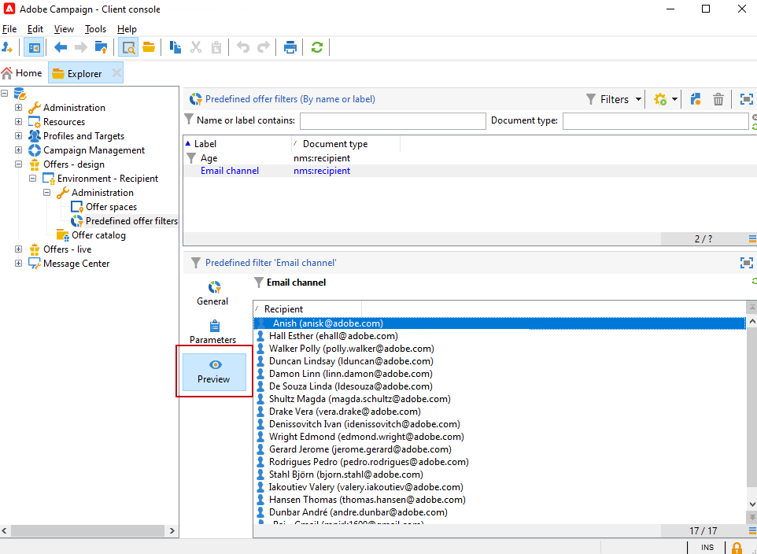

# 创建预定义过滤器{#creating-pre-defined-filters}

创建预定义过滤器以定义目标群体的资格规则，这些规则在选件创建过程中可以轻松重复使用。 它们特定于每个环境，并考虑选件参数。

要创建预定义过滤器，请应用以下流程：

1. 浏览到 **[!UICONTROL Administration]** 文件夹，选择 **[!UICONTROL Pre-defined offer filters]**.

   

1. 单击 **[!UICONTROL New]**。

   

1. 更改标签以便稍后能够识别过滤器。

   

1. 选择筛选条件将涉及的字段。

   

1. 根据需要选择运算符和值，然后保存查询。

   

1. 单击 **[!UICONTROL Preview]** 查看过滤器的结果。

   
