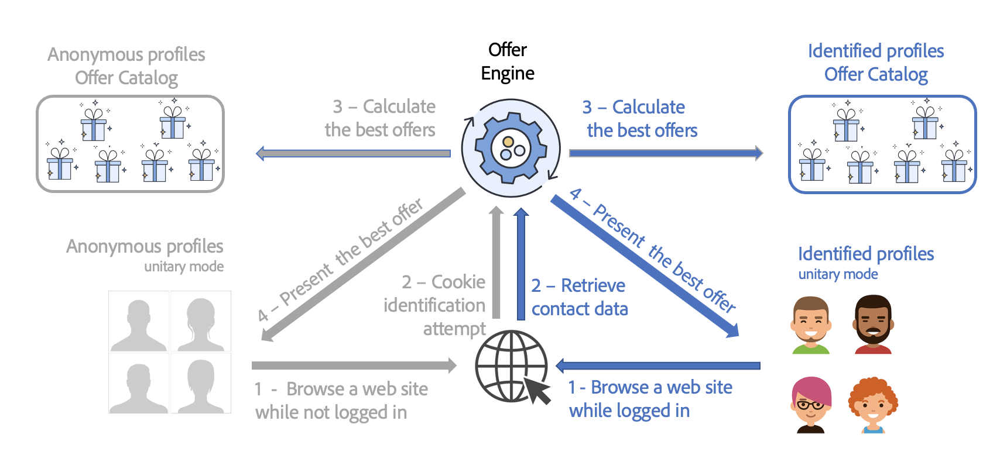

# 提供最佳优惠{#interaction-present-offers}

可以使用[入站或出站渠道](interaction-architecture.md#interaction-types)在各种优惠空间中显示优惠。 本章详细介绍了入站渠道的一些特定功能。

选件引擎要选择选件，该选件必须获得批准并在实时环境中可用。

有关更多信息，请参阅 [Campaign Classic v7 文档](https://experienceleague.adobe.com/docs/campaign-classic/using/managing-offers/managing-an-offer-catalog/approving-and-activating-an-offer.html#approving-offer-content){target="_blank"}。

在入站联系人的上下文中，网站可以识别正在浏览页面的用户，也可以识别不存在的用户。 优惠引擎为已识别的用户档案和匿名用户档案提供不同的优惠。

在入站渠道中提供优惠之前，必须配置优惠引擎调用，以便能够在其中提供优惠。 在大多数情况下，对于入站交互，这是网页。

>[!NOTE]
>
>对于入站交互，您必须专门配置选件引擎以呈现和更新一个或多个选件。
>
>您还必须在优惠空间上启用单一模式。 有关详细信息，请参见[此页面](interaction-offer-spaces.md)。
