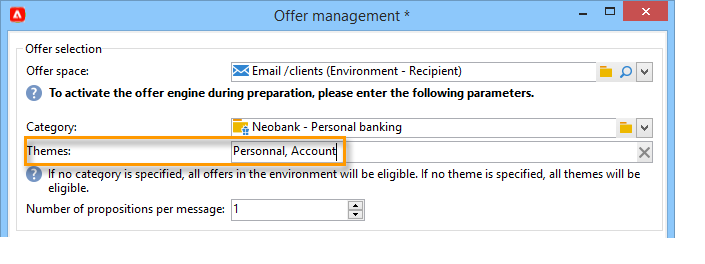

# 发送优惠{#send}

为了让选件引擎选择该选件，该选件已在 **实时** 环境。 [了解详情](interaction-offer.md#approve-offers)

通过出站通信渠道进行优惠演示，可通过直邮、电子邮件或移动投放进行。 您还可以将统一模式与事务型消息传递（消息中心）结合使用。

## 在投放中插入选件 {#offer-into-a-delivery}

要在投放中插入优惠建议，请执行以下步骤：

1. 在投放窗口中，单击 **选件** 图标。

   

1. 选择与您的选件环境匹配的空间。

   

1. 要优化引擎的选件选择，请选择要显示的选件所属的类别，或选择一个/多个主题。 我们建议一次只使用其中一个字段，以避免超出限制。

   

   

1. 指定要插入投放正文的选件数量。

   

1. 选择 **[!UICONTROL Exclude non-eligible recipients]** 选项。 [了解详情](#parameters-for-calling-offer-engine)

   

1. 如果需要，请选择 **[!UICONTROL Do not display anything if no offers are selected]** 选项。 [了解详情](#parameters-for-calling-offer-engine)

   

1. 使用合并字段将属性插入投放内容。 可用的建议数取决于引擎调用的配置方式，其顺序取决于选件的优先级。

   

1. 完成内容、测试并发送投放。

   

### 优惠引擎的参数 {#parameters-for-calling-offer-engine}

* **[!UICONTROL Space]** :选件环境的空间，必须选择该空间才能激活选件引擎。
* **[!UICONTROL Category]** :选件排序的特定文件夹。 如果未指定类别，则选件引擎将考虑环境中包含的所有选件，除非选择了主题。
* **[!UICONTROL Themes]** :类别中上游定义的关键词。 这些选件用作过滤器，允许您通过在一组类别中选择选件来优化要显示的选件数量。
* **[!UICONTROL Number of propositions]** :引擎返回的可插入到投放主体中的选件数。 如果未将选件插入到消息中，则仍会生成选件，但不会显示选件。
* **[!UICONTROL Exclude non-eligible recipients]** :利用此选项，可激活或取消激活排除符合条件的选件不足的收件人。 合格建议的数目可能低于所要求的建议数目。 如果选中此框，则投放中将排除没有足够建议的收件人。 如果不选择此选项，则不会排除这些收件人，但他们将没有请求的建议数。
* **[!UICONTROL Do not display anything if no offer is selected]** :此选项允许您选择在其中一个命题不存在时如何处理消息。 选中此框后，将不显示缺少命题的表示，并且此命题的消息中将不显示任何内容。 如果未勾选方框，则在发送期间将取消消息本身，收件人将不再收到任何消息。

## 在工作流中发送选件{#offer-via-wf}

利用多个工作流活动，可定义选件的呈现方式：

* 扩充
* 优惠引擎
* 单元格优惠

### 扩充 {#enrichment}

的 **扩充** 活动，可向投放收件人的选件添加选件或链接。

 有关扩充活动的更多信息，请参阅 [Campaign Classicv7文档](https://experienceleague.adobe.com/docs/campaign-classic/using/automating-with-workflows/targeting-activities/enrichment.html)

例如，您可以在投放之前扩充收件人查询的数据。

有两种方法可指定优惠建议。

* 指定选件或选件引擎调用。
* 引用指向选件的链接。

#### 指定选件或对选件引擎的调用 {#specifying-an-offer-or-a-call-to-the-offer-engine}

配置 **查询** 活动：

1. 添加并打开 **扩充** 活动。
1. 在 **[!UICONTROL Enrichment]** 选项卡中，选择 **[!UICONTROL Add data]**。
1. 选择 **[!UICONTROL An offer proposition]** 在要添加的数据类型中。

   

1. 为要添加的建议指定标识符和标签。
1. 指定选件选择。 可以使用以下两个选项：

   * **[!UICONTROL Search for the best offer in a category]** :选中此选项并指定选件引擎调用参数（选件空间、类别或主题、联系日期、要保留的选件数量）。 引擎将根据这些参数自动计算要添加的选件。 我们建议您完成 **[!UICONTROL Category]** 或 **[!UICONTROL Theme]** 字段，而不是同时使用这两个字段。

      

   * **[!UICONTROL A pre-defined offer]** :选中此选项并指定选件空间、特定选件和联系日期，以便直接配置要添加的选件，而无需调用选件引擎。

      

1. 然后，配置与您选择的渠道对应的投放活动。 [了解详情](#offer-into-a-delivery)

   >[!NOTE]
   >
   >可用于预览的建议数取决于扩充活动中执行的配置，而不是直接在投放中执行的任何可能的配置。

#### 引用指向选件的链接 {#referencing-a-link-to-an-offer}

您还可以引用 **扩充** 活动。

为此请执行以下操作步骤：

1. 选择 **[!UICONTROL Add data]** 的 **[!UICONTROL Enrichment]** 选项卡。
1. 在选择要添加的数据类型的窗口中，选择 **[!UICONTROL A link]**.
1. 选择要建立的链接类型及其目标。 在这种情况下，目标是选件架构。

   

1. 指定扩充活动（此处为收件人表）中的集客表数据与选件表之间的连接。 例如，您可以将选件代码关联到收件人。

   

1. 然后，配置与您选择的渠道对应的投放活动。 [了解详情](#offer-into-a-delivery)

   >[!NOTE]
   >
   >可用于预览的建议数取决于投放中执行的配置。

#### 商店优惠排名和权重 {#storing-offer-rankings-and-weights}

默认情况下，当 **扩充** 活动用于提供优惠，其排名和权重不会存储在建议表中。

>[!NOTE]
>
>的 **[!UICONTROL Offer engine]** 默认情况下，活动会存储此信息。

但是，您可以按如下方式存储此信息：

1. 在置于查询之后和投放活动之前的扩充活动中，创建对选件引擎的调用。 [了解详情](#specifying-an-offer-or-a-call-to-the-offer-engine)
1. 在活动的主窗口中，选择 **[!UICONTROL Edit additional data...]**.

   

1. 添加 **[!UICONTROL @rank]** 排名和 **[!UICONTROL @weight]** 选件权重。

   

1. 确认添加并保存工作流。

投放会自动存储选件的排名和权重。 此信息显示在投放的 **[!UICONTROL Offers]** 选项卡。

### 优惠引擎 {#offer-engine}

的 **[!UICONTROL Offer engine]** 活动还允许您在投放之前指定对选件引擎的调用。

 有关 **优惠引擎** 活动，请参阅 [Campaign Classicv7文档](https://experienceleague.adobe.com/docs/campaign-classic/using/automating-with-workflows/targeting-activities/offer-engine.html)

本活动的工作原理与 **扩充** 活动，方法是在投放之前，使用引擎计算的选件扩充集客群体数据。

配置 **查询** 活动：

1. 添加并打开 **[!UICONTROL Offer engine]** 活动。
1. 填写各种可用字段以指定对选件引擎参数（选件空间、类别或主题、联系日期、要保留的选件数量）的调用。 引擎将根据这些参数自动计算要添加的选件。

   >[!CAUTION]
   >
   >如果您使用此活动，则只会存储投放中使用的选件建议。

   

1. 然后，配置与您选择的渠道对应的投放活动。 [了解详情](#inserting-an-offer-proposition-into-a-delivery)

### 单元格优惠 {#offers-by-cell}

的 **[!UICONTROL Offers by cell]** 活动允许您将集客群体（例如，通过查询）分发到多个区段，并指定要为其中每个区段显示的选件。

 有关 **单元格优惠** 活动，请参阅 [Campaign Classicv7文档](https://experienceleague.adobe.com/docs/campaign-classic/using/automating-with-workflows/targeting-activities/offers-by-cell.html)

为此，请使用以下过程：

1. 添加 **[!UICONTROL Offers by cell]** 活动，然后将其打开。
1. 在 **[!UICONTROL General]** 选项卡，选择要在其中显示选件的选件空间。
1. 在 **[!UICONTROL Cells]** ，请使用 **[!UICONTROL Add]** 按钮：

   * 使用可用的过滤和限制规则指定子集群体。
   * 然后，选择要向子集显示的选件。 可用的选件是那些符合在上一步中选择的选件环境中的条件选件。

      

1. 然后，配置与您选择的渠道对应的投放活动。

<!--

## Delivering with delivery outlines {#delivering-with-delivery-outlines}

You can also present offers in a delivery using delivery outlines.

For more information on delivery outlines, refer to the Campaign - MRM guide.

1. Create a new campaign or access an existing campaign.
1. Access the delivery outlines via the campaign's **[!UICONTROL Edit]** > **[!UICONTROL Documents]** tab.
1. Add an outline then insert as many offers as you like into it by right-clicking on the outline and selecting **[!UICONTROL New]** > **[!UICONTROL Offer]**, then save the campaign.

1. Create a delivery whose delivery outlines you have access to (for example, a direct mail delivery).
1. When editing the delivery, click **[!UICONTROL Select a delivery outline]**.

   >[!NOTE]
   >
   >Depending on the type of delivery, this option can be found in the **[!UICONTROL Properties]** > **[!UICONTROL Advanced]** menu (for email deliveries for example).

1. Using the **[!UICONTROL Offers]** button, you can then configure the offer space as well as the number of offers to present in the delivery.

1. Add the propositions into the delivery body using the personalization fields (for more on this, refer to the [Inserting an offer proposition into a delivery](#inserting-an-offer-proposition-into-a-delivery) section), or in the case of a direct mail delivery, by editing the extraction file format.

   Propositions will be selected from the offers referenced in the delivery outline.

   >[!NOTE]
   >
   >Information regarding the offer rankings and weights is only saved in the proposition table if the offers are generated directly in the delivery.
-->
