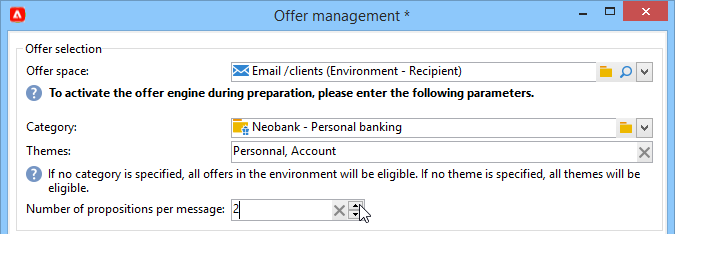
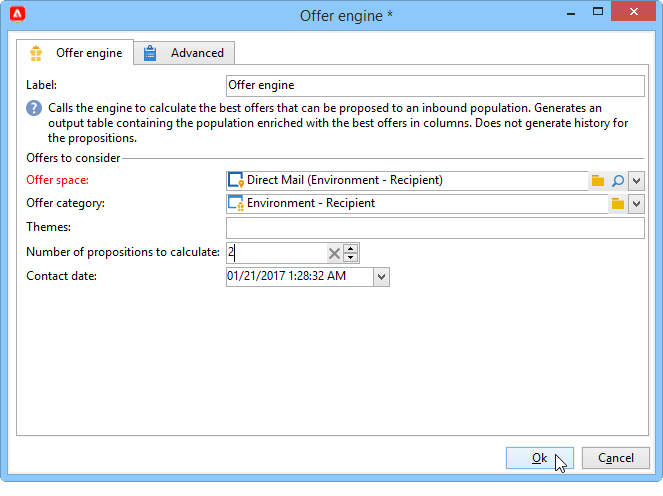

# 发送优惠{#send}

为了让优惠引擎选择优惠，该优惠已在&#x200B;**实时**&#x200B;环境中获得批准并可用。 [了解详情](interaction-offer.md#approve-offers)

通过出站通信渠道进行的优惠呈现通过直邮、电子邮件或移动投放进行。 您还可以将统一模式与事务性消息传递（消息中心）结合使用。

## 在投放中插入优惠 {#offer-into-a-delivery}

要在投放中插入优惠建议，请执行以下步骤：

1. 在投放窗口中，单击&#x200B;**选件**&#x200B;图标。

   

1. 选择与优惠环境匹配的空间。

   

1. 要优化引擎的选件选择，请选择要显示的选件所属类别或一个/多个主题。 我们建议一次只使用这些字段之一，以避免超出限制。

   

   

1. 指定要插入到投放主体中的选件数。

   

1. 根据需要选择&#x200B;**[!UICONTROL Exclude non-eligible recipients]**&#x200B;选项。 [了解详情](#parameters-for-calling-offer-engine)

   

1. 如果需要，请选择&#x200B;**[!UICONTROL Do not display anything if no offers are selected]**&#x200B;选项。 [了解详情](#parameters-for-calling-offer-engine)

   

1. 使用合并字段将属性插入投放内容。 可用建议的数目取决于引擎调用的配置方式，其顺序取决于优惠的优先级。

   

1. 完成内容，测试并发送投放。

   

### 优惠引擎的参数 {#parameters-for-calling-offer-engine}

* **[!UICONTROL Space]**：必须选择优惠环境的空间才能激活优惠引擎。
* **[!UICONTROL Category]**：用于对优惠进行排序的特定文件夹。 如果未指定类别，则除非选择了主题，否则选件引擎将会考虑环境中包含的所有选件。
* **[!UICONTROL Themes]**：在类别中上游定义的关键字。 这些功能用作过滤器，允许您通过在一组类别中选择选件来优化要呈现的选件数量。
* **[!UICONTROL Number of propositions]**：引擎返回的可插入到投放主体的选件数。 如果未将选件插入到消息中，则仍会生成选件，但不会显示选件。
* **[!UICONTROL Exclude non-eligible recipients]**：通过此选项，您可以激活或取消激活对没有足够的合格优惠的收件人的排除。 合格建议的数目可能低于请求的建议数目。 如果选中此框，则将从投放中排除没有足够建议的收件人。 如果不选择此选项，则不会排除这些收件人，但他们不会具有所请求的建议数量。
* **[!UICONTROL Do not display anything if no offer is selected]**：通过此选项，可选择在某个建议不存在时如何处理消息。 选中此框后，将不显示缺少的建议的表示形式，并且此建议的消息中不会出现任何内容。 如果未选中该框，则在发送期间将取消邮件本身，收件人将不再收到任何邮件。

## 在工作流中发送优惠{#offer-via-wf}

利用几个工作流活动，可定义优惠的显示方式：

* 扩充
* 优惠引擎
* 单元格优惠

### 扩充 {#enrichment}

通过&#x200B;**扩充**&#x200B;活动，您可以将优惠或链接添加到投放收件人的优惠中。[了解详情](https://experienceleague.adobe.com/docs/campaign/automation/workflows/wf-activities/targeting-activities/enrichment.html?lang=zh-Hans){target="_blank"}。

例如，您可以在投放之前扩充收件人查询的数据。

指定优惠建议的方法有两种。

* 指定选件或选件引擎调用。
* 引用优惠的链接。

#### 指定优惠或调用优惠引擎 {#specifying-an-offer-or-a-call-to-the-offer-engine}

配置&#x200B;**查询**&#x200B;活动后：

1. 添加并打开&#x200B;**扩充**&#x200B;活动。
1. 在&#x200B;**[!UICONTROL Enrichment]**&#x200B;选项卡中，选择&#x200B;**[!UICONTROL Add data]**。
1. 在要添加的数据类型中选择&#x200B;**[!UICONTROL An offer proposition]**。

   

1. 指定要添加的建议标识符和标签。
1. 指定选件选择。 对此有两种可能的选项：

   * **[!UICONTROL Search for the best offer in a category]**：选中此选项并指定优惠引擎调用参数（优惠空间、类别或主题、联系日期、要保留的优惠数量）。 引擎将根据这些参数自动计算要添加的选件。 我们建议填写&#x200B;**[!UICONTROL Category]**&#x200B;或&#x200B;**[!UICONTROL Theme]**&#x200B;字段，而不是同时填写两者。

     

   * **[!UICONTROL A pre-defined offer]**：选中此选项并指定优惠空间、特定优惠和联系日期，以直接配置要添加的优惠，而无需调用优惠引擎。

     

1. 然后，配置与您选择的渠道对应的投放活动。 [了解详情](#offer-into-a-delivery)

   >[!NOTE]
   >
   >可用于预览的建议数量取决于在扩充活动中执行的配置，而不是直接在投放中执行的任何可能的配置。

#### 引用到优惠的链接 {#referencing-a-link-to-an-offer}

您还可以引用指向&#x200B;**扩充**&#x200B;活动中选件的链接。

为此请执行以下操作步骤：

1. 在活动的&#x200B;**[!UICONTROL Enrichment]**&#x200B;选项卡中选择&#x200B;**[!UICONTROL Add data]**。
1. 在选择要添加的数据类型的窗口中，选择&#x200B;**[!UICONTROL A link]**。
1. 选择要建立的链接类型及其目标。 在本例中，目标是选件架构。

   

1. 指定扩充活动（此处为收件人表）中的集客表数据与选件表之间的联接。 例如，您可以将优惠代码链接到收件人。

   

1. 然后，配置与您选择的渠道对应的投放活动。 [了解详情](#offer-into-a-delivery)

   >[!NOTE]
   >
   >可用于预览的建议数量取决于投放中执行的配置。

#### 存储优惠排名和权重 {#storing-offer-rankings-and-weights}

默认情况下，当使用&#x200B;**扩充**&#x200B;活动交付优惠时，其排名和权重不会存储在建议表中。

>[!NOTE]
>
>默认情况下，**[!UICONTROL Offer engine]**&#x200B;活动会存储此信息。

但是，您可以按如下方式存储此信息：

1. 在查询之后和投放活动之前放置的扩充活动中创建对优惠引擎的调用。 [了解详情](#specifying-an-offer-or-a-call-to-the-offer-engine)
1. 在活动的主窗口中，选择&#x200B;**[!UICONTROL Edit additional data...]**。

   

1. 为排名添加&#x200B;**[!UICONTROL @rank]**&#x200B;列，为优惠权重添加&#x200B;**[!UICONTROL @weight]**&#x200B;列。

   

1. 确认添加并保存工作流。

投放会自动存储优惠的排名和权重。 此信息在投放的&#x200B;**[!UICONTROL Offers]**&#x200B;选项卡中可见。

### 优惠引擎 {#offer-engine}

**[!UICONTROL Offer engine]**&#x200B;活动还允许您在投放之前指定对优惠引擎的调用。

有关&#x200B;**优惠引擎**&#x200B;活动的详细信息，请参阅[此页面](https://experienceleague.adobe.com/docs/campaign/automation/workflows/wf-activities/targeting-activities/offer-engine.html?lang=zh-Hans){target="_blank"}。

此活动与引擎调用中的&#x200B;**扩充**&#x200B;活动的工作原理相同，即在投放前使用引擎计算的优惠扩充集客群体数据。

配置&#x200B;**查询**&#x200B;活动后：

1. 添加并打开&#x200B;**[!UICONTROL Offer engine]**&#x200B;活动。
1. 填写各种可用字段以指定对优惠引擎参数的调用（优惠空间、类别或主题、联系日期、要保留的优惠数量）。 引擎将根据这些参数自动计算要添加的选件。

   >[!CAUTION]
   >
   >如果您使用此活动，则只会存储投放中使用的优惠建议。

   

1. 然后，配置与您选择的渠道对应的投放活动。 [了解详情](#inserting-an-offer-proposition-into-a-delivery)

### 单元格优惠 {#offers-by-cell}

利用&#x200B;**[!UICONTROL Offers by cell]**&#x200B;活动，可将集客群体（例如从查询）分发到多个区段中，并指定要为每个区段呈现的选件。

有关&#x200B;**单元格选件**&#x200B;活动的详细信息，请参阅[此页面](https://experienceleague.adobe.com/docs/campaign/automation/workflows/wf-activities/targeting-activities/offers-by-cell.html?lang=zh-Hans){target="_blank"}。

为此，请使用以下流程：

1. 在指定目标群体后添加&#x200B;**[!UICONTROL Offers by cell]**&#x200B;活动，然后打开它。
1. 在&#x200B;**[!UICONTROL General]**&#x200B;选项卡中，选择要显示优惠的优惠空间。
1. 在&#x200B;**[!UICONTROL Cells]**&#x200B;选项卡中，使用&#x200B;**[!UICONTROL Add]**&#x200B;按钮指定不同的子集：

   * 使用可用的筛选和限制规则指定子集群体。
   * 然后，选择要提供给子集的选件。 可用的优惠是在上一步骤中选择的优惠环境中符合条件的优惠。

     

1. 然后，配置与您选择的渠道对应的投放活动。

<!--

## Delivering with delivery outlines {#delivering-with-delivery-outlines}

You can also present offers in a delivery using delivery outlines.

For more information on delivery outlines, refer to the Campaign - MRM guide.

1. Create a new campaign or access an existing campaign.
1. Access the delivery outlines via the campaign's **[!UICONTROL Edit]** > **[!UICONTROL Documents]** tab.
1. Add an outline then insert as many offers as you like into it by right-clicking on the outline and selecting **[!UICONTROL New]** > **[!UICONTROL Offer]**, then save the campaign.

1. Create a delivery whose delivery outlines you have access to (for example, a direct mail delivery).
1. When editing the delivery, click **[!UICONTROL Select a delivery outline]**.

   >[!NOTE]
   >
   >Depending on the type of delivery, this option can be found in the **[!UICONTROL Properties]** > **[!UICONTROL Advanced]** menu (for email deliveries for example).

1. Using the **[!UICONTROL Offers]** button, you can then configure the offer space as well as the number of offers to present in the delivery.

1. Add the propositions into the delivery body using the personalization fields (for more on this, refer to the [Inserting an offer proposition into a delivery](#inserting-an-offer-proposition-into-a-delivery) section), or in the case of a direct mail delivery, by editing the extraction file format.

   Propositions will be selected from the offers referenced in the delivery outline.

   >[!NOTE]
   >
   >Information regarding the offer rankings and weights is only saved in the proposition table if the offers are generated directly in the delivery.
-->
