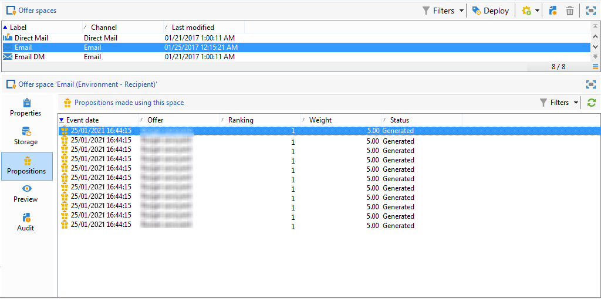

# 实时互动历史记录和报告

>[!NOTE]
>
>这些功能仅在线上可见，并且仅对&#x200B;**投放经理**&#x200B;可见。

## 产品建议提议历史{#offer-proposition-history}

提出优惠建议后，即可查看演示文稿历史记录。

* 在选件级别的&#x200B;**[!UICONTROL Edit]**&#x200B;选项卡中，单击&#x200B;**[!UICONTROL Propositions]**。

  

* 在收件人的配置文件中，单击&#x200B;**[!UICONTROL Propositions]**&#x200B;选项卡。

  

* 在选件空间级别，单击&#x200B;**[!UICONTROL Propositions]**&#x200B;选项卡。

  

## 产品建议分析报告{#offer-analysis-report}

**[!UICONTROL Offer analysis]**&#x200B;报告提供了已接受或已拒绝建议数量的概览。

统计信息基于三个标准排序：

* 按日期：

  

* 按空间：

  

* 按投放：

  

可基于报表上半部分提供的各种标准筛选数据。 选择所需的标准后，单击&#x200B;**[!UICONTROL Refresh]**&#x200B;链接以将其应用于报表。
