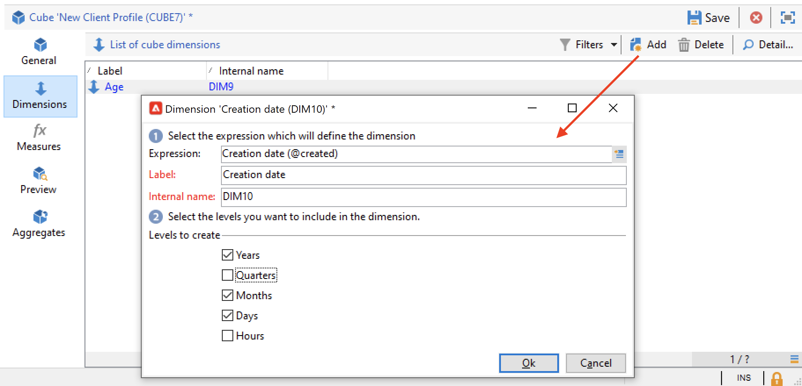

# 创建多维数据集{#create-a-cube}

## 立方工作区 {#cube-workspace}

要访问多维数据集，请浏览 **[!UICONTROL Administration > Configuration > Cubes]** 从Campaign资源管理器。

通过多维数据集，您可以：

* 直接在报表中导出数据，该报表设计在 **[!UICONTROL Reports]** 选项卡。

   要实现此目的，请创建新报告并选择要使用的多维数据集。

   

   多维数据集的显示方式与创建报告时所依据的模板类似。 选择模板后，单击 **[!UICONTROL Create]** 以配置和查看新报表。

   您可以调整测量、更改显示模式或配置表格，然后使用主按钮显示报表。

   

* 在中引用多维数据集 **[!UICONTROL Query]** 报表框以使用其指标，如下所示：

   

* 将基于多维数据集的数据透视表插入报表的任何页面。 为此，请引用 **[!UICONTROL Data]** 选项卡。

   

   有关更多信息，请参阅 [浏览报表中的数据](cube-tables.md#explore-the-data-in-a-report).

>[!CAUTION]
>
>创建多维数据集需要管理员权限。

## 构建多维数据集{#cube-create}

在开始构建多维数据集报告之前，请确定相关维度和度量，并在多维数据集中创建它们。

要创建多维数据集，请应用以下步骤：

1. 选择工作表。 [了解详情](#select-the-work-table)。
1. 定义维度。 [了解详情](#define-dimensions)。
1. 定义度量。 [了解详情](#build-indicators)。
1. 创建聚合（可选）。 [了解详情](customize-cubes.md#calculate-and-use-aggregates)。

在以下示例中，了解如何在报表中快速创建一个简单的多维数据集以导出其度量。

### 选择工作表 {#select-the-work-table}

要创建多维数据集，请执行以下步骤：

1. 单击 **[!UICONTROL New]** 按钮。

   

1. 选择包含要浏览的元素的架构（也称为“事实架构”）。 在本例中，选择默认 **收件人** 表。
1. 单击 **[!UICONTROL Save]** 要创建多维数据集，请执行以下操作：它会添加到多维数据集列表中。 您现在可以使用选项卡对其进行配置。

1. 单击 **[!UICONTROL Filter the source data...]** 链接，将此多维数据集的计算应用到数据库中的数据。

   

### 定义维度 {#define-dimensions}

创建多维数据集后，定义其维度。 Dimension是根据每个多维数据集的相关事实架构为其定义的分析轴。 这些是分析中探索的维度，如时间（年、月、日期）、产品或合同的分类（家庭、参考等）、人口区段（按城市、年龄组、状态等）。

要创建维度，请执行以下步骤：

1. 浏览到 **[!UICONTROL Dimension]** 选项卡，然后单击 **[!UICONTROL Add]** 按钮以创建新维度。
1. 在 **[!UICONTROL Expression field]**，请单击 **[!UICONTROL Edit expression]** 图标以选择包含相关数据的字段。

   

1. 在本例中，我们选择的是收件人 **年龄**. 对于此字段，您可以定义绑定以对页面进行分组，并使信息阅读更轻松。 当可能存在多个单独值时，我们建议使用绑定。

为此，请检查 **[!UICONTROL Enable binning]** 选项。 [了解详情](customize-cubes.md#data-binning)。

1. 添加 **日期** 类型维度。 在此，我们要显示收件人用户档案的创建日期。 为此，请单击 **[!UICONTROL Add]** ，然后选择 **[!UICONTROL Creation date]** 字段。
您可以自定义日期显示模式。 要实现此目的，请选择要使用的层次结构和要生成的级别：

在本例中，我们只想显示年、月和日。 请注意，您无法同时处理周和秒/月：这些级别不兼容。

1. 创建另一个维度以分析与收件人所在城市相关的数据。 为此，请添加新维度，然后在 **[!UICONTROL Location]** 收件人模式的节点。

您可以启用绑定，以便更轻松地读取信息，并将值链接到枚举。

从下拉列表中选择枚举。 请注意，此枚举必须定义为 **[!UICONTROL Reserved for binning]**.

将仅显示枚举中的值。 其他组将分组到 **[!UICONTROL Label of the other values]** 字段。

如需详细信息，请参阅[此部分](customize-cubes.md#dynamically-manage-bins)。

### 建立指标 {#build-indicators}

定义维度后，为要在单元格中显示的值指定计算模式。

为此，请在 **[!UICONTROL Measures]** 选项卡。 根据此多维数据集创建要在报表中显示的任意数量的度量。

要构建指标，请执行以下步骤：

1. 浏览到 **[!UICONTROL Measures]** ，然后单击 **[!UICONTROL Add]** 按钮。
1. 选择要应用的度量类型和公式。 在本例中，我们计算了受助者中女性的数量。 我们的衡量标准基于事实模式，并使用 **[!UICONTROL Count]** 运算符。

   

   使用 **[!UICONTROL Filter the measure data...]** 链接以仅选择女性。 [了解详情](customize-cubes.md#define-measures)。

   

1. 输入度量的标签并保存它。

   

1. 保存多维数据集。

您现在可以基于此多维数据集创建报告。 [了解详情](cube-tables.md)。
