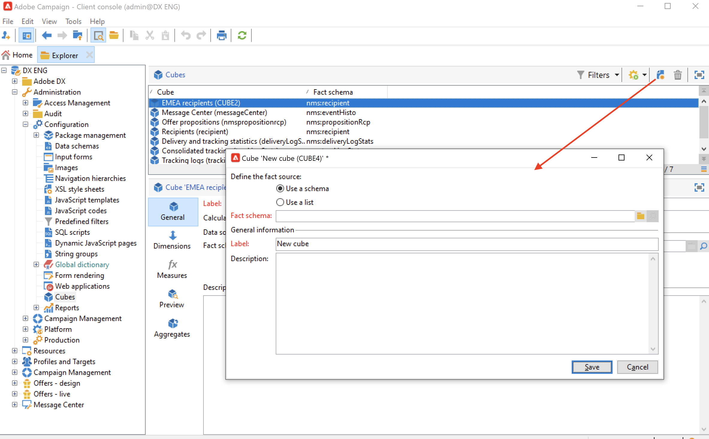

# 创建多维数据集{#create-a-cube}

## 多维数据集工作区 {#cube-workspace}

要访问多维数据集，请从Campaign资源管理器浏览到&#x200B;**[!UICONTROL Administration > Configuration > Cubes]**。

通过多维数据集，您可以：

* 直接在报表中导出数据，报表设计在Adobe Campaign平台的&#x200B;**[!UICONTROL Reports]**&#x200B;选项卡中。

  要执行此操作，请创建新报告并选择要使用的多维数据集。

  

  多维数据集看起来像模板，其创建基于哪些报告。 选择模板后，单击&#x200B;**[!UICONTROL Create]**&#x200B;以配置和查看新报告。

  您可以调整度量、更改显示模式或配置表，然后使用主按钮显示报表。

  

* 引用报告的&#x200B;**[!UICONTROL Query]**&#x200B;框中的多维数据集以使用其指示器，如下所示：

  

* 将基于多维数据集的透视表插入报表的任何页面。 为此，请在相关页面上引用要在数据透视表的&#x200B;**[!UICONTROL Data]**&#x200B;选项卡中使用的多维数据集。

  

  有关详细信息，请参阅[浏览报表中的数据](cube-tables.md#explore-the-data-in-a-report)。

>[!CAUTION]
>
>创建多维数据集需要管理员权限。
>

## 构建多维数据集{#cube-create}

在开始构建多维数据集报表之前，请确定相关的维和度量，并在多维数据集中创建它们。

要创建多维数据集，请应用以下步骤：

1. 选择工作表。 [了解详情](#select-the-work-table)。
1. 定义维度。 [了解详情](#define-dimensions)。
1. 定义度量。 [了解详情](#build-indicators)。
1. 创建聚合（可选）。 [了解详情](customize-cubes.md#calculate-and-use-aggregates)。

在以下示例中，了解如何在报告中快速创建简单多维数据集以导出其度量。

### 选择工作表 {#select-the-work-table}

要创建多维数据集，请执行以下步骤：

1. 单击多维数据集列表上方的&#x200B;**[!UICONTROL New]**&#x200B;按钮。

   

1. 选择包含您要浏览的元素的架构（也称为“事实架构”）。 在此示例中，选择默认的&#x200B;**收件人**&#x200B;表。
1. 单击&#x200B;**[!UICONTROL Save]**&#x200B;以创建多维数据集：该多维数据集已添加到多维数据集列表。 您现在可以使用选项卡对其进行配置。

1. 单击&#x200B;**[!UICONTROL Filter the source data...]**&#x200B;链接可将此多维数据集的计算应用于数据库中的数据。

   

### 定义维度 {#define-dimensions}

创建多维数据集后，定义其维。 维是每个多维数据集根据其相关数值架构定义的分析轴。 这些是在分析中探索的维度，如时间（年、月、日）、产品或合同的分类（家庭、参考资料等）、人口区段（按城市、年龄组、地位等）。

要创建维度，请执行以下步骤：

1. 浏览到多维数据集的&#x200B;**[!UICONTROL Dimension]**&#x200B;选项卡，然后单击&#x200B;**[!UICONTROL Add]**&#x200B;按钮以创建新维度。
1. 在&#x200B;**[!UICONTROL Expression field]**&#x200B;中，单击&#x200B;**[!UICONTROL Edit expression]**&#x200B;图标以选择包含相关数据的字段。

   

1. 在此示例中，我们将选择收件人&#x200B;**年龄**。 对于此字段，您可以定义对年龄进行分组，并使信息阅读更加容易。 当存在多个单独值的可能性时，我们建议使用量化。

为此，请选中&#x200B;**[!UICONTROL Enable binning]**&#x200B;选项。 [了解详情](customize-cubes.md#data-binning)。

1. 添加&#x200B;**日期**&#x200B;类型维度。 在这里，我们要显示收件人用户档案创建日期。 为此，请单击&#x200B;**[!UICONTROL Add]**&#x200B;并选择收件人表中的&#x200B;**[!UICONTROL Creation date]**字段。
您可以自定义日期显示模式。 要执行此操作，请选择要使用的层次和要生成的级别：

在我们的示例中，我们只希望显示年、月和日。 请注意，您不能同时使用周和学期/月：这些级别不兼容。

1. 创建另一个维度以分析相对于收件人城市的数据。 为此，请添加新维度，然后在收件人架构的&#x200B;**[!UICONTROL Location]**&#x200B;节点中选择城市。

您可以启用量化以使信息读取更容易，并将值链接到[枚举](../config/enumerations.md)。

从下拉列表中选择明细列表。 请注意，此枚举必须定义为&#x200B;**[!UICONTROL Reserved for binning]**。

将仅显示枚举中的值。 其他人将分组到&#x200B;**[!UICONTROL Label of the other values]**&#x200B;字段中定义的标签下。

如需详细信息，请参阅[此小节](customize-cubes.md#dynamically-manage-bins)。

### 构建指标 {#build-indicators}

定义维后，为要在单元格中显示的值指定计算模式。

为此，请在&#x200B;**[!UICONTROL Measures]**&#x200B;选项卡中创建指标。 根据此多维数据集创建要显示在报表中的列数。

要构建指标，请执行以下步骤：

1. 浏览到&#x200B;**[!UICONTROL Measures]**&#x200B;选项卡，然后单击&#x200B;**[!UICONTROL Add]**&#x200B;按钮。
1. 选择要应用的度量类型和公式。 在本例中，我们统计了接收者中的妇女人数。 我们的度量值基于事实架构并使用&#x200B;**[!UICONTROL Count]**&#x200B;运算符。

   

   使用&#x200B;**[!UICONTROL Filter the measure data...]**&#x200B;链接仅选择女性。 [了解详情](customize-cubes.md#define-measures)。

   

1. 输入度量的标签并保存。

   

1. 保存多维数据集。

您现在可以基于此多维数据集创建报告。 [了解详情](cube-tables.md)。
